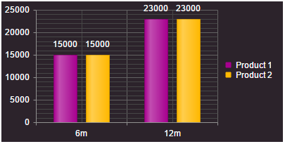

# Create Custom Skin

This help article illustrates how to create a custom skin for RadHtmlChart.

* [Modify an Existing Skin](#modify-an-existing-skin)
* [Create a New Skin](#create-a-new-skin)


## Modify an Existing Skin

RadHtmlChart renders entirely on the client-side as SVG/Canvas. The control reads the skin-specific colors from a JSON (i.e., RadHtmlChartSkins.js file), so that you cannot use pure HTML to style its elements but modify the JSON itself.

To modify an existing chart skin you can follow the steps below:

1. Copy the `RadHtmlChartSkins.js` file to your project and open it. The file is located in the `Telerik.Web.UI\HtmlChart` folder of the Telerik UI for ASP.NET AJAX Source Code and can also be found in the JavaScript tab of **Example 2**.

1. Find the skin you want to modfiy and customize the colors of the corresponding elements. **Example 1** shows how to set a silver background for the chart area and colorize the first two series with green and blue colors. 

	>caption Example 1: Customize the Black skin of RadHtmlChart via the `RadHtmlChartSkins.js` file.

	**JavaScript**

		Black: {
			chart: deepExtend({}, chartBaseTheme, {
				chartArea: {
					background: "silver"
				},
				seriesColors: ["green", "blue"],
			})
		},

1. Set the name of the customized skin to the RadHtmlChart and load the `RadHtmlChartSkins.js` file to the same page where resides the chart.

>caption Example 2: Load the `RadHtmlChartSkins.js` file to the page where reside the RadHtmlChart and set the skin.

````ASP.NET
<telerik:RadScriptManager ID="RadScriptManager1" runat="server"></telerik:RadScriptManager>
<script src="RadHtmlChartSkins.js"></script>
<telerik:RadHtmlChart runat="server" ID="RadHtmlChart1" Width="400px" Height="200px" Skin="Black">
	<PlotArea>
		<Series>
			<telerik:ColumnSeries Name="Product 1">
				<SeriesItems>
					<telerik:CategorySeriesItem Y="15000" />
					<telerik:CategorySeriesItem Y="23000" />
				</SeriesItems>
			</telerik:ColumnSeries>
			<telerik:ColumnSeries Name="Product 2">
				<SeriesItems>
					<telerik:CategorySeriesItem Y="15000" />
					<telerik:CategorySeriesItem Y="23000" />
				</SeriesItems>
			</telerik:ColumnSeries>
		</Series>
		<XAxis>
			<Items>
				<telerik:AxisItem LabelText="6m" />
				<telerik:AxisItem LabelText="12m" />
			</Items>
		</XAxis>
	</PlotArea>
</telerik:RadHtmlChart>
````
````JavaScript
//RadHtmlChartSkins.js
; (function ($) {

	// Imports ================================================================
	var kendo = window.kendo,
        dataviz = kendo.dataviz,
        deepExtend = kendo.deepExtend;

	// Constants ==============================================================
	var BAR_GAP = 1.5,
        BAR_SPACING = 0.4,
		CANDLESTICK_GAP = 1,
		CANDLESTICK_SPACING = 0.3,
        BLACK = "#000",
        SANS = "Arial,Helvetica,sans-serif",
        SANS11 = "11px " + SANS,
        SANS12 = "12px " + SANS,
        SANS16 = "16px " + SANS,
        WHITE = "#fff";

	// Chart themes ============================================================
	var chartBaseTheme = {
		title: {
			font: SANS16
		},
		legend: {
			labels: {
				font: SANS12
			},
			inactiveItems: {
				labels: {
					color: "#A1A7AB"
				},
				markers: {
					color: "#A1A7AB"
				}
			}
		},
		seriesDefaults: {
		    visible: true,
		    labels: {
		        font: SANS11
		    },
		    area: {
		        opacity: 0.4,
		        markers: {
		            visible: false,
		            size: 6
		        },
		        line: {
		            opacity: 1,
		            width: 1
		        }
		    },
		    line: {
		        width: 1
		    },
		    bar: {
		        gap: BAR_GAP,
		        spacing: BAR_SPACING
		    },
		    column: {
		        gap: BAR_GAP,
		        spacing: BAR_SPACING
		    },
		    rangeColumn: {
		        gap: BAR_GAP,
		        spacing: BAR_SPACING
		    },
		    rangeBar: {
		        gap: BAR_GAP,
		        spacing: BAR_SPACING
		    },
		    waterfall: {
		        gap: 0.5,
		        spacing: BAR_SPACING,
		        line: {
		            width: 1,
		            color: BLACK
		        }
		    },
		    horizontalWaterfall: {
		        gap: 0.5,
		        spacing: BAR_SPACING,
		        line: {
		            width: 1,
		            color: BLACK
		        }
		    },
		    candlestick: {
		        gap: CANDLESTICK_GAP,
		        spacing: CANDLESTICK_SPACING,
		        aggregate: {
		            open: "max",
		            high: "max",
		            low: "min",
		            close: "max",
		            noteText: "first"
		        },
		        border:{
                    width: 0.2
		        }
			},
			scatterLine: {
				width: 1
			},
			radarLine: {
				width: 4,
				markers: {
					visible: false
				}
			},
			radarArea: {
				opacity: 0.5,
				markers: {
					visible: false,
					size: 6
				},
				line: {
					opacity: 1,
					width: 0
				}
			},
			polarLine: {
				width: 4,
				markers: {
					visible: false
				}
			},
			polarArea: {
				opacity: 0.5,
				markers: {
					visible: false,
					size: 6
				},
				line: {
					opacity: 1,
					width: 0
				}
			},
			funnel: {
				labels: {
					color: "",
					background: ""
				}
			},
			boxPlot: {
				outliersField: "",
				meanField: "",
				whiskers: {
					width: 1,
					color: BLACK
				},
				mean: {
					width: 1,
					color: BLACK
				},
				median: {
					width: 1,
					color: BLACK
				},
				border: {
					width: 1,
					_brightness: 0.8
				},
				gap: 1,
				spacing: 0.3,
				downColor: WHITE,
				highlight: {
					whiskers: {
						width: 2
					},
					mean: {
						width: 2
					},
					median: {
						width: 2
					},
					border: {
						width: 2,
						opacity: 1
					}
				}
			}
		},
		axisDefaults: {
			labels: {
				font: SANS12
			},
			title: {
				font: SANS16,
				margin: 5
			},
			majorGridLines: {
				width: 1
			}
		},
		tooltip: {
			font: SANS12
		},
		navigator: {
			pane: {
				height: 90,
				margin: {
					top: 10
				}
			}
		}
	};

	var chartThemes = {

		Black: {
			chart: deepExtend({}, chartBaseTheme, {
				title: {
					color: WHITE
				},
				legend: {
					labels: {
						color: WHITE
					}
				},
				seriesDefaults: {
					labels: {
						color: WHITE
					},
					line: {
						markers: {
							background: "#3d3d3d"
						}
					},
					verticalLine: {
						markers: {
							background: "#3d3d3d"
						}
					},
					scatter: {
						markers: {
							background: "#3d3d3d"
						}
					},
					scatterLine: {
						markers: {
							background: "#3d3d3d"
						}
					},
					area: {
						opacity: 0.4
					},
					candlestick: {
						downColor: "#888888"
					}
				},
				chartArea: {
					background: "#3d3d3d"
				},
				seriesColors: ["#f9a319", "#1edee2", "#9eda29", "#ffce00", "#dd007f", "#01ae98", "#ffc961", "#ff6714", "#fa1852", "#008bcb"],
				categoryAxis: {
					majorGridLines: {
						visible: true
					}
				},
				axisDefaults: {
					line: {
						color: "#919191"
					},
					labels: {
						color: WHITE
					},
					majorGridLines: {
						color: "#636363"
					},
					minorGridLines: {
						color: "#464646"
					},
					title: {
						color: WHITE
					}
				},
				tooltip: {
					color: WHITE
				}
			})

		},

		BlackMetroTouch: {
			chart: deepExtend({}, chartBaseTheme, {
				title: {
					color: WHITE
				},
				legend: {
					labels: {
						color: WHITE
					}
				},
				seriesDefaults: {
					overlay: {
						gradient: "none"
					},
					labels: {
						color: WHITE
					},
					line: {
						markers: {
							background: "#000000"
						}
					},
					verticalLine: {
						markers: {
							background: "#000000"
						}
					},
					scatter: {
						markers: {
							background: "#000000"
						}
					},
					scatterLine: {
						markers: {
							background: "#000000"
						}
					},
					area: {
						opacity: 0.4
					},
					candlestick: {
						downColor: "#888888"
					}
				},
				chartArea: {
					background: "#000000"
				},
				seriesColors: ["#25a0da", "#309b46", "#d8e404", "#e61e26", "#515151", "#2568cc", "#9dd418", "#ffc924", "#ff7200", "#af0007"],
				categoryAxis: {
					majorGridLines: {
						visible: true
					}
				},
				axisDefaults: {
					line: {
						color: "#919191"
					},
					labels: {
						color: WHITE
					},
					majorGridLines: {
						color: "#636363"
					},
					minorGridLines: {
						color: "#464646"
					},
					title: {
						color: WHITE
					}
				},
				tooltip: {
					color: WHITE
				}
			})

		},

		Bootstrap: {
		    chart: deepExtend({}, chartBaseTheme, {
		        chartArea: {
		            background: ""
		        },
		        title: {
		            color: "#333333"
		        },
		        legend: {
		            labels: {
		                color: "#333333"
		            }
		        },
		        seriesColors: ["#337ab7", "#5bc0de", "#5cb85c", "#f0ad4e", "#da3b36", "#144d7d", "#0597c1", "#268d26", "#ea7003", "#b10500"],
		        categoryAxis: {
		            majorGridLines: {
		                visible: true
		            }
		        },
		        axisDefaults: {
		            majorGridLines: {
		                color: "#cccccc"
		            },
		            line: {
		                color: "#cccccc"
		            },
		            minorGridLines: {
		                color: "#ebebeb"
		            },
		            labels: {
		                color: "#333333"
		            },
		            title: {
		                color: "#333333"
		            }
		        },
		        tooltip: {
		            color: WHITE
		        },
		        seriesDefaults: {
		            overlay: {
		                gradient: "none"
		            },
		            area: {
		                opacity: 0.4
		            },
		            candlestick: {
		                downColor: "#bbbbbb"
		            },
		            labels: {
		                    color: "#333333"
		                }
		        }
		    })

		},

		Default: {
			chart: deepExtend({}, chartBaseTheme, {
				chartArea: {
					background: ""
				},
				seriesColors: ["#f6921e", "#d6de23", "#8bc53f", "#26a9e0", "#9e1f63", "#61b045", "#d4ae18", "#f7742c", "#9e0c40", "#136bc5"],
				categoryAxis: {
					majorGridLines: {
						visible: true
					}
				},
				axisDefaults: {
					majorGridLines: {
						color: "#aaaaaa"
					},
					minorGridLines: {
						color: "#cccccc"
					},
					line: {
						color: "#828282"
					}
				},
				tooltip: {
					color: BLACK
				},
				seriesDefaults: {
					area: {
						opacity: 0.4
					},
					candlestick: {
						downColor: "#999999"
					}
				}
			})

		},

		Glow: {
			chart: deepExtend({}, chartBaseTheme, {
				title: {
					color: "WHITE"
				},
				legend: {
					labels: {
						color: "WHITE"
					}
				},
				seriesDefaults: {
					labels: {
						color: "WHITE"
					},
					verticalLine: {
						markers: {
							background: "#d3e0c2"
						}
					},
					line: {
						markers: {
							background: "#d3e0c2"
						}
					},
					scatter: {
						markers: {
							background: "#d3e0c2"
						}
					},
					scatterLine: {
						markers: {
							background: "#d3e0c2"
						}
					},
					area: {
						opacity: 0.4
					},
					candlestick: {
						downColor: "#617078"
					}
				},
				chartArea: {
					background: "#29343b"
				},
				seriesColors: ["#f89d26", "#b8e54b", "#52d5f6", "#ffd800", "#277db4", "#01ae98", "#fffc00", "#f7742c", "#9fcf2d", "#008bcb"],
				categoryAxis: {
					majorGridLines: {
						visible: true
					}
				},
				axisDefaults: {
					majorGridLines: {
						color: "#5c6a73"
					},
					minorGridLines: {
						color: "#3a454b"
					},
					line: {
						color: "WHITE"
					},
					labels: {
						color: "WHITE"
					},
					title: {
						color: "WHITE"
					}
				},

				tooltip: {
					color: WHITE
				}
			})

		},
		Material: {
		    chart: deepExtend({}, chartBaseTheme, {
		        chartArea: {
		            background: ""
		        },
		        title: {
		            color: "#455a64"
		        },
		        legend: {
		            labels: {
		                color: "#607d8b"
		            }
		        },
		        seriesColors: ["#8bc34a", "#03a9f4", "#673ab7", "#d81b60", "#cddc39", "#1976D2", "#7e57c2", "#f06292", "#00acc1", "#00897b"],
		        categoryAxis: {
		            majorGridLines: {
		                visible: true
		            }
		        },
		        axisDefaults: {
		            majorGridLines: {
		                color: "#cfd8dc"
		            },
		            line: {
		                color: "#9aafb8"
		            },
		            minorGridLines: {
		                color: "#e4e9ec"
		            },
		            labels: {
		                color: "#607d8b"
		            },
		            title: {
		                color: "#607d8b"
		            }
		        },
		        tooltip: {
		            color: WHITE
		        },
		        seriesDefaults: {
		            overlay: {
		                gradient: "none"
		            },
		            area: {
		                opacity: 0.4
		            },
		            candlestick: {
		                downColor: "#607d8b"
		            },
		            labels: {
		                color: "#455a64"
		            }
		        }
		    })

		},

		Metro: {
			chart: deepExtend({}, chartBaseTheme, {
				chartArea: {
					background: ""
				},
				seriesColors: ["#25a0da", "#309b46", "#d8e404", "#e61e26", "#313131", "#43bcf5", "#9dd418", "#ffc924", "#c4001c", "#0e53bb"],
				categoryAxis: {
					majorGridLines: {
						visible: true
					}
				},
				axisDefaults: {
					majorGridLines: {
						color: "#b4b4b4"
					},
					line: {
						color: "#b4b4b4"
					},
					minorGridLines: {
						color: "#d2d2d2"
					}
				},
				tooltip: {
					color: BLACK
				},
				seriesDefaults: {
					overlay: {
						gradient: "none"
					},
					area: {
						opacity: 0.4
					},
					candlestick: {
						downColor: "#bbbbbb"
					}
				}
			})

		},

		MetroTouch: {
			chart: deepExtend({}, chartBaseTheme, {
				chartArea: {
					background: ""
				},
				seriesColors: ["#25a0da", "#309b46", "#d8e404", "#e61e26", "#313131", "#43bcf5", "#9dd418", "#ffc924", "#c4001c", "#0e53bb"],
				categoryAxis: {
					majorGridLines: {
						visible: true
					}
				},
				axisDefaults: {
					majorGridLines: {
						color: "#b4b4b4"
					},
					line: {
						color: "#b4b4b4"
					},
					minorGridLines: {
						color: "#d2d2d2"
					}
				},
				tooltip: {
					color: BLACK
				},
				seriesDefaults: {
					overlay: {
						gradient: "none"
					},
					area: {
						opacity: 0.4
					},
					candlestick: {
						downColor: "#bbbbbb"
					}
				}
			})

		},


		Office2007: {
			chart: deepExtend({}, chartBaseTheme, {
				chartArea: {
					background: ""
				},
				seriesColors: ["#99c62a", "#27adcc", "#2477c9", "#7042b2", "#d83636", "#5f9c40", "#73cae3", "#00738d", "#e96969", "#a4355f"],
				categoryAxis: {
					majorGridLines: {
						visible: true
					}
				},
				axisDefaults: {
					majorGridLines: {
						color: "#bdcce2"
					},
					minorGridLines: {
						color: "#d7e0ee"
					},
					line: {
						color: "#688CAF"
					}
				},
				tooltip: {
					color: BLACK
				},
				seriesDefaults: {
					area: {
						opacity: 0.4
					},
					candlestick: {
						downColor: "#bbbbbb"
					}
				}
			})

		},

		Office2010Black: {
			chart: deepExtend({}, chartBaseTheme, {
				title: {
					color: WHITE
				},
				legend: {
					labels: {
						color: WHITE
					}
				},
				seriesDefaults: {
					labels: {
						color: WHITE
					},
					verticalLine: {
						markers: {
							background: "#6f6f6f"
						}
					},
					line: {
						markers: {
							background: "#6f6f6f"
						}
					},
					scatter: {
						markers: {
							background: "#6f6f6f"
						}
					},
					scatterLine: {
						markers: {
							background: "#6f6f6f"
						}
					},
					area: {
						opacity: 0.4
					},
					candlestick: {
						downColor: "#bbbbbb"
					}
				},
				chartArea: {
					background: "#6f6f6f"
				},
				seriesColors: ["#99c62a", "#27adcc", "#2477c9", "#7042b2", "#d83636", "#5f9c40", "#73cae3", "#00738d", "#e96969", "#a4355f"],
				categoryAxis: {
					majorGridLines: {
						visible: true
					}
				},
				axisDefaults: {
					line: {
						color: "#999999"
					},
					labels: {
						color: WHITE
					},
					majorGridLines: {
						color: "#888888"
					},
					minorGridLines: {
						color: "#7c7c7c"
					},
					title: {
						color: WHITE
					}
				},
				tooltip: {
					color: WHITE
				}
			})

		},

		Office2010Blue: {
			chart: deepExtend({}, chartBaseTheme, {
				title: {
					color: "#384E73"
				},
				legend: {
					labels: {
						color: "#384E73"
					}
				},
				chartArea: {
					background: ""
				},
				seriesDefaults: {
					labels: {
						color: "#384E73"
					},
					area: {
						opacity: 0.4
					},
					candlestick: {
						downColor: "#bbbbbb"
					}
				},
				seriesColors: ["#99c62a", "#27adcc", "#2477c9", "#7042b2", "#d83636", "#5f9c40", "#73cae3", "#00738d", "#e96969", "#a4355f"],
				categoryAxis: {
					majorGridLines: {
						visible: true
					}
				},
				axisDefaults: {
					line: {
						color: "#8ba0bc"
					},
					labels: {
						color: "#384e73"
					},
					majorGridLines: {
						color: "#d1dbe5"
					},
					minorGridLines: {
						color: "#e3e9ef"
					},
					title: {
						color: "#384e73"
					}
				},
				tooltip: {
					color: BLACK
				}
			})

		},

		Office2010Silver: {
			chart: deepExtend({}, chartBaseTheme, {
				title: {
					color: "#3b3b3b"
				},
				legend: {
					labels: {
						color: "#3b3b3b"
					}
				},
				chartArea: {
					background: ""
				},
				seriesDefaults: {
					labels: {
						color: "#3b3b3b"
					},
					area: {
						opacity: 0.4
					},
					candlestick: {
						downColor: "#bbbbbb"
					}
				},
				seriesColors: ["#99c62a", "#27adcc", "#2477c9", "#7042b2", "#d83636", "#5f9c40", "#73cae3", "#00738d", "#e96969", "#a4355f"],
				categoryAxis: {
					majorGridLines: {
						visible: true
					}
				},
				axisDefaults: {
					line: {
						color: "#a4abb2"
					},
					labels: {
						color: "#3b3b3b"
					},
					majorGridLines: {
						color: "#dbdfe4"
					},
					minorGridLines: {
						color: "#e9ecef"
					},
					title: {
						color: "#3b3b3b"
					}
				},
				tooltip: {
					color: BLACK
				}
			})

		},

		Outlook: {
			chart: deepExtend({}, chartBaseTheme, {
				chartArea: {
					background: ""
				},
				seriesColors: ["#231f20", "#1b75bb", "#7da5e0", "#f9ec31", "#faaf40", "#355cb4", "#d9ce2a", "#58b6ff", "#e89324", "#767676"],
				categoryAxis: {
					majorGridLines: {
						visible: true
					}
				},
				axisDefaults: {
					line: {
						color: "#5d8cc9"
					},
					majorGridLines: {
						color: "#aac3e8"
					},
					minorGridLines: {
						color: "#ccdbf1"
					}
				},
				tooltip: {
					color: BLACK
				},
				seriesDefaults: {
					area: {
						opacity: 0.4
					},
					candlestick: {
						downColor: "#bbbbbb"
					}
				}
			})

		},

		Silk: {
			chart: deepExtend({}, chartBaseTheme, {
				chartArea: {
					background: ""
				},
				seriesColors: ["#2dabc1", "#8ac24e", "#f1ac4a", "#326eb9", "#a34973", "#48a69e", "#dd7774", "#4a9ddc", "#912357", "#83b66f"],
				categoryAxis: {
					majorGridLines: {
						visible: true
					}
				},
				axisDefaults: {
					line: {
						color: "#767676"
					},
					majorGridLines: {
						color: "#c8c8c8"
					},
					minorGridLines: {
						color: "#e8e8e8"
					}
				},
				tooltip: {
					color: BLACK
				},
				seriesDefaults: {
					area: {
						opacity: 0.4
					},
					candlestick: {
						downColor: "#bbbbbb"
					}
				}
			})

		},

		Simple: {
			chart: deepExtend({}, chartBaseTheme, {
				title: {
					color: "#606060"
				},
				legend: {
					labels: {
						color: "#606060"
					}
				},
				chartArea: {
					background: ""
				},
				seriesDefaults: {
					overlay: {
						gradient: "none"
					},
					labels: {
						color: "#606060"
					},
					area: {
						opacity: 0.4
					},
					candlestick: {
						downColor: "#bbbbbb"
					}
				},
				seriesColors: ["#231f20", "#404041", "#58595b", "#808184", "#929497", "#cbcbcb", "#aeaeae", "#7e7e7e", "#272727", "#000000"],
				categoryAxis: {
					majorGridLines: {
						visible: true
					}
				},
				axisDefaults: {
					line: {
						color: "#828282"
					},
					majorGridLines: {
						color: "#d1d1d1"
					},
					minorGridLines: {
						color: "#e3e3e3"
					},
					labels: {
						color: "#606060"
					},
					title: {
						color: "#606060"
					}
				},
				tooltip: {
					color: BLACK
				}
			})

		},

		Sunset: {
			chart: deepExtend({}, chartBaseTheme, {
				title: {
					color: "#854324"
				},
				legend: {
					labels: {
						color: "#854324"
					}
				},
				seriesDefaults: {
					labels: {
						color: "#854324"
					},
					area: {
						opacity: 0.4
					},
					candlestick: {
						downColor: "#b7aca7"
					}
				},
				chartArea: {
					background: ""
				},
				seriesColors: ["#3f1c12", "#ba3b01", "#d95a1a", "#e7931e", "#f9bc12", "#571414", "#cd2929", "#e26d52", "#fc9d5e", "#ffbf6d"],
				categoryAxis: {
					majorGridLines: {
						visible: true
					}
				},
				axisDefaults: {
					line: {
						color: "#b7836a"
					},
					labels: {
						color: "#854324"
					},
					majorGridLines: {
						color: "#cebab1"
					},
					minorGridLines: {
						color: "#e2d6d0"
					},
					title: {
						color: "#854324"
					}
				},
				tooltip: {
					color: BLACK
				}
			})

		},

		Telerik: {
			chart: deepExtend({}, chartBaseTheme, {
				chartArea: {
					background: ""
				},
				seriesColors: ["#7e7e7e", "#cbcbcb", "#a2ea8b", "#63ac39", "#000000", "#39830f", "#75cc43", "#a2a2a2", "#404040", "#153b00"],
				categoryAxis: {
					majorGridLines: {
						visible: true
					}
				},
				axisDefaults: {
					line: {
						color: "#828282"
					},
					majorGridLines: {
						color: "#c6c6c6"
					},
					minorGridLines: {
						color: "#b4b4b4"
					}
				},
				tooltip: {
					color: BLACK
				},
				seriesDefaults: {
					area: {
						opacity: 0.4
					},
					candlestick: {
						downColor: "#cccccc"
					}
				}
			})

		},

		Vista: {
			chart: deepExtend({}, chartBaseTheme, {
				title: {
					color: "#333333"
				},
				legend: {
					labels: {
						color: "#333333"
					}
				},
				chartArea: {
					background: ""
				},
				seriesDefaults: {
					labels: {
						color: "#333333"
					},
					area: {
						opacity: 0.4
					},
					candlestick: {
						downColor: "#999999"
					}
				},
				seriesColors: ["#83abc0", "#64d6f4", "#3399ff", "#03597a", "#000000", "#0066cc", "#1faeff", "#1773a6", "#777d8b", "#003d5c"],
				categoryAxis: {
					majorGridLines: {
						visible: true
					}
				},
				axisDefaults: {
					line: {
						color: "#a7bac5"
					},
					majorGridLines: {
						color: "#d3d3d3"
					},
					labels: {
						color: "#333333"
					},
					minorGridLines: {
						color: "#e5e5e5"
					},
					title: {
						color: "#333333"
					}
				},
				tooltip: {
					color: BLACK
				}
			})

		},

		Web20: {
			chart: deepExtend({}, chartBaseTheme, {
				title: {
					color: "#001454"
				},
				legend: {
					labels: {
						color: "#001454"
					}
				},
				chartArea: {
					background: ""
				},
				seriesDefaults: {
					labels: {
						color: "#001454"
					},
					area: {
						opacity: 0.4
					},
					candlestick: {
						downColor: "#999999"
					}
				},
				seriesColors: ["#0e4302", "#64ba36", "#a0beea", "#3460b9", "#2c4072", "#b1df97", "#3cae00", "#2864e1", "#6b8dc2", "#001d89"],
				categoryAxis: {
					majorGridLines: {
						visible: true
					}
				},
				axisDefaults: {
					line: {
						color: "#708dc3"
					},
					majorGridLines: {
						color: "#cfd9e7"
					},
					labels: {
						color: "#001454"
					},
					minorGridLines: {
						color: "#e2e8f1"
					},
					title: {
						color: "#001454"
					}
				},
				tooltip: {
					color: BLACK
				}
			})

		},

		WebBlue: {
			chart: deepExtend({}, chartBaseTheme, {
				title: {
					color: "#0d202b"
				},
				legend: {
					labels: {
						color: "#0d202b"
					}
				},
				chartArea: {
					background: ""
				},
				seriesDefaults: {
					labels: {
						color: "#0d202b"
					},
					area: {
						opacity: 0.4
					},
					candlestick: {
						downColor: "#bbbbbb"
					}
				},
				seriesColors: ["#a2b3c7", "#76c8e8", "#358db0", "#426682", "#2d3d4f", "#2a72ab", "#77aadc", "#48beec", "#005475", "#050e31"],
				categoryAxis: {
					majorGridLines: {
						visible: true
					}
				},
				axisDefaults: {
					line: {
						color: "#708dc3"
					},
					majorGridLines: {
						color: "#d0d8dd"
					},
					labels: {
						color: "#0d202b"
					},
					minorGridLines: {
						color: "#e2e8f1"
					},
					title: {
						color: "#0d202b"
					}
				},
				tooltip: {
					color: BLACK
				}
			})
		},

		Windows7: {
			chart: deepExtend({}, chartBaseTheme, {
				title: {
					color: "#4c607a"
				},
				legend: {
					labels: {
						color: "#4c607a"
					}
				},
				chartArea: {
					background: ""
				},
				seriesDefaults: {
					labels: {
						color: "#4c607a"
					},
					area: {
						opacity: 0.4
					},
					candlestick: {
						downColor: "#cccccc"
					}
				},
				seriesColors: ["#a5b3c5", "#82afe5", "#358db0", "#03597a", "#152435", "#48beec", "#326fbe", "#698cb5", "#6babc5", "#83c8f4"],
				categoryAxis: {
					majorGridLines: {
						visible: true
					}
				},
				axisDefaults: {
					line: {
						color: "#a5b3c5"
					},
					majorGridLines: {
						color: "#dae2e8"
					},
					labels: {
						color: "#4c607a"
					},
					minorGridLines: {
						color: "#e9eef1"
					},
					title: {
						color: "#4c607a"
					}
				},
				tooltip: {
					color: BLACK
				}
			})

		}

	};

	// Exports ================================================================
	deepExtend(dataviz.ui, {
		themes: chartThemes
	});


})($telerik.$);
````

You can see the output of the modified Black skin in **Figure 1**.

>caption Figure 1: RadHtmlChart with customized Black skin.


## Create a New Skin

You can create a new skin out of an existing one by following the steps below:

1. Create a JSON that will store the chart element's colors. You can use the free [Kendo UI Theme Builder] (http://demos.telerik.com/kendo-ui/themebuilder/) for the purpose.
````JavaScript
"chart": {
	"chartArea": {
		"background": "#2c232b"
	},
	"seriesColors": [
		"#a7008f",
		"#ffb800"
	]
}
````

1. Make a deep copy of an existing kendo dataviz theme and apply the created JSON to it.
````JavaScript
var themes = kendo.dataviz.ui.themes;
var MyTheme = kendo.deepExtend({}, themes.Black, {
	"chart": { "chartArea": { "background": "#2c232b" }, "seriesColors": ["#a7008f", "#ffb800"] }
	}
````

1. Add the new theme to the kendo dataviz themes and set the theme name to the chart via the [setOptions()](http://docs.telerik.com/kendo-ui/api/javascript/dataviz/ui/chart#methods-setOptions) method.
````JavaScript
themes.MyTheme = MyTheme;
$find("<%=RadHtmlChart1.ClientID%>").get_kendoWidget().setOptions({ theme: "MyTheme" });
````


You can find a fully runnable sample about creating a custom skin out of an existing one in **Example 3**. The output is available in **Figure 2**.

>caption Example 3: Create and set a custom skin for the RadHtmlChart.

````JavaScript
function chartLoad() {
	$ = $telerik.$;
	var themes = kendo.dataviz.ui.themes;
	var MyTheme = kendo.deepExtend(
		// Deep copy
		{},
		// Base theme      
		themes.Black,
		{
		// Customize the theme JSON
		"chart": {
			"chartArea": {
				"background": "#2c232b"
			},
			"seriesColors": [
				"#a7008f",
				"#ffb800"
			]
		}
		}
	);

	themes.MyTheme = MyTheme;
	var kendoChart = $find("<%=RadHtmlChart1.ClientID%>").get_kendoWidget();
	kendoChart.setOptions({ theme: "MyTheme" });
}
````
````ASP.NET
<telerik:RadHtmlChart runat="server" ID="RadHtmlChart1" Width="400px" Height="200px">
	<ClientEvents OnLoad="chartLoad" />
	<PlotArea>
		<Series>
			<telerik:ColumnSeries Name="Product 1">
				<SeriesItems>
					<telerik:CategorySeriesItem Y="15000" />
					<telerik:CategorySeriesItem Y="23000" />
				</SeriesItems>
			</telerik:ColumnSeries>
			<telerik:ColumnSeries Name="Product 2">
				<SeriesItems>
					<telerik:CategorySeriesItem Y="15000" />
					<telerik:CategorySeriesItem Y="23000" />
				</SeriesItems>
			</telerik:ColumnSeries>
		</Series>
		<XAxis>
			<Items>
				<telerik:AxisItem LabelText="6m" />
				<telerik:AxisItem LabelText="12m" />
			</Items>
		</XAxis>
	</PlotArea>
</telerik:RadHtmlChart>
````

>caption Figure 2: RadHtmlChart with new custom skin.




## See Also

 * [RadHtmlChart Structure]()

 * [Kendo UI Theme Builder] (http://demos.telerik.com/kendo-ui/themebuilder/)
 
 * [Kendo UI Chart: setOptions()](http://docs.telerik.com/kendo-ui/api/javascript/dataviz/ui/chart#methods-setOptions)

