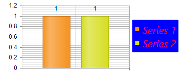

# Create Custom Skin

This help article illustrates how to create a custom skin for RadHtmlChart.

* [Modify an Existing Skin](#modify-an-existing-skin)
* [Create a New Skin](#create-a-new-skin)


## Modify an Existing Skin

RadHtmlChart renders entirely on the client-side as SVG/Canvas. The control reads the skin-specific colors from a JSON (i.e., RadHtmlChartSkins.js file), so that you cannot use pure HTML to style its elements but modify the JSON itself.

To modify an existing chart skin you can follow the steps below:

1. Copy the `RadHtmlChartSkins.js` file to your project and open it. The file is located in the `Telerik.Web.UI\HtmlChart` folder of the Telerik UI for ASP.NET AJAX Source Code.

1. Find the skin you want to modfiy and customize the colors of the corresponding elements. **Example 1** shows how to set a silver background for the chart area and colorize the first two series with green and blue colors. 

	>caption Example 1: Customize the Black skin of RadHtmlChart via the `RadHtmlChartSkins.js` file.

	**JavaScript**

		Black: {
			chart: deepExtend({}, chartBaseTheme, {
				chartArea: {
					background: "silver"
				},
				seriesColors: ["green", "blue"],
			})
		},

1. Set the name of the customized skin to the RadHtmlChart and load the `RadHtmlChartSkins.js` file to the same page where resides the chart.

	>caption Example 2: Load the `RadHtmlChartSkins.js` file to the page where reside the RadHtmlChart and set the skin.

	**ASP.NET**

		<telerik:RadScriptManager ID="RadScriptManager1" runat="server"></telerik:RadScriptManager>
		<script src="RadHtmlChartSkins.js"></script>
		<telerik:RadHtmlChart runat="server" ID="RadHtmlChart1" Width="400px" Height="200px" Skin="Black">
			<PlotArea>
				<Series>
					<telerik:ColumnSeries Name="Product 1">
						<SeriesItems>
							<telerik:CategorySeriesItem Y="15000" />
							<telerik:CategorySeriesItem Y="23000" />
						</SeriesItems>
					</telerik:ColumnSeries>
					<telerik:ColumnSeries Name="Product 2">
						<SeriesItems>
							<telerik:CategorySeriesItem Y="15000" />
							<telerik:CategorySeriesItem Y="23000" />
						</SeriesItems>
					</telerik:ColumnSeries>
				</Series>
				<XAxis>
					<Items>
						<telerik:AxisItem LabelText="6m" />
						<telerik:AxisItem LabelText="12m" />
					</Items>
				</XAxis>
			</PlotArea>
		</telerik:RadHtmlChart>

You can see the output of the modified Black skin in **Figure 1**.

>caption Figure 1: RadHtmlChart with customized Black skin.


You can find all the available options for the `TextStyle` inner property in the [Labels and Titles Font Settings]() help article.

>caption **Figure 1**: Chart legend with customized background and text styles.



>caption **Example 1**: Configure the appearance of the chart legend.

````ASP.NET
<telerik:RadHtmlChart ID="RadHtmlChart1" runat="server" Width="350" Height="150">
	<Legend>
		<Appearance BackgroundColor="Blue">
			<TextStyle Color="Red" FontFamily="Segoe UI" FontSize="20" Italic="true" />
		</Appearance>
	</Legend>
</telerik:RadHtmlChart>
````
````C#
protected void Page_Init(object sender, EventArgs e)
{
	int seriesNum = 2;
	for (int i = 1; i <= seriesNum; i++)
	{
		ColumnSeries cs1 = new ColumnSeries() { Name = "Series " + i };
		cs1.SeriesItems.Add(new CategorySeriesItem() { Y = 1 });
		RadHtmlChart1.PlotArea.Series.Add(cs1);
	}
}
````
````VB
Protected Sub Page_Init(sender As Object, e As EventArgs)
	Dim seriesNum As Integer = 2
	For i As Integer = 1 To seriesNum
		Dim cs1 As New ColumnSeries() With { _
			Key .Name = "Series " & i _
		}
		cs1.SeriesItems.Add(New CategorySeriesItem() With { _
			Key .Y = 1 _
		})
		RadHtmlChart1.PlotArea.Series.Add(cs1)
	Next
End Sub
````

The color of the markers is automatically detected from the series colors.

>tip To change the type, size and color of the legend markers you can:
* Use [visual templates]().
* Use the workaround from the following feedback item [ADD more legend markers options in RadHtmlChart](http://feedback.telerik.com/Project/108/Feedback/Details/123802).


## See Also

 * [Labels and Titles Font Settings]()
 
 * [Visual Templates]()
 
 * [ADD more legend markers options in RadHtmlChart](http://feedback.telerik.com/Project/108/Feedback/Details/123802)
 
 * [legend.labels.template](http://docs.telerik.com/kendo-ui/api/javascript/dataviz/ui/chart#configuration-legend.labels.template) 
 
 * [Execute JavaScript with a ClientTemplate]()

