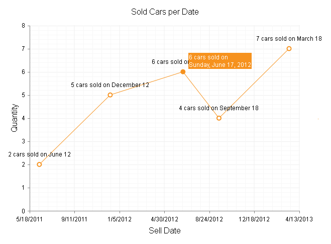

# Format Dates


## 

The way the dates are shown on the axis labels, series labels and series tooltips are controlledvia the __DataFormatString__ property that must be set in the corresponding chart element as follows:

* __Series Labels__ and __Series Tooltips__ - {0} and/or {1} placeholdersare used to denote the corresponding SeriesItem's __X__ and/or __Y__value in the __DateFormatString__ followed by ":" and the desired date specifier(e.g., __DataFormatString="{1} units are ordered on {0:d}"__).

* __Axis Labels__ - Only the desired date specifier must be set in the__DateFormatString__ property,as placeholders are not applicable (e.g., __DataFormatString="y"__).

>note Date formats can be used inside the __Client Templates__ . You can find more information	in the[Formatting Numbers]()article, in the section, *Formatting Labels and Tooltips by Using their Client Templates* .
>


__Table 1__ lists standard date format specifiers with descriptions.__Figure 1__ shows formatting the d, m|M and D pattern while__Example 1__ shows the markup to create the figure.


>caption Table 1: List of standard date format specifiers with descriptions.

|  __Format Specifier__  |  __Description__  |  __Pattern Equivalent (for en-US Culture)__  |
| ------ | ------ | ------ |
| __d__ |short date pattern| __M/d/yyyy__ (e.g., the date 11th of November 2000 will be formatted as "11/6/2000")|
| __D__ |long date pattern| __dddd, MMMM dd, yyyy__ (e.g., the date 11th of November 2000 will be formatted as "Monday, November 06, 2000")|
| __F__ |full date/time pattern| __dddd, MMMM dd, yyyy h:mm:ss tt__ (e.g., the date 11th of November 2000 will be formatted as "Monday, November 06, 2000 12:00:00 AM")|
| __g__ |general date/time pattern (short time)| __M/d/yyyy h:mm tt__ (e.g., the date 11th of November 2000 will be formatted as "11/6/2000 12:00 AM")|
| __G__ |general date/time pattern (long time)| __M/d/yyyy h:mm:ss tt__ (e.g., the date 11th of November 2000 will be formatted as "11/6/2000 12:00:00 AM")|
| __m|M__ |month/day pattern| __MMMM dd__ (e.g., the date 11th of November 2000 will be formatted as "November 06")|
| __u__ |universal sortable date/time pattern| __yyyy'-'MM'-'dd HH':'mm':'ss'Z'__ (e.g., the date 11th of November 2000 will be formatted as "2000-11-06 00:00:00Z")|
| __y|Y__ |month/year pattern| __MMMM, yyyy__ (e.g., the date 11th of November 2000 will be formatted as "November, 2000")|

__Table 2__ lists custom date format specifiers with descriptions.__Figure 2__ shows formatting the "MMM-yyyy", "ddd, MMM, yyyy" and "MMM yyyy" pattern while__Example 2__ shows the markup to create the figure.


>caption Table 2: List of custom date format specifiers with descriptions.

|  __Format Specifier__  |  __Description__  |
| ------ | ------ |
| __d__ |The day of the month from 1 to 31.|
| __dd__ |The zero-padded day of the month from 01 to 31.|
| __ddd__ |The abbreviated name of the day of the week.|
| __dddd__ |The full name of the day of the week.|
| __M__ |The month from 1 to 12.|
| __MM__ |The zero-padded month from 01 to 12.|
| __MMM__ |The abbreviated name of the month.|
| __MMMM__ |The full name of the month.|
| __yy__ |The year, from 00 to 99.|
| __yyyy__ |The year as a four-digit number.|
| __h__ |The hour, using 12-hour clock from 1 to 12.|
| __hh__ |The zero-padded hour, using 12-hour clock from 01 to 12.|
| __H__ |The hour, using 24-hour clock from 0 to 23.|
| __HH__ |The zero-padded hour, using 24-hour clock from 00 to 23.|
| __m__ |The minute from 0 to 59.|
| __mm__ |The zero-padded minute from 00 to 59.|
| __s__ |The second from 0 to 59.|
| __ss__ |The zero-padded second from 00 to 59.|
| __tt__ |The AM/PM designator.|
>caption Figure 1: Formatting axis labels, series labels and series tooltip with standard format via the DateFormatString property.



__Example 1__ shows the simple markup used to format the series labels, axis labels andseries tooltip with standard format in __Figure 1__.


````ASPNET
		<telerik:RadHtmlChart runat="server" ID="RadHtmlChart1" Width="640px" Height="480px">
			<PlotArea>
				<Series>
					<telerik:ScatterLineSeries DataFieldY="SellQuantity" DataFieldX="SellDate">
						<LabelsAppearance DataFormatString="{1} cars sold on {0:m}">
						</LabelsAppearance>
						<TooltipsAppearance Color="White" DataFormatString="{1} cars sold on<br/>{0:D}" />
					</telerik:ScatterLineSeries>
				</Series>
				<XAxis BaseUnit="days">
					<TitleAppearance Text="Sell Date">
					</TitleAppearance>
					<LabelsAppearance DataFormatString="d">
					</LabelsAppearance>
					<MajorGridLines Color="#EFEFEF" Width="1"></MajorGridLines>
					<MinorGridLines Color="#F7F7F7" Width="1"></MinorGridLines>
				</XAxis>
				<YAxis>
					<TitleAppearance Text="Quantity">
					</TitleAppearance>
					<MajorGridLines Color="#EFEFEF" Width="1"></MajorGridLines>
					<MinorGridLines Color="#F7F7F7" Width="1"></MinorGridLines>
				</YAxis>
			</PlotArea>
			<ChartTitle Text="Sold Cars per Date">
			</ChartTitle>
		</telerik:RadHtmlChart>
````
````C#
		protected void Page_Load(object sender, EventArgs e)
		{
			RadHtmlChart1.DataSource = GetData();
			RadHtmlChart1.DataBind();
		}
	
		protected DataTable GetData()
		{
			DataTable dt = new DataTable();
	
			dt.Columns.Add("ID", typeof(int));
			dt.Columns.Add("SellQuantity", typeof(int));
			dt.Columns.Add("SellDate", typeof(DateTime));
	
			dt.Rows.Add(1, 2, new DateTime(2011, 06, 12));
			dt.Rows.Add(2, 5, new DateTime(2011, 12, 12));
			dt.Rows.Add(3, 6, new DateTime(2012, 06, 17));
			dt.Rows.Add(4, 4, new DateTime(2012, 09, 18));
			dt.Rows.Add(5, 7, new DateTime(2013, 03, 18));
	
			return dt;
		}
````
````VB.NET
		Protected Sub Page_Load(sender As Object, e As EventArgs) Handles Me.Load
			RadHtmlChart1.DataSource = GetData()
			RadHtmlChart1.DataBind()
		End Sub
	
		Protected Function GetData() As DataTable
			Dim dt As New DataTable()
	
			dt.Columns.Add("ID", GetType(Integer))
			dt.Columns.Add("SellQuantity", GetType(Integer))
			dt.Columns.Add("SellDate", GetType(DateTime))
	
			dt.Rows.Add(1, 2, New DateTime(2011, 6, 12))
			dt.Rows.Add(2, 5, New DateTime(2011, 12, 12))
			dt.Rows.Add(3, 6, New DateTime(2012, 6, 17))
			dt.Rows.Add(4, 4, New DateTime(2012, 9, 18))
			dt.Rows.Add(5, 7, New DateTime(2013, 3, 18))
	
			Return dt
		End Function
````

>caption Figure 2: Formatting axis labels, series labels and series tooltip with custom pattern via the DateFormatString property.


__Example 2__ shows the simple markup used to format the series labels, axis labels andseries tooltip with custom pattern in __Figure 2__.


````ASPNET
		<telerik:RadHtmlChart runat="server" ID="RadHtmlChart1" Width="640px" Height="480px">
			<PlotArea>
				<Series>
					<telerik:ScatterLineSeries DataFieldY="SellQuantity" DataFieldX="SellDate">
						<LabelsAppearance DataFormatString="{1} cars sold on {0:MMM-yyyy}">
						</LabelsAppearance>
						<TooltipsAppearance Color="White" DataFormatString="{1} cars sold on<br/>{0:ddd, MMM, yyyy}" />
					</telerik:ScatterLineSeries>
				</Series>
				<XAxis BaseUnit="days">
					<TitleAppearance Text="Sell Date">
					</TitleAppearance>
					<LabelsAppearance DataFormatString="MMM yyyy">
					</LabelsAppearance>
					<MajorGridLines Color="#EFEFEF" Width="1"></MajorGridLines>
					<MinorGridLines Color="#F7F7F7" Width="1"></MinorGridLines>
				</XAxis>
				<YAxis>
					<TitleAppearance Text="Quantity">
					</TitleAppearance>
					<MajorGridLines Color="#EFEFEF" Width="1"></MajorGridLines>
					<MinorGridLines Color="#F7F7F7" Width="1"></MinorGridLines>
				</YAxis>
			</PlotArea>
			<ChartTitle Text="Sold Cars per Date">
			</ChartTitle>
		</telerik:RadHtmlChart>
````
````C#
		protected void Page_Load(object sender, EventArgs e)
		{
			RadHtmlChart1.DataSource = GetData();
			RadHtmlChart1.DataBind();
		}
	
		protected DataTable GetData()
		{
			DataTable dt = new DataTable();
	
			dt.Columns.Add("ID", typeof(int));
			dt.Columns.Add("SellQuantity", typeof(int));
			dt.Columns.Add("SellDate", typeof(DateTime));
	
			dt.Rows.Add(1, 2, new DateTime(2011, 06, 12));
			dt.Rows.Add(2, 5, new DateTime(2011, 12, 12));
			dt.Rows.Add(3, 6, new DateTime(2012, 06, 17));
			dt.Rows.Add(4, 4, new DateTime(2012, 09, 18));
			dt.Rows.Add(5, 7, new DateTime(2013, 03, 18));
	
			return dt;
		}
````
````VB.NET
		Protected Sub Page_Load(sender As Object, e As EventArgs) Handles Me.Load
			RadHtmlChart1.DataSource = GetData()
			RadHtmlChart1.DataBind()
		End Sub
	
		Protected Function GetData() As DataTable
			Dim dt As New DataTable()
	
			dt.Columns.Add("ID", GetType(Integer))
			dt.Columns.Add("SellQuantity", GetType(Integer))
			dt.Columns.Add("SellDate", GetType(DateTime))
	
			dt.Rows.Add(1, 2, New DateTime(2011, 6, 12))
			dt.Rows.Add(2, 5, New DateTime(2011, 12, 12))
			dt.Rows.Add(3, 6, New DateTime(2012, 6, 17))
			dt.Rows.Add(4, 4, New DateTime(2012, 9, 18))
			dt.Rows.Add(5, 7, New DateTime(2013, 3, 18))
	
			Return dt
		End Function
````


>note The above dates are formatted in the default "en-US" culture. More information on how to localize text	elements is available in the[Localization]()article.
>


# See Also

 * [Date Axis]()

 * [Format Numbers]()

 * [Localization]()
