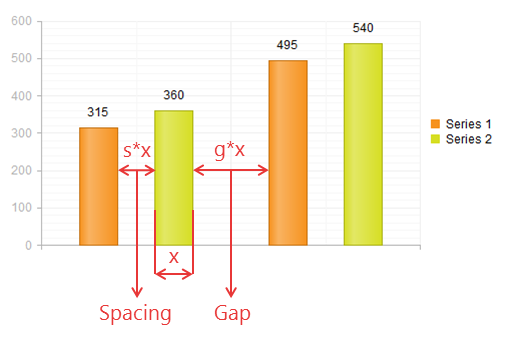

# Gap and Spacing


The __Gap__ and __Spacing__ properties for __BarSeries__, __ColumnSeries__and __RadarColumnSeries__ let you configure the gaps between the series categories and the spacing between the chart series items. Telerik introduced these properties in Q1 2014.

## 

The __Gap__ and __Spacing__ properties of the chart series control the distance between the series items,visualized in the PlotArea of the chart (__Figure 1__):

* __Gap__ - The distance between the series categories as a proportion of the width of a single series item.

* __Spacing__ - The space between the series items in one series category as a proportion of the width of a single series item.
>caption Figure 1: Configuring Gap and Spacing in a Column chart. 'g' and 's' are the values of Gap and Spacing respectively and 'x' is the widthof the series item. For this chart g = 2 and s = 1.



__Figure 1__ shows the rendered chart demonstrated in __Example 1__. Note how the gap is two times the width of the column item and the spacing has the same width, which corresponds to the values in the example.

As shown in __Example 1__, you configure the values of __Gap__ and __Spacing__ for the whole chart __in the first series__ and they are applied for all categories and series items.

__Example 1__: Configuring Gap and Spacing in a Column chart.

````ASPNET
	    <telerik:RadHtmlChart runat="server" ID="RadHtmlChart1" Width="500" Height="250">
	        <PlotArea>
	            <XAxis Color="#b3b3b3">
	                <MajorGridLines Color="#EFEFEF"></MajorGridLines>
	                <MinorGridLines Color="#F7F7F7"></MinorGridLines>
	            </XAxis>
	            <YAxis Color="#b3b3b3">
	                <MajorGridLines Color="#EFEFEF"></MajorGridLines>
	                <MinorGridLines Color="#F7F7F7"></MinorGridLines>
	            </YAxis>
	            <Series>
	                <telerik:ColumnSeries Name="Series 1" Gap="2" Spacing="1" >
	                    <SeriesItems>
	                        <telerik:CategorySeriesItem Y="315"></telerik:CategorySeriesItem>
	                        <telerik:CategorySeriesItem Y="495"></telerik:CategorySeriesItem>
	                    </SeriesItems>
	                </telerik:ColumnSeries>
	                <telerik:ColumnSeries Name="Series 2">
	                    <SeriesItems>
	                        <telerik:CategorySeriesItem Y="360"></telerik:CategorySeriesItem>
	                        <telerik:CategorySeriesItem Y="540"></telerik:CategorySeriesItem>
	                    </SeriesItems>
	                </telerik:ColumnSeries>
	            </Series>
	        </PlotArea>
	    </telerik:RadHtmlChart>
	
````


>note The __Gap__ and __Spacing__ properties can be configured only for[BarSeries](),[ColumnSeries]()and[RadarColumnSeries]().
>


# See Also

 * [RadHtmlChart Configuring Series]()

 * [RadHtmlChart BarSeries]()

 * [RadHtmlChart ColumnSeries]()

 * [RadHtmlChart RadarColumnSeries]()
