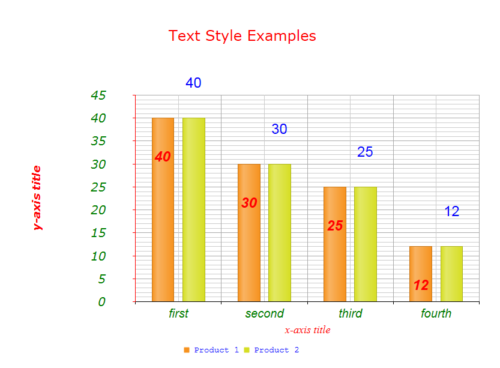

# Labels and Titles Font Settings


This Help article describes how to set a number of properties that let you change the fonts, colors, size, margin, etc., of labels, titles, and legends in a	__RadHtmlChart__. __Example 1__ shows how to set four different fonts plus different colors and size, eventually creating	__Figure 1__.

## Setting Text Styles for Titles and Labels

As of Q1 2013, __RadHtmlChart__ exposes a number of properties that control the fonts and appearance of the various labelsthe control renders:

* Axis labels

* Axis titles

* Chart legend

* Chart title

* Series labels

The object that exposes these properties is located under __<element>.Appearance.TextStyle__. All of these labels expose a common set of properties:

* __Bold__ - A Boolean value that indicates whether the text will be __bold__.

* __Color__ - A string representing the color of the text. It can take a common color name or a hex value (e.g., "red", "#ff0000") when set in the markup and a value of type __System.Drawing.Color__ when set in the code behind.

* __FontFamily__ - A string representing the font-family of the text. More information is available in thenext section, *using the FontFamily property*).

* __FontSize__ - An integer for the font size of the text in pixels.

* __Italic__ - A Boolean value that indicates whether the text will be *italic*.

* __Margin__ - Takes from one to four integers that specifyall the labels' margins in pixels. For example:

* __Margin="15"__ - All four margins are 15px.

* __Margin="15 30"__ - Top and bottom margins are 15px, right and left margins are 30px.

* __Margin="15 30 45"__ - Top margin is 15px, right and left margins are 30px,	bottom margin is 45px.

* __Margin="15 30 45 60"__ - Top margin is 15px, right margin is 30px,	bottom margin is 45px, left margin is 60px;

* __Padding__ - Takes from one to four integers that specifyall the labels' paddings in pixels (see Margin property above).
>caption Figure 1: An HtmlChart with different fonts, sizes, colors, margins and padding.



__Example 1__: This example shows how to set fonts, colors and size for labels, the legend and title of the Column chart in__Figure 1__.

````ASPNET
		<telerik:RadHtmlChart runat="server" ID="TextStyleExamples" Width="800" Height="600">
			<ChartTitle Text="Text Style Examples">
				<Appearance>
					<TextStyle Color="Red" FontSize="24" FontFamily="Verdana" Margin="11" Padding="22" />
				</Appearance>
			</ChartTitle>
			<Legend>
				<Appearance Position="Bottom">
					<TextStyle FontSize="14" Color="Blue" FontFamily="Courier New, sans-serif" />
				</Appearance>
			</Legend>
			<PlotArea>
				<Series>
					<telerik:ColumnSeries Name="Product 1">
						<SeriesItems>
							<telerik:CategorySeriesItem X="10" Y="40" />
							<telerik:CategorySeriesItem X="20" Y="30" />
							<telerik:CategorySeriesItem X="15" Y="25" />
							<telerik:CategorySeriesItem X="30" Y="12" />
						</SeriesItems>
						<LabelsAppearance Position="InsideEnd">
							<TextStyle Color="Red" FontFamily="Arial" FontSize="24" Padding="10" Bold="true"
								Italic="true" Margin="40" />
						</LabelsAppearance>
					</telerik:ColumnSeries>
					<telerik:ColumnSeries Name="Product 2">
						<SeriesItems>
							<telerik:CategorySeriesItem X="10" Y="40" />
							<telerik:CategorySeriesItem X="20" Y="30" />
							<telerik:CategorySeriesItem X="15" Y="25" />
							<telerik:CategorySeriesItem X="30" Y="12" />
						</SeriesItems>
						<LabelsAppearance>
							<TextStyle Color="Blue" FontFamily="Arial" FontSize="24" Padding="40" />
						</LabelsAppearance>
					</telerik:ColumnSeries>
				</Series>
				<XAxis Color="Black">
					<Items>
						<telerik:AxisItem LabelText="first" />
						<telerik:AxisItem LabelText="second" />
						<telerik:AxisItem LabelText="third" />
						<telerik:AxisItem LabelText="fourth" />
					</Items>
					<LabelsAppearance>
						<TextStyle Color="Green" FontFamily="Arial" Italic="true" FontSize="20" />
					</LabelsAppearance>
					<TitleAppearance Text="x-axis title">
						<TextStyle Color="REd" FontFamily="Times New Roman" Italic="true" FontSize="18" />
					</TitleAppearance>
				</XAxis>
				<YAxis Color="Red">
					<LabelsAppearance>
						<TextStyle Color="Green" FontFamily="Verdana" Italic="true" FontSize="20" Padding="20"
							Margin="20" />
					</LabelsAppearance>
					<TitleAppearance Text="y-axis title">
						<TextStyle Color="Red" FontFamily="VERDANA" Italic="true" FontSize="18" Bold="true"
							Padding="20" Margin="20" />
					</TitleAppearance>
				</YAxis>
			</PlotArea>
		</telerik:RadHtmlChart>
````


## Using the FontFamily Property

Use the __FontFamily__ property to set the font of the text in the [	chart title, chart legend](),[XAxis/YAxis title, XAxis/YAxis labels](),and [SeriesItems labels](). You can set the __FontFamily__ property throughthe __TextStyle__ property each of these elements exposes using the following syntax:

__Font1,Font2,Font3__ (e.g. __FontFamily="Times New Roman,Arial,serif"__).

Use the __FontSize__ property under __TextStyle__ to set the desired size of the font.It always works together with the __FontFamily__ property to create the final settings for the font.


>caption Table 1: The default font settings for different RadHtmlChart elements.

| HtmlChart Property | Default Font |
| ------ | ------ |
|Chart title|16px Arial,Helvetica,sans-serif|
|XAxis/YAxis title|16px Arial,Helvetica,sans-serif|
|Chart legend|12px Arial,Helvetica,sans-serif|
|XAxis/YAxis labels|12px Arial,Helvetica,sans-serif|
|Series Items labels|12px Arial,Helvetica,sans-serif|

* The property holds several font names that act as a "fallback" system. This means that if the browser does not support thefirst font, it will try the next one. If none of the listed fonts are available, the browser will use its own default font.

* The last font can be of [generic-family type](http://en.wikipedia.org/wiki/Font_family_%28HTML%29#Generic_fonts) (e.g. serif, sans serif, cursive, etc.), so that the browser can pick a similar font in the generic family,in case the other one is unavailable.

You can se the __FontFamily__ property in the markup or in the code-behind, for example:

* RadHtmlChart1.PlotArea.XAxis.TitleAppearance.TextStyle.FontFamily = "Calibri,Arial,serif"*

# See Also

 * [Basic Configuration]()

 * [Axes Configuration]()

 * [Series Configuration]()

 * [Font family (HTML)](http://en.wikipedia.org/wiki/Font_family_%28HTML%29#Generic_fonts)

 * [Column Chart]()

 * [Handle Special Symbols]()
