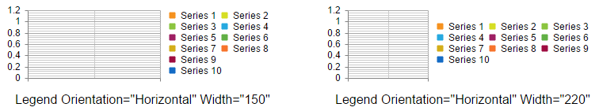
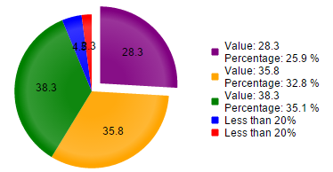

# Legend Settings

This help article discusses how to configure the chart legend.

* [Appearance](#appearance)
* [Position and Alignment](#position-and-alignment)
* [Orientation](#orientation)
* [Client Templates](#client-templates)
* [Visual Templates]()
* [Troubleshooting (*Legend is not visible*)](#legend-is-not-visible)

## Appearance

You can control the background color of the legend with the `Legend.Appearance.BackgroundColor` property. To control the color and the font of the text you can use the `Legend.Appearance.TextStyle` inner property (**Example 1**).

You can find all the available options for the `TextStyle` inner property in the [Labels and Titles Font Settings]() help article.

>caption **Figure 1**: Chart legend with customized background and text styles.


>caption **Example 1**: Configure the appearance of the chart legend.

````ASP.NET
<telerik:RadHtmlChart ID="RadHtmlChart1" runat="server" Width="350" Height="150">
	<Legend>
		<Appearance BackgroundColor="Blue">
			<TextStyle Color="Red" FontFamily="Segoe UI" FontSize="20" Italic="true" />
		</Appearance>
	</Legend>
</telerik:RadHtmlChart>
````
````C#
protected void Page_Init(object sender, EventArgs e)
{
	int seriesNum = 2;
	for (int i = 1; i <= seriesNum; i++)
	{
		ColumnSeries cs1 = new ColumnSeries() { Name = "Series " + i };
		cs1.SeriesItems.Add(new CategorySeriesItem() { Y = 1 });
		RadHtmlChart1.PlotArea.Series.Add(cs1);
	}
}
````
````VB
Protected Sub Page_Init(sender As Object, e As EventArgs)
	Dim seriesNum As Integer = 2
	For i As Integer = 1 To seriesNum
		Dim cs1 As New ColumnSeries() With { _
			Key .Name = "Series " & i _
		}
		cs1.SeriesItems.Add(New CategorySeriesItem() With { _
			Key .Y = 1 _
		})
		RadHtmlChart1.PlotArea.Series.Add(cs1)
	Next
End Sub
````

The color of the markers is automatically detected from the series colors.

>tip To change the type, size and color of the legend markers you can:
* Use [visual templates]().
* Use the workaround from the following feedback item [ADD more legend markers options in RadHtmlChart](https://feedback.telerik.com/Project/108/Feedback/Details/123802).

## Position and Alignment

You can control the position and the alignment of the legend with the following properties exposed by the `Legend.Appearance` tag:

* `Position` - The position of the chart, relative to the plot area (**Example 2**). The supported values are:
 * `Top` - The legend is positioned on the top of the chart area.
 * `Bottom` - The legend is positioned on the bottom of the chart area.
 * `Left` - The legend is positioned on the left of the chart area.
 * `Right` - The legend is positioned on the right of the chart area.
 * `Custom` - The legend can be positioned on a custom position through the `OffsetX` and `OffsetY` properties.
* `Align` - The alignment of the legend, relative to the position (**Example 2**). When the legend is `Top` or `Bottom` positioned it can be horizontally aligned. When the legend is `Left` or `Right` positioned in can be vertically aligned. The supported values are:
 * `Start` - The legend is left or top aligned according to its position.
 * `End` - The legend is right or bottom aligned according to its position.
 * `Center` - The legend is centered according to its position.
* `OffsetX` - The x offset of the legend. The x value is relative to the current position of the legend. A positive and negative value can be set.
* `OffsetY` - The y offset of the legend. The y value is relative to the current position of the legend. A positive and negative value can be set.

>caption **Figure 2**: Legend with `Position`=`Bottom` and `Align`=`End`.


>caption **Example 2**: The code that creates **Figure 2**.

````ASP.NET
<telerik:RadHtmlChart ID="RadHtmlChart1" runat="server" Width="350" Height="150">
	<Legend>
		<Appearance Position="Bottom" Align="End">
		</Appearance>
	</Legend>
</telerik:RadHtmlChart>
````
````C#
protected void Page_Init(object sender, EventArgs e)
{
	int seriesNum = 2;
	for (int i = 1; i <= seriesNum; i++)
	{
		ColumnSeries cs1 = new ColumnSeries() { Name = "Series " + i };
		cs1.SeriesItems.Add(new CategorySeriesItem() { Y = 1 });
		RadHtmlChart1.PlotArea.Series.Add(cs1);
	}
}
````
````VB
Protected Sub Page_Init(sender As Object, e As EventArgs)
	Dim seriesNum As Integer = 2
	For i As Integer = 1 To seriesNum
		Dim cs1 As New ColumnSeries() With { _
			Key .Name = "Series " & i _
		}
		cs1.SeriesItems.Add(New CategorySeriesItem() With { _
			Key .Y = 1 _
		})
		RadHtmlChart1.PlotArea.Series.Add(cs1)
	Next
End Sub
````

## Orientation

The `Legend.Appearance.Orientation` property lets you distribute the legend items vertically or horizontally. You can also define distribution constraints by setting particular dimensions for the legend via the `Legend.Appearance.Width` and `Legend.Appearance.Height` properties.

* `Orientation` - The orientation of the legend items.
 * `Horizontal` - Legend items are added horizontally.
 * `Vertical` - Legend items are added vertically.
* `Width` - The legend width when the legend orientation is set to `Horizontal`.
* `Height` - The legend height when the legend orientation is set to `Vertical`.

You can see the difference of both orientations with different legend dimensions in **Figure 3** and **Figure 4**.

>caption **Figure 3**: Compare the legend of two charts with horizontal orientation and different width.


>caption **Example 3**: The code that creates **Figure 3**.

````ASP.NET
<telerik:RadHtmlChart ID="RadHtmlChart1" runat="server" Width="350" Height="150">
	<Legend>
		<Appearance Orientation="Horizontal" Width="150">
		</Appearance>
	</Legend>
	<ChartTitle Text='Legend Orientation="Horizontal" Width="150"'>
		<Appearance Position="Bottom" Align="Left"></Appearance>
	</ChartTitle>
</telerik:RadHtmlChart>
<telerik:RadHtmlChart ID="RadHtmlChart2" runat="server" Width="350" Height="150">
	<Legend>
		<Appearance Orientation="Horizontal" Width="220">
		</Appearance>
	</Legend>
	<ChartTitle Text='Legend Orientation="Horizontal" Width="220"'>
		<Appearance Position="Bottom" Align="Left"></Appearance>
	</ChartTitle>
</telerik:RadHtmlChart>
````
````C#
protected void Page_Init(object sender, EventArgs e)
{
	int seriesNum = 10;
	for (int i = 1; i <= seriesNum; i++)
	{
		ColumnSeries cs1 = new ColumnSeries() { Name = "Series " + i };
		RadHtmlChart1.PlotArea.Series.Add(cs1);
		RadHtmlChart2.PlotArea.Series.Add(cs1);
	}
}
````
````VB
Protected Sub Page_Init(sender As Object, e As EventArgs)
	Dim seriesNum As Integer = 10
	For i As Integer = 1 To seriesNum
		Dim cs1 As New ColumnSeries() With { _
			Key .Name = "Series " & i _
		}
		RadHtmlChart1.PlotArea.Series.Add(cs1)
		RadHtmlChart2.PlotArea.Series.Add(cs1)
	Next
End Sub
````

>caption **Figure 4**: Compare the legend of two charts with vertical orientation and different height.


>caption **Example 4**: The code that creates **Figure 4**.

````ASP.NET
<telerik:RadHtmlChart ID="RadHtmlChart1" runat="server" Width="350" Height="150">
	<Legend>
		<Appearance Orientation="Vertical" Height="90">
		</Appearance>
	</Legend>
	<ChartTitle Text='Legend Orientation="Vertical" Height="90"'>
		<Appearance Position="Bottom" Align="Left"></Appearance>
	</ChartTitle>
</telerik:RadHtmlChart>
<telerik:RadHtmlChart ID="RadHtmlChart2" runat="server" Width="350" Height="150">
	<Legend>
		<Appearance Orientation="Vertical" Height="80">
		</Appearance>
	</Legend>
	<ChartTitle Text='Legend Orientation="Vertical" Height="80"'>
		<Appearance Position="Bottom" Align="Left"></Appearance>
	</ChartTitle>
</telerik:RadHtmlChart>
````
````C#
protected void Page_Init(object sender, EventArgs e)
{
	int seriesNum = 10;
	for (int i = 1; i <= seriesNum; i++)
	{
		ColumnSeries cs1 = new ColumnSeries() { Name = "Series " + i };
		RadHtmlChart1.PlotArea.Series.Add(cs1);
		RadHtmlChart2.PlotArea.Series.Add(cs1);
	}
}
````
````VB
Protected Sub Page_Init(sender As Object, e As EventArgs)
	Dim seriesNum As Integer = 10
	For i As Integer = 1 To seriesNum
		Dim cs1 As New ColumnSeries() With { _
			Key .Name = "Series " & i _
		}
		RadHtmlChart1.PlotArea.Series.Add(cs1)
		RadHtmlChart2.PlotArea.Series.Add(cs1)
	Next
End Sub
````

## Client Templates

You can use client-side templates to display custom text in the legend labels since the **Q2 2016** release. 

The functionality is available through the `ClientTemplate` inner property exposed by the `Legend.Appearance` tag. The fields that can be used inside the template are available in the [legend.labels.template](https://docs.telerik.com/kendo-ui/api/javascript/dataviz/ui/chart#configuration-legend.labels.template) article.

>tip You can also execute JavaScript in the `ClientTemplate`. More information is available in the [Execute JavaScript with a ClientTemplate]() article.

>caption **Figure 5**: You can define client templates for the legend labels.


>caption **Example 5**: Configure a sample client template for the legend.

````ASP.NET
<telerik:RadHtmlChart runat="server" ID="PieChart1" Width="400px" Height="400px">
	<Legend>
		<Appearance>
			<ClientTemplate>
				#if(value > 20){# 
						Value: #=value# \n
						Percentage: #=kendo.format(\'{0:P1}\',percentage)#
					#} else {# Less than 20% #}
				#
			</ClientTemplate>
		</Appearance>
	</Legend>
	<PlotArea>
		<Series>
			<telerik:PieSeries>
				<SeriesItems>
					<telerik:PieSeriesItem BackgroundColor="Purple" Exploded="true" Name="Internet Explorer" Y="28.3" />
					<telerik:PieSeriesItem BackgroundColor="Orange" Exploded="false" Name="Firefox" Y="35.8" />
					<telerik:PieSeriesItem BackgroundColor="Green" Exploded="false" Name="Chrome" Y="38.3" />
					<telerik:PieSeriesItem BackgroundColor="Blue" Exploded="false" Name="Safari" Y="4.5" />
					<telerik:PieSeriesItem BackgroundColor="Red" Exploded="false" Name="Opera" Y="2.3" />
				</SeriesItems>
				<LabelsAppearance Position="Center"></LabelsAppearance>
			</telerik:PieSeries>
		</Series>
	</PlotArea>
</telerik:RadHtmlChart>
````

## See Also

 * [Labels and Titles Font Settings]()
 
 * [Visual Templates]()
 
 * [ADD more legend markers options in RadHtmlChart](https://feedback.telerik.com/Project/108/Feedback/Details/123802)
 
 * [legend.labels.template](https://docs.telerik.com/kendo-ui/api/javascript/dataviz/ui/chart#configuration-legend.labels.template) 
 
 * [Execute JavaScript with a ClientTemplate]()

