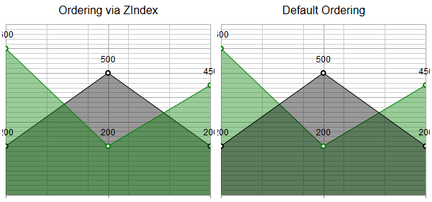

# Order Series via ZIndex Property

As of **Q1 2015** the **RadHtmlChart** series items expose the **ZIndex** property with which you can define a specific ordering defined by the numeric value assigned.

>caption Figure 1: Examines the difference between the default and the predefined (via ZIndex) ordering.



## Defining the Series’ Ordering

Using the **ZIndex** property of a **Series** item can change the default ordering of the series in the chart,i.e., one that is shown below, to be instructed to overlay the other series. The logic behind is based on simple	numeric value rules. Which means that the series with the greatest **ZIndex** value will be shown above all.

You can see in **Example 1** the markup that generates the charts in **Figure 1**. As shown in the first chart (Ordering via ZIndex), *GreenSeries* is rendered above *BlackSeries*. This is because the **ZIndex** property of the *GreenSeries*	is set to 2, whereas the one	of the *BlackSeries* to 1. As for the second chart, you can see that the BlackSeries is displayed on top, because as per to default	rendering, the first series added to the Series collection is the one to show on top.

````ASP.NET
<telerik:RadHtmlChart runat="server" ID="AreaChart1" Width="300" Height="300">
	<ChartTitle Text="Ordering via ZIndex">
	</ChartTitle>
	<PlotArea>
		<Series>
			<telerik:AreaSeries Name="BlackSeries" ZIndex="1">
				<Appearance>
					<FillStyle BackgroundColor="Black" />
				</Appearance>
				<SeriesItems>
					<telerik:CategorySeriesItem Y="200" />
					<telerik:CategorySeriesItem Y="500" />
					<telerik:CategorySeriesItem Y="200" />
				</SeriesItems>
			</telerik:AreaSeries>
			<telerik:AreaSeries Name="GreenSeries" ZIndex="2">
				<Appearance>
					<FillStyle BackgroundColor="Green" />
				</Appearance>
				<SeriesItems>
					<telerik:CategorySeriesItem Y="600" />
					<telerik:CategorySeriesItem Y="200" />
					<telerik:CategorySeriesItem Y="450" />
				</SeriesItems>
			</telerik:AreaSeries>
		</Series>
		<YAxis Visible="false">
		</YAxis>
	</PlotArea>
	<Legend>
		<Appearance Visible="false"></Appearance>
	</Legend>
</telerik:RadHtmlChart>

<telerik:RadHtmlChart runat="server" ID="AreaChart2" Width="300" Height="300">
	<ChartTitle Text="Default Ordering">
	</ChartTitle>
	<PlotArea>
		<Series>
			<telerik:AreaSeries Name="BlackSeries">
				<Appearance>
					<FillStyle BackgroundColor="Black"/>
				</Appearance>
				<SeriesItems>
					<telerik:CategorySeriesItem Y="200" />
					<telerik:CategorySeriesItem Y="500" />
					<telerik:CategorySeriesItem Y="200" />
				</SeriesItems>
			</telerik:AreaSeries>
			<telerik:AreaSeries Name="GreenSeries" >
				<Appearance>
					<FillStyle BackgroundColor="Green"/>
				</Appearance>
				<SeriesItems>
					<telerik:CategorySeriesItem Y="600" />
					<telerik:CategorySeriesItem Y="200" />
					<telerik:CategorySeriesItem Y="450" />
				</SeriesItems>
			</telerik:AreaSeries>
		</Series>
		<YAxis Visible="false">
		</YAxis>
	</PlotArea>
	<Legend>
		<Appearance Visible="false"></Appearance>
	</Legend>
</telerik:RadHtmlChart>
````

## See Also

 * [RadHtmlChart Structure]()
