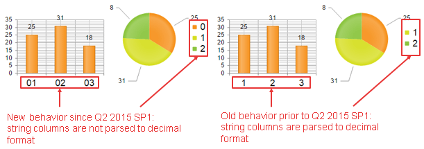
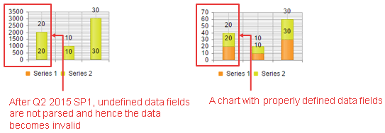

# Data Source String Fields Are Not Parsed to Decimal

As of **Q2 2015 SP1**, **RadHtmlChart** doesn't try to automatically parse string fields from the data source to a decimal format. This change may lead to the cases described below.

* [XAxis and Legend Labels Are Not 'TryParsed' to Decimal](#xaxis-and-legend-labels-are-not-tryparsed-to-decimal)

* [Incorrect Data Rendering When Data Source Field Types Are Not Defined](#incorrect-data-rendering-when-data-source-field-types-are-not-defined)

>important You should always define the type of the data source fields so that the chart can properly process and render the data.

## XAxis and Legend Labels Are Not 'TryParsed' to Decimal

If the chart's category x-axis refers to a string type column from the data source that can be parsed to a decimal format, it will be handled as a string and the labels displayed will not be parsed.

The old ([incorrect](https://feedback.telerik.com/Project/108/Feedback/Details/122627)) and the new behavior of the control are illustrated with the code from **Example 1** and you can see the difference in **Figure 1**.

>caption Figure 1: String columns from the data source that can be parsed to a decimal format will be displayed as strings.



>caption Example 1: Binding RadHtmlChart to a DataTable that contains a string column whose values can be parsed to a decimal format. These values are not parsed by RadHtmlChart.

````ASP.NET
<telerik:RadHtmlChart ID="ColumnChart1" runat="server" Width="200px" Height="150px">
	<PlotArea>
		<Series>
			<telerik:ColumnSeries DataFieldY="yValues">
			</telerik:ColumnSeries>
		</Series>
		<XAxis DataLabelsField="xItems">
			<LabelsAppearance>
				<TextStyle FontSize="18" />
			</LabelsAppearance>
		</XAxis>
	</PlotArea>
</telerik:RadHtmlChart>

<telerik:RadHtmlChart runat="server" ID="PieChart1" Width="200px" Height="200px">
	<PlotArea>
		<Series>
			<telerik:PieSeries DataFieldY="yValues" NameField="legendItems">
			</telerik:PieSeries>
		</Series>
	</PlotArea>
	<Legend>
		<Appearance>
			<TextStyle FontSize="18" />
		</Appearance>
	</Legend>
</telerik:RadHtmlChart>
````

````C#
protected void Page_Load(object sender, EventArgs e)
{
	PieChart1.DataSource = GetData();
	PieChart1.DataBind();

	ColumnChart1.DataSource = GetData();
	ColumnChart1.DataBind();
}

protected DataTable GetData()
{
	DataTable dt = new DataTable();

	dt.Columns.Add("yValues", typeof(int));
	dt.Columns.Add("xItems", typeof(string));
	dt.Columns.Add("legendItems", typeof(string));

	dt.Rows.Add(25, "01", "0");
	dt.Rows.Add(31, "02", "1");
	dt.Rows.Add(18, "03", "2");

	return dt;
}
````
````VB
Protected Sub Page_Load(sender As Object, e As EventArgs)
	PieChart1.DataSource = GetData()
	PieChart1.DataBind()

	ColumnChart1.DataSource = GetData()
	ColumnChart1.DataBind()
End Sub

Protected Function GetData() As DataTable
	Dim dt As New DataTable()

	dt.Columns.Add("yValues", GetType(Integer))
	dt.Columns.Add("xItems", GetType(String))
	dt.Columns.Add("legendItems", GetType(String))

	dt.Rows.Add(25, "01", "0")
	dt.Rows.Add(31, "02", "1")
	dt.Rows.Add(18, "03", "2")

	Return dt
End Function
````

## Incorrect Data Rendering When Data Source Field Types Are Not Defined

As of **Q2 2015 SP1**, if data source fields types are not defined, the data may not be properly processed and rendered by the chart.  You can see the difference in **Figure 2** and the code that creates the image in **Example 2**.

>caption Figure 2: Data is not rendered properly if the data source field type is not defined.



>caption Example 2: Binding RadHtmlChart to a DataTable that contains a field without type defined. This scenario is not supported by RadHtmlChart and you should always define the field/column types.

````C#
protected void Page_Init(object sender, EventArgs e)
{
	DataTable dt = new DataTable();

	//Field type is not defined - the chart is rendered incorrectly
	dt.Columns.Add("yValues");

	//Field type is defined - the chart is rendered correctly
	//dt.Columns.Add("yValues", typeof(int));

	dt.Rows.Add(20);
	dt.Rows.Add(10);
	dt.Rows.Add(30);

	RadHtmlChart1.DataSource = dt;
	RadHtmlChart1.DataBind();
}
````
````VB
Protected Sub Page_Init(sender As Object, e As EventArgs)
	Dim dt As New DataTable()

	'Field type is not defined - the chart is rendered incorrectly
	dt.Columns.Add("yValues")

	'Field type is defined - the chart is rendered correctly
	'dt.Columns.Add("yValues", typeof(int));

	dt.Rows.Add(20)
	dt.Rows.Add(10)
	dt.Rows.Add(30)

	RadHtmlChart1.DataSource = dt
	RadHtmlChart1.DataBind()
End Sub
````

````ASP.NET
<telerik:RadHtmlChart ID="RadHtmlChart1" runat="server" Width="200px" Height="150px">
	<PlotArea>
		<Series>
			<telerik:ColumnSeries Name="Series 1" Stacked="true" DataFieldY="yValues"></telerik:ColumnSeries>
			<telerik:ColumnSeries Name="Series 2" DataFieldY="yValues"></telerik:ColumnSeries>
		</Series>
	</PlotArea>
	<Legend>
		<Appearance Position="Bottom"></Appearance>
	</Legend>
</telerik:RadHtmlChart>
````


## See Also

 * [Important Changes Regarding Data Binding DateTime Parsable String Fields]()

 * [Important Changes Regarding Series Declaration]()
 
