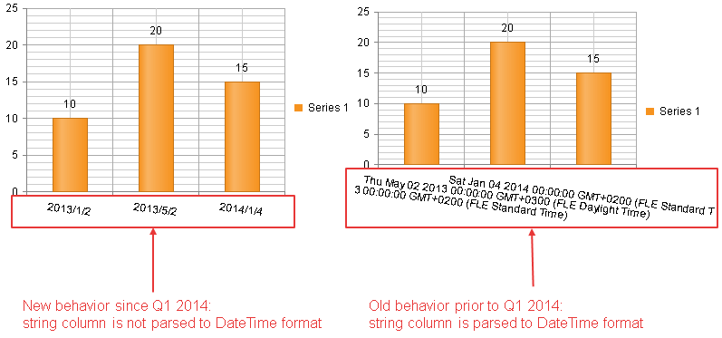

# Important Changes Regarding Data Binding DateTime Parsable String Fields


## 

As of the __Q1 2014__ release, __RadHtmlChart__ takes into account the type of the columns from the data sourcethat are bound to the chart. This means if the chart's category x-axis refers to a string type column from the data source that can be parsedto a DateTime format, it will be handled as a string and the labeled displayed will not be parsed.

The old and the new behavior of the control is illustrated with the code from __Example 1__ and is shown in__Figure 1__.
>caption Figure 1: String columns from the data source that can be parsed to a DateTime format will be displayed as strings.



__Example1:__ Data binding a DataTable data source that contains a string column that can be parsed to a DateTime format.

>tabbedCode

````ASPNET
		<telerik:RadHtmlChart runat="server" ID="RadHtmlChart1" Width="400" Height="250">
			<PlotArea>
				<Series>
					<telerik:ColumnSeries DataFieldY="yValues" Name="Series 1">
					</telerik:ColumnSeries>
				</Series>
				<XAxis DataLabelsField="dateValues" Type="category">
					<LabelsAppearance RotationAngle="7"></LabelsAppearance>
				</XAxis>
			</PlotArea>
		</telerik:RadHtmlChart>
````
````C#
		protected void Page_Load(object sender, EventArgs e)
		{
			RadHtmlChart1.DataSource = GetData();
			RadHtmlChart1.DataBind();
		}
	
		protected DataTable GetData()
		{
			DataTable dt = new DataTable();
			dt.Columns.Add(new DataColumn("yValues", typeof(int)));
			dt.Columns.Add(new DataColumn("dateValues", typeof(string)));
	
			dt.Rows.Add(new object[] { 10, "2013/1/2" });
			dt.Rows.Add(new object[] { 20, "2013/5/2" });
			dt.Rows.Add(new object[] { 15, "2014/1/4" });
	
			return dt;
		}
````
````VB
		Protected Sub Page_Load(sender As Object, e As EventArgs)
			RadHtmlChart1.DataSource = GetData()
			RadHtmlChart1.DataBind()
		End Sub
	
		Protected Function GetData() As DataTable
			Dim dt As New DataTable()
			dt.Columns.Add(New DataColumn("yValues", GetType(Integer)))
			dt.Columns.Add(New DataColumn("dateValues", GetType(String)))
	
			dt.Rows.Add(New Object() {10, "2013/1/2"})
			dt.Rows.Add(New Object() {20, "2013/5/2"})
	        dt.Rows.Add(New Object() {15, "2014/1/4"})
	
			Return dt
		End Function
````
>end

# See Also

 * [RadHtmlChart Date Axis]()

 * [RadHtmlChart Data Binding to a DataSet]()

 * [RadHtmlChart Important Changes Regarding Series Declaration]()
