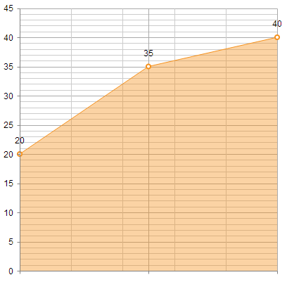

# Important Changes Regarding Series Declaration

The programmatic creation of series items in the **RadHtmlChart** control should be done via the **SeriesItems** collection. Telerik made the **Items** collection obsolete with the **Q2 2013** release.

Along with these changes, the respective series item object for each series type must be used. The corresponding series items for each series type are listed in **Table 1**.


>caption Table 1: List of series item objects for the corresponding series types.	

| Series type | Series item |
| ------ | ------ |
|Candlestick|telerik:CandlestickSeriesItem|
|Bar, Column, Area, Line|telerik:CategorySeriesItem|
|Scatter, ScatterLine|telerik:ScatterSeriesItem|
|Bubble|telerik:BubbleSeriesItem|
|Pie, Donut|telerik:PieSeriesItem|

**XValue**, **YValue**, **SizeValue** and **ToolTipValue** properties of the **SeriesItem** (now **CategorySeriesItem**, **PieSeriesItem**, **ScatterSeriesItem** or **BubbleSeriesItem**) have been renamed respectively to **X**, **Y**, **Size** and **ToolTip**.

>note In order to access the properties of the series in the code behind, the series should be converted explicitly to the respective series type.
>
Casting the first series to theAreaSeries class:
>
>**C#**
>`(RadHtmlChart1.PlotArea.Series[0] as AreaSeries).SeriesItems[0].Y = 10;`
>
>**VB**
>`(RadHtmlChart1.PlotArea.Series[0] as AreaSeries).SeriesItems[0].Y = 10`

## How to Configure Chart Series

You can find an example of how to configure a simple Area chart with the **SeriesItems** collection in the markup and the code behind in **Example 1**. The output from either setup can be seen in **Figure 1**.

>caption Figure 1: This chart can be rendered with the setup from Example 1 or Example 2.



>caption Example 1: Creation of the Area chart with the **SeriesItems** collection in the markup.

````ASP.NET
<telerik:radhtmlchart runat="server" id="Chart1" width="400">
	<PlotArea>
		<Series>
			<telerik:AreaSeries>
				<SeriesItems>
					<telerik:CategorySeriesItem Y="20" />
					<telerik:CategorySeriesItem Y="35" />
					<telerik:CategorySeriesItem Y="40" />
				</SeriesItems>
			</telerik:AreaSeries>
		</Series>
	</PlotArea>
</telerik:radhtmlchart>
````

The same result can be achieved programmatically by using the code in **Example 2**.

>caption Example 2: Programmatic creation of the Area chart with the **SeriesItems** collection.

````ASP.NET
<telerik:RadHtmlChart runat="server" ID="Chart1" Width="400">
	<PlotArea>
		<Series>
			<telerik:AreaSeries>
			</telerik:AreaSeries>
		</Series>
	</PlotArea>
</telerik:RadHtmlChart>
````
````C#
AreaSeries areaSeries = Chart1.PlotArea.Series[0] as AreaSeries;

areaSeries.SeriesItems.Add(20);
areaSeries.SeriesItems.Add(35);
areaSeries.SeriesItems.Add(40);
````
````VB
Dim areaSeries As AreaSeries
areaSeries = CType(Chart1.PlotArea.Series.Item(0), AreaSeries)

areaSeries.SeriesItems.Add(20)
areaSeries.SeriesItems.Add(35)
areaSeries.SeriesItems.Add(40)
````

## See Also

 * [Series Configuration]()

 * [Series Items Configuration]()

 * [Introducing the SeriesItems Collection in RadHtmlChart for ASP.NET AJAX](http://www.telerik.com/blogs/introducing-the-seriesitems-collection-in-radhtmlchart-for-asp.net-ajax)
