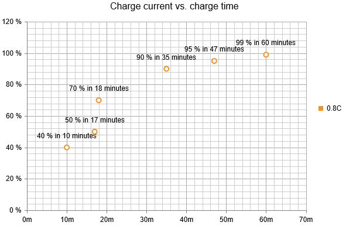

# Migrate Data Binding Configuration


This article illustrates how to migrate the configuration of data binding with discrete and continuous data from	__RadChart__ to __RadHtmlChart__. The examples illustrate how to migrate the data binding declaratively;	however, you can use the same classes and properties of the series and axis to programmatically migrate the configuration of the data binding.

## Data Binding Discrete Data

### Data Binding Discrete Data in RadChart

Data-bound specific properties in __RadChart__ are configured in the following objects:

* __XAxis__ - The object holds the corresponding x-axis related property -__DataLabelsColumn__.

* __ChartSeries__ - The object holds the corresponding y-axis related properties -__DataYColumn__, __DataYColumn2__,__DataYColumn3__ and __DataYColumn4__.

The code in __Example 1__ illustrates how to bind discrete data in a Candlestick series with __RadChart__and is shown in __Figure 1__.
>caption Figure 1: Display data-bound discrete data in a Candlestick series with RadChart.


__Example 1__: Configuring data binding of discrete data in a Candlestick series with __RadChart__.


````ASPNET
		<telerik:RadChart ID="RadChart1" runat="server" Width="600px" Height="400px">
			<Series>
				<telerik:ChartSeries Type="CandleStick" DataYColumn="OpenField" DataYColumn3="HighField" DataYColumn4="LowField" DataYColumn2="CloseField" Name="Company A">
					<Appearance>
						<LabelAppearance Visible="false"></LabelAppearance>
					</Appearance>
				</telerik:ChartSeries>
			</Series>
			<PlotArea>
				<XAxis DataLabelsColumn="DayField"></XAxis>
				<YAxis MinValue="24" MaxValue="30" AutoScale="false"></YAxis>
			</PlotArea>
			<ChartTitle TextBlock-Text="Daily Prices of Company A"></ChartTitle>
		</telerik:RadChart>
````
````C#
		protected void Page_Load(object sender, EventArgs e)
		{
			RadChart1.DataSource = GetData();
			RadChart1.DataBind();
		}
		protected DataTable GetData()
		{
			DataTable dt = new DataTable();
	
			dt.Columns.Add("ID", typeof(byte));
			dt.Columns.Add("OpenField", typeof(float));
			dt.Columns.Add("HighField", typeof(float));
			dt.Columns.Add("LowField", typeof(float));
			dt.Columns.Add("CloseField", typeof(float));
			dt.Columns.Add("DayField", typeof(string));
	
			dt.Rows.Add(1, 26.29, 26.93, 25.49, 26.00, "Mon");
			dt.Rows.Add(2, 26.30, 27.09, 25.20, 25.99, "Tue");
			dt.Rows.Add(3, 26.25, 27.18, 24.60, 26.87, "Wed");
			dt.Rows.Add(4, 26.68, 26.82, 26.06, 26.29, "Thu");
			dt.Rows.Add(5, 26.22, 28.15, 25.67, 27.91, "Fri");
			dt.Rows.Add(6, 27.25, 29.44, 27.01, 27.99, "Sat");
			dt.Rows.Add(7, 28.15, 28.15, 25.49, 26.76, "Sun");
	
			return dt;
		}
````
````VB
		Protected Sub Page_Load(sender As Object, e As EventArgs)
			RadChart1.DataSource = GetData()
			RadChart1.DataBind()
		End Sub
		Protected Function GetData() As DataTable
			Dim dt As New DataTable()
	
			dt.Columns.Add("ID", GetType(Byte))
			dt.Columns.Add("OpenField", GetType(Single))
			dt.Columns.Add("HighField", GetType(Single))
			dt.Columns.Add("LowField", GetType(Single))
			dt.Columns.Add("CloseField", GetType(Single))
			dt.Columns.Add("DayField", GetType(String))
	
			dt.Rows.Add(1, 26.29, 26.93, 25.49, 26.0, "Mon")
			dt.Rows.Add(2, 26.3, 27.09, 25.2, 25.99, "Tue")
			dt.Rows.Add(3, 26.25, 27.18, 24.6, 26.87, "Wed")
			dt.Rows.Add(4, 26.68, 26.82, 26.06, 26.29, "Thu")
			dt.Rows.Add(5, 26.22, 28.15, 25.67, 27.91, "Fri")
			dt.Rows.Add(6, 27.25, 29.44, 27.01, 27.99, "Sat")
			dt.Rows.Add(7, 28.15, 28.15, 25.49, 26.76, "Sun")
	
			Return dt
		End Function
````


### Data Binding Discrete Data in RadHtmlChart

Data-bound specific properties in __RadHtmlChart__ are configured in the following objects:

* __XAxis__ - The object holds the corresponding x-axis related property -__DataLabelsField__.

* __[Series Type]__ - The object holds the corresponding y-axis related properties.__RadHtmlChart__ exposes specific data-bound properties for each series type, which makes theconfiguration much easier and intuitive. __Table 1__ lists the corresponding data-boundproperties for each category series type.


>caption 	Table 1: List of data-bound properties for the corresponding category series types.

| Series Type | Series Data-bound Properties |
| ------ | ------ |
|Bar, Column, Area, Line|DataFieldY|
|Candlestick|DataOpenField, DataHighField, DataLowField, DataCloseField|
|Pie|DataFieldY|

The code in __Example 2__ illustrates how to bind discrete data in a Candlestick series with __RadHtmlChart__in __Figure 2__.
>caption Figure 2: Display data-bound discrete data in a Candlestick series with RadHtmlChart.


__Example 2__: Configuring data binding of discrete data in a Candlestick series with __RadHtmlChart__.


````ASPNET
		<telerik:RadHtmlChart ID="RadHtmlChart1" runat="server" Width="600px" Height="400px">
			<PlotArea>
				<Series>
					<telerik:CandlestickSeries DataOpenField="OpenField" DataHighField="HighField" DataLowField="LowField" DataCloseField="CloseField" Name="Company A"></telerik:CandlestickSeries>
				</Series>
				<XAxis DataLabelsField="DayField"></XAxis>
				<YAxis MinValue="24" MaxValue="30"></YAxis>
			</PlotArea>
			<ChartTitle Text="Daily Prices of Company A"></ChartTitle>
		</telerik:RadHtmlChart>
````
````C#
		protected void Page_Load(object sender, EventArgs e)
		{
			RadHtmlChart1.DataSource = GetData();
			RadHtmlChart1.DataBind();
		}
		protected DataTable GetData()
		{
			DataTable dt = new DataTable();
	
			dt.Columns.Add("ID", typeof(byte));
			dt.Columns.Add("OpenField", typeof(float));
			dt.Columns.Add("HighField", typeof(float));
			dt.Columns.Add("LowField", typeof(float));
			dt.Columns.Add("CloseField", typeof(float));
			dt.Columns.Add("DayField", typeof(string));
	
			dt.Rows.Add(1, 26.29, 26.93, 25.49, 26.00, "Mon");
			dt.Rows.Add(2, 26.30, 27.09, 25.20, 25.99, "Tue");
			dt.Rows.Add(3, 26.25, 27.18, 24.60, 26.87, "Wed");
			dt.Rows.Add(4, 26.68, 26.82, 26.06, 26.29, "Thu");
			dt.Rows.Add(5, 26.22, 28.15, 25.67, 27.91, "Fri");
			dt.Rows.Add(6, 27.25, 29.44, 27.01, 27.99, "Sat");
			dt.Rows.Add(7, 28.15, 28.15, 25.49, 26.76, "Sun");
	
			return dt;
		}
````
````VB
		Protected Sub Page_Load(sender As Object, e As EventArgs)
			RadHtmlChart1.DataSource = GetData()
			RadHtmlChart1.DataBind()
		End Sub
		Protected Function GetData() As DataTable
			Dim dt As New DataTable()
	
			dt.Columns.Add("ID", GetType(Byte))
			dt.Columns.Add("OpenField", GetType(Single))
			dt.Columns.Add("HighField", GetType(Single))
			dt.Columns.Add("LowField", GetType(Single))
			dt.Columns.Add("CloseField", GetType(Single))
			dt.Columns.Add("DayField", GetType(String))
	
			dt.Rows.Add(1, 26.29, 26.93, 25.49, 26.0, "Mon")
			dt.Rows.Add(2, 26.3, 27.09, 25.2, 25.99, "Tue")
			dt.Rows.Add(3, 26.25, 27.18, 24.6, 26.87, "Wed")
			dt.Rows.Add(4, 26.68, 26.82, 26.06, 26.29, "Thu")
			dt.Rows.Add(5, 26.22, 28.15, 25.67, 27.91, "Fri")
			dt.Rows.Add(6, 27.25, 29.44, 27.01, 27.99, "Sat")
			dt.Rows.Add(7, 28.15, 28.15, 25.49, 26.76, "Sun")
	
			Return dt
		End Function
````


## Data Binding Continuous Data

### Data Binding Continuous Data in RadChart

Data-bound specific properties in __RadChart__ are configured in the __ChartSeries__ object:

* The corresponding x-axis related properties are__DataXColumn__ and __DataXColumn2__.

* The corresponding y-axis related properties are__DataYColumn__, __DataYColumn2__,__DataYColumn3__ and __DataYColumn4__.

The code in __Example 3__ illustrates how to bind continuous data in a Point series with __RadChart__and is shown in __Figure 3__.
>caption Figure 3: Display data-bound continuous data in a Point series with RadChart.


__Example 3__: Configuring data binding of continuous data in a Point series with __RadChart__.


````ASPNET
		<telerik:RadChart ID="RadChart1" runat="server" Width="600px" Height="400px">
			<Series>
				<telerik:ChartSeries Type="Point" DataXColumn="xField" DataYColumn="yField" Name="0.8C" DefaultLabelValue="#Y{P0} in #X minutes">
				</telerik:ChartSeries>
			</Series>
			<PlotArea>
				<XAxis Appearance-CustomFormat="0#m"></XAxis>
				<YAxis Appearance-CustomFormat="0#%"></YAxis>
			</PlotArea>
			<ChartTitle TextBlock-Text="Charge current vs. charge time"></ChartTitle>
		</telerik:RadChart>
````
````C#
		protected void Page_Load(object sender, EventArgs e)
		{
			RadChart1.DataSource = GetData();
			RadChart1.DataBind();
		}
	
		protected DataTable GetData()
		{
			DataTable dt = new DataTable();
	
			dt.Columns.Add("ID", typeof(byte));
			dt.Columns.Add("xField", typeof(float));
			dt.Columns.Add("yField", typeof(float));
	
			dt.Rows.Add(1, 10, 0.40);
			dt.Rows.Add(2, 17, 0.50);
			dt.Rows.Add(3, 18, 0.70);
			dt.Rows.Add(4, 35, 0.90);
			dt.Rows.Add(5, 47, 0.95);
			dt.Rows.Add(6, 60, 0.99);
	
			return dt;
		}
````
````VB
		Protected Sub Page_Load(sender As Object, e As EventArgs)
			RadChart1.DataSource = GetData()
			RadChart1.DataBind()
		End Sub
	
		Protected Function GetData() As DataTable
			Dim dt As New DataTable()
	
			dt.Columns.Add("ID", GetType(Byte))
			dt.Columns.Add("xField", GetType(Single))
			dt.Columns.Add("yField", GetType(Single))
	
	        dt.Rows.Add(1, 10, 0.4)
	        dt.Rows.Add(2, 17, 0.5)
	        dt.Rows.Add(3, 18, 0.7)
	        dt.Rows.Add(4, 35, 0.9)
	        dt.Rows.Add(5, 47, 0.95)
	        dt.Rows.Add(6, 60, 0.99)
	
			Return dt
		End Function
	
````


### Data Binding Continuous Data in RadHtmlChart

Data-bound specific properties in __RadHtmlChart__ are configured in the __[Series Type]__ object.The series object holds the corresponding x-axis and y-axis related properties.__RadHtmlChart__ exposes specific data-bound properties for each series type, which makes theconfiguration much easier and intuitive. __Table 2__ lists the corresponding data-boundproperties for each numeric series type.


>caption 	Table 2: List of data-bound properties for the corresponding numeric series types.

| Series Type | Series Data-bound Properties |
| ------ | ------ |
|Scatter, ScatterLine|DataFieldY, DataFieldX|
|Bubble|DataFieldY, DataFieldX, DataFieldSize, DataFieldTooltip|

The code in __Example 4__ illustrates how to bind continuous data in a Scatter series with __RadHtmlChart__ as shown	in __Figure 4__.
>caption Figure 4: Display data-bound continuous data in a Scatter series with RadHtmlChart.



__Example 4__: Configuring data binding of continuous data in a Scatter series with __RadHtmlChart__.


````ASPNET
		<telerik:RadHtmlChart ID="RadHtmlChart1" runat="server" Width="600px" Height="400px">
			<PlotArea>
				<Series>
					<telerik:ScatterSeries DataFieldX="xField" DataFieldY="yField" Name="0.8C">
						<LabelsAppearance DataFormatString="{1:P0} in {0} minutes"></LabelsAppearance>
					</telerik:ScatterSeries>
				</Series>
				<XAxis>
					<LabelsAppearance DataFormatString="{0}m"></LabelsAppearance>
				</XAxis>
				<YAxis>
					<LabelsAppearance DataFormatString="{0:P0}"></LabelsAppearance>
				</YAxis>
			</PlotArea>
			<ChartTitle Text="Charge current vs. charge time"></ChartTitle>
		</telerik:RadHtmlChart>
````
````C#
		protected void Page_Load(object sender, EventArgs e)
		{
			RadHtmlChart1.DataSource = GetData();
			RadHtmlChart1.DataBind();
		}
	
		protected DataTable GetData()
		{
			DataTable dt = new DataTable();
	
			dt.Columns.Add("ID", typeof(byte));
			dt.Columns.Add("xField", typeof(float));
			dt.Columns.Add("yField", typeof(float));
	
			dt.Rows.Add(1, 10, 0.40);
			dt.Rows.Add(2, 17, 0.50);
			dt.Rows.Add(3, 18, 0.70);
			dt.Rows.Add(4, 35, 0.90);
			dt.Rows.Add(5, 47, 0.95);
			dt.Rows.Add(6, 60, 0.99);
	
			return dt;
		}
````
````VB
		Protected Sub Page_Load(sender As Object, e As EventArgs)
			RadHtmlChart1.DataSource = GetData()
			RadHtmlChart1.DataBind()
		End Sub
	
		Protected Function GetData() As DataTable
			Dim dt As New DataTable()
	
			dt.Columns.Add("ID", GetType(Byte))
			dt.Columns.Add("xField", GetType(Single))
			dt.Columns.Add("yField", GetType(Single))
	
	        dt.Rows.Add(1, 10, 0.4)
	        dt.Rows.Add(2, 17, 0.5)
	        dt.Rows.Add(3, 18, 0.7)
	        dt.Rows.Add(4, 35, 0.9)
	        dt.Rows.Add(5, 47, 0.95)
	        dt.Rows.Add(6, 60, 0.99)
	
			Return dt
		End Function
	
````


# See Also

 * [RadHtmlChart : Migrating Axes Configuration]()

 * [RadHtmlChart : Migrating Date Axis Configuration]()

 * [RadHtmlChart : Migrating Functionalities - Features and Series Types Parity]()

 * [RadHtmlChart : Migrating Series Configuration]()
