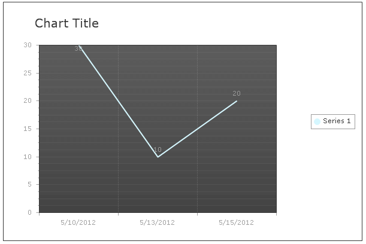
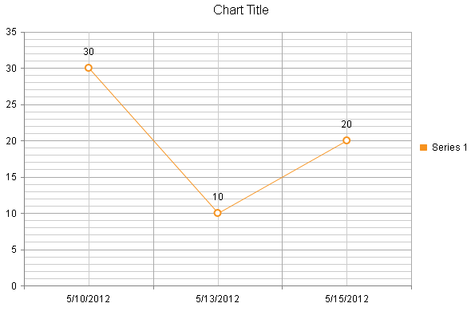
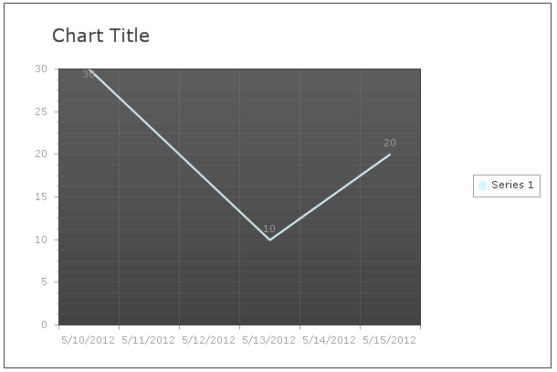
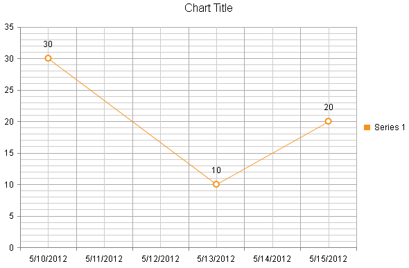

# Migrate Date Axis Configuration

The term date axis refers to an axis from a chart that can display discrete or continuous data in a DateTime type. This article illustrates how to migrate the configuration of date axis with discrete and continuous data from **RadChart** to **RadHtmlChart**. The examples illustrate how to migrate the date axes declaratively; however, the	same classes and properties of the axis can be used for the programmatic creation as well.

## Configuring Date Axis with Discrete Data

### Configuring Date Axis with Discrete Data in RadChart

**RadChart** doesn't support a date axis out of the box and therefore you must perform additional manipulations.

1. Convert the DateTime values to **ToOADate** format and then pass them to the XAxis' items.

1. Set the XAxis' **AutoScale** and **IsZeroBased** properties to **false**.

1. Choose an appropriate date **ValueFormat** for the XAxis (i.e., **ShortTime**, **ShortDate**, **LongTime** or **LongDate**).

1. You can set a desired **CustomFormat** for the XAxis (e.g., "M/dd/yyyy").

**Example 1** illustrates how to configure a date axis in **RadChart** that displays discrete data in **Figure 1**.

>caption Figure 1: Display discrete data with date axis in RadChart.



>caption Example 1: Configuring date axis in **RadChart** that displays discrete data.


````ASP.NET
<telerik:RadChart ID="RadChart1" runat="server" Width="600" Height="400">
	<PlotArea>
		<XAxis AutoScale="false" IsZeroBased="false" DataLabelsColumn="myXValues">
			<Appearance ValueFormat="ShortDate" CustomFormat="M/dd/yyyy">
			</Appearance>
		</XAxis>
	</PlotArea>
	<Series>
		<telerik:ChartSeries Type="Line" DataYColumn="myYValues" Name="Series 1">
		</telerik:ChartSeries>
	</Series>
	<ChartTitle TextBlock-Text="Chart Title">
	</ChartTitle>
</telerik:RadChart>
````
````C#
protected void Page_Load(object sender, EventArgs e)
{
	RadChart1.DataSource = ConvertColumnToODate(GetData(), "myXvalues");
	RadChart1.DataBind();
}
protected DataTable GetData()
{
	DataTable dt = new DataTable();

	dt.Columns.Add("ID");
	dt.Columns.Add("myYValues");
	dt.Columns.Add("myXValues");

	dt.Rows.Add(1, 30, new DateTime(2012, 05, 10));
	dt.Rows.Add(2, 10, new DateTime(2012, 05, 13));
	dt.Rows.Add(3, 20, new DateTime(2012, 05, 15));

	return dt;
}

protected DataTable ConvertColumnToODate(DataTable dt, string columnName)
{
	for (int i = 0; i < dt.Rows.Count; i++)
	{

		dt.Rows[i][columnName] = (DateTime.Parse(dt.Rows[i][columnName].ToString())).ToOADate();
	}
	return dt;
}
````
````VB
Protected Sub Page_Load(sender As Object, e As EventArgs)
	RadChart1.DataSource = ConvertColumnToODate(GetData(), "myXvalues")
	RadChart1.DataBind()
End Sub
Protected Function GetData() As DataTable
	Dim dt As New DataTable()

	dt.Columns.Add("ID")
	dt.Columns.Add("myYValues")
	dt.Columns.Add("myXValues")

	dt.Rows.Add(1, 30, New DateTime(2012, 5, 10))
	dt.Rows.Add(2, 10, New DateTime(2012, 5, 13))
	dt.Rows.Add(3, 20, New DateTime(2012, 5, 15))

	Return dt
End Function

Protected Function ConvertColumnToODate(dt As DataTable, columnName As String) As DataTable
	For i As Integer = 0 To dt.Rows.Count - 1

		dt.Rows(i)(columnName) = (DateTime.Parse(dt.Rows(i)(columnName).ToString())).ToOADate()
	Next
	Return dt
End Function
````

### Configuring Date Axis with Discrete Data in RadHtmlChart

**RadHtmlChart** does support date axis out of the box. The DateTime format of the x-axis items is automatically recognized and no additional configuration is needed.

1. In order to display discrete data in **RadHtmlChart** you must set the x-axis **Type** property to **Category**.

1. The format of the x-axis items labels is controlled through the **XAxis.LabelsAppearance.DataFormatString** property(e.g., **DataFormatString**="M/dd/yyyy").

**Example 2** illustrates how to configure a date axis in **RadHtmlChart** that displays discrete data in **Figure 2**.

>caption Figure 2: Display discrete data with date axis in RadHtmlChart.



>caption Example 2: Configuring date axis in **RadHtmlChart** that displays discrete data.


````ASP.NET
<telerik:RadHtmlChart ID="RadHtmlChart1" runat="server" Width="600" Height="400">
	<PlotArea>
		<XAxis Type="category" DataLabelsField="myXValues">
			<LabelsAppearance DataFormatString="M/dd/yyyy"></LabelsAppearance>
		</XAxis>
		<Series>
			<telerik:LineSeries DataFieldY="myYValues" Name="Series 1">
			</telerik:LineSeries>
		</Series>
	</PlotArea>
	<ChartTitle Text="Chart Title">
	</ChartTitle>
</telerik:RadHtmlChart>
````
````C#
protected void Page_Load(object sender, EventArgs e)
{
	RadHtmlChart1.DataSource = GetData();
	RadHtmlChart1.DataBind();
}
protected DataTable GetData()
{
	DataTable dt = new DataTable();

	dt.Columns.Add("ID");
	dt.Columns.Add("myYValues");
	dt.Columns.Add("myXValues");

	dt.Rows.Add(1, 30, new DateTime(2012, 05, 10));
	dt.Rows.Add(2, 10, new DateTime(2012, 05, 13));
	dt.Rows.Add(3, 20, new DateTime(2012, 05, 15));

	return dt;
}
````
````VB
Protected Sub Page_Load(sender As Object, e As EventArgs)
	RadHtmlChart1.DataSource = GetData()
	RadHtmlChart1.DataBind()
End Sub
Protected Function GetData() As DataTable
	Dim dt As New DataTable()

	dt.Columns.Add("ID")
	dt.Columns.Add("myYValues")
	dt.Columns.Add("myXValues")

	dt.Rows.Add(1, 30, New DateTime(2012, 5, 10))
	dt.Rows.Add(2, 10, New DateTime(2012, 5, 13))
	dt.Rows.Add(3, 20, New DateTime(2012, 5, 15))

	Return dt
End Function
````

## Configuring Date Axis with Continuous Data

### Configuring Date Axis with Continuous Data in RadChart

**RadChart** doesn't support a date axis out of the box and therefore you must perform additional manipulations.

1. Convert the DateTime values to **ToOADate** format and then pass them to the series item's X values.

1. Set the XAxis' **IsZeroBased** property to **false**.

1. Choose an appropriate date **ValueFormat** for the XAxis (i.e., **ShortTime**, **ShortDate**, **LongTime** or **LongDate**).

1. You can set a desired **CustomFormat** for the XAxis (e.g., "M/dd/yyyy").

1. If you want to set the XAxis' **MinValue** and **MaxValue** properties, you must also set the **AutoScale** property to **false**.

**Example 3** illustrates how to configure a date axis in **RadChart** that displays continuous data in **Figure 3**.

>caption Figure 3: Display continuous data with date axis in RadChart.



>caption Example 3: Configuring date axis in **RadChart** that displays continuous data.

````ASP.NET
<telerik:RadChart ID="RadChart1" runat="server" Width="600" Height="400">
	<PlotArea>
		<XAxis IsZeroBased="false">
			<Appearance ValueFormat="ShortDate" CustomFormat="M/dd/yyyy">
			</Appearance>
		</XAxis>
	</PlotArea>
	<Series>
		<telerik:ChartSeries Type="Line" DataYColumn="myYValues" DataXColumn="myXValues" Name="Series 1">
		</telerik:ChartSeries>
	</Series>
	<ChartTitle TextBlock-Text="Chart Title">
	</ChartTitle>
</telerik:RadChart>
````
````C#
protected void Page_Load(object sender, EventArgs e)
{
	RadChart1.DataSource = ConvertColumnToODate(GetData(), "myXvalues");
	RadChart1.DataBind();
}
protected DataTable GetData()
{
	DataTable dt = new DataTable();

	dt.Columns.Add("ID");
	dt.Columns.Add("myYValues");
	dt.Columns.Add("myXValues");

	dt.Rows.Add(1, 30, new DateTime(2012, 05, 10));
	dt.Rows.Add(2, 10, new DateTime(2012, 05, 13));
	dt.Rows.Add(3, 20, new DateTime(2012, 05, 15));

	return dt;
}

protected DataTable ConvertColumnToODate(DataTable dt, string columnName)
{
	for (int i = 0; i < dt.Rows.Count; i++)
	{

		dt.Rows[i][columnName] = (DateTime.Parse(dt.Rows[i][columnName].ToString())).ToOADate();
	}
	return dt;
}
````
````VB
Protected Sub Page_Load(sender As Object, e As EventArgs)
	RadChart1.DataSource = ConvertColumnToODate(GetData(), "myXvalues")
	RadChart1.DataBind()
End Sub
Protected Function GetData() As DataTable
	Dim dt As New DataTable()

	dt.Columns.Add("ID")
	dt.Columns.Add("myYValues")
	dt.Columns.Add("myXValues")

	dt.Rows.Add(1, 30, New DateTime(2012, 5, 10))
	dt.Rows.Add(2, 10, New DateTime(2012, 5, 13))
	dt.Rows.Add(3, 20, New DateTime(2012, 5, 15))

	Return dt
End Function

Protected Function ConvertColumnToODate(dt As DataTable, columnName As String) As DataTable
	For i As Integer = 0 To dt.Rows.Count - 1

		dt.Rows(i)(columnName) = (DateTime.Parse(dt.Rows(i)(columnName).ToString())).ToOADate()
	Next
	Return dt
End Function
````


### Configuring Date Axis with Continuous Data in RadHtmlChart

**RadHtmlChart** does support date axis out of the box. The DateTime format of the x-axis items is automatically recognized and no additional configuration is needed.

1. In order to display continuous data in **RadHtmlChart** you must set the x-axis **Type** property to **Date**.

1. The format of the x-axis items labels is controlled through the **XAxis.LabelsAppearance.DataFormatString** property (e.g., **DataFormatString**="M/dd/yyyy").

**Example 4** illustrates how to configure a date axis in **RadHtmlChart** that displays continuous data in **Figure 4**.

>caption Figure 4: Display continuous data with date axis in RadHtmlChart.



>caption Example 4: Configuring date axis in **RadHtmlChart** that displays continuous data.

````ASP.NET
<telerik:RadHtmlChart ID="RadHtmlChart1" runat="server" Width="600" Height="400">
	<PlotArea>
		<XAxis Type="Date" DataLabelsField="myXValues">
			<LabelsAppearance DataFormatString="M/dd/yyyy"></LabelsAppearance>
		</XAxis>
		<Series>
			<telerik:LineSeries DataFieldY="myYValues" Name="Series 1">
			</telerik:LineSeries>
		</Series>
	</PlotArea>
	<ChartTitle Text="Chart Title">
	</ChartTitle>
</telerik:RadHtmlChart>
````
````C#
protected void Page_Load(object sender, EventArgs e)
{
	RadHtmlChart1.DataSource = GetData();
	RadHtmlChart1.DataBind();
}
protected DataTable GetData()
{
	DataTable dt = new DataTable();

	dt.Columns.Add("ID");
	dt.Columns.Add("myYValues");
	dt.Columns.Add("myXValues");

	dt.Rows.Add(1, 30, new DateTime(2012, 05, 10));
	dt.Rows.Add(2, 10, new DateTime(2012, 05, 13));
	dt.Rows.Add(3, 20, new DateTime(2012, 05, 15));

	return dt;
}
````
````VB
Protected Sub Page_Load(sender As Object, e As EventArgs)
	RadHtmlChart1.DataSource = GetData()
	RadHtmlChart1.DataBind()
End Sub
Protected Function GetData() As DataTable
	Dim dt As New DataTable()

	dt.Columns.Add("ID")
	dt.Columns.Add("myYValues")
	dt.Columns.Add("myXValues")

	dt.Rows.Add(1, 30, New DateTime(2012, 5, 10))
	dt.Rows.Add(2, 10, New DateTime(2012, 5, 13))
	dt.Rows.Add(3, 20, New DateTime(2012, 5, 15))

	Return dt
End Function
````

## See Also

 * [RadHtmlChart : Migrating Axes Configuration]()

 * [RadHtmlChart : Migrating Data Binding Configuration]()

 * [RadHtmlChart : Migrating Functionalities - Features and Series Types Parity]()

 * [RadHtmlChart : Migrating Series Configuration]()

 * [RadHtmlChart : Configuring Axes]()

 * [RadHtmlChart : Date Axis]()

 * [RadHtmlChart : Formatting Dates]()

 * [RadHtmlChart : Multiple Y-axes]()
