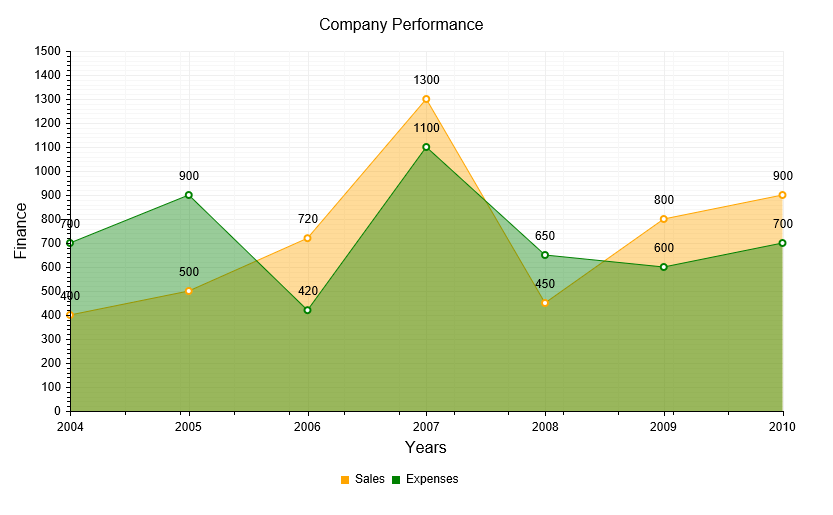

# Area Chart


## 

An __Area__ chart shows the data as continuous lines that pass through points defined by their items' values.The portion of the graph beneath the lines is filled with a particular color for every series.As __Figure 1__ shows, colors in an Area chartcan be useful for emphasizing changes in values from several sets of similar data. A colored background will clearly visualize the differences.

An area chart emphasizes on the volume of money, data or any other unit that the given series has encompassed. When backgrounds are semi-transparent, itlets the user clearly see where different sets of data overlap.

The sample in __Figure 1__ (which is generated by the code in __Example 1__)shows sales data—the expenses and revenue generatedby the sales effort. For example, such a chart could easily let management see where/when there are issues and the company's sales are not meeting performance goals.
>caption Figure 1: A basic Area chart. Example 1 shows the markup used to create it.



>tip As of Q1 2014, you can use[spline curves]()and[step-like progression]()to render an __AreaSeries__ .	This can provide more suitable visualization according to the type of data that is explored.
>


## Customizing an Area Chart

The following list shows the most common areas and elements of the Area chart that you can modify.To explore the full list of options, start from the	[Visual Structure of the RadHtmlChart Control’s Tag Hierarchy]() help article.

* The fill color of each series is controlled via the __BackgroundColor__ property of the__AreaSeries > Appearance > FillStyle__ inner tag.

* The width of the line in each series is controlled via the __Width__ property of the__AreaSeries > LineAppearance__ tag.

* The name that is shown in the legend is set via the __Name__ property of the __AreaSeries__.

* The position of each item on the y-axis is controlled by its __Y__ property of the __CategorySeriesItem__and each __CategorySeriesItem__ is placed with regard to one __AxisItem__ on the x-axis.

* Each item can have a label and a tooltip that follow the common pattern defined in the __DataFormatString__ property of the__LabelsAppearance__ and __TooltipsAppearance__ sections of the series.The format string uses the __Y__ of the item. You can create more complex content via the[ClientTemplate]() of the tooltips and labels.

* The markers are fully customizable—the type, background color, size, border's width and color can becontrolled respectively through __MarkersType__,	__BackgroundColor__, __Size__, __BorderWidth__ and__BorderColor__ properties, exposed by the__AreaSeries > MarkersAppearance__ tag.

* The axes are also fully customizable—the y-axis automatically adjusts the scale to accommodate the data that comes in and for finer tuningthere are numerous properties that can change each aspect:

* Directly in the axis tag you can use the tag's properties to control color, major and minor tick types and sizes, minimal and maximal values for the y-axis (plus a step size)whereas the x-axis requires a set of items to match the number of __CategorySeriesItems__ the series have. This tag is also the place where the crossing value with the other axis can be set (the index of an item for an item axis) and whether the axis will be reversed.

* The inner tags of the axis tag can control the major and minor grid lines in terms of color and sizeand the labels can have a __DataFormatString__, position and visibility set through each inner tag's properties.

* If some values are missing (i.e., they are null/Nothing) from the series data, you can have the chart work around this by setting the __MissingValues__ property ofthe series to the desired behavior: interpolate, missing or gap.

* The title, background colors and legend are controlled via the inner properties of the __RadHtmlChart__ control and are common for all charts.You can find more information in the [Server-side API]()and in the [Element structure]() articles.

>tip Not all properties are necessary. The __RadHtmlChart__ will match the axes to the values if you do not declare explicit values, steps and tick properties (although the	Items for axes that need them are necessary).
>


## The Example that Creates Figure 1

__Example 1__: The code that creates the chart from __Figure 1__. It showsa simple comparison between the sales and the expenses of a company.

````ASPNET
			<telerik:RadHtmlChart runat="server" ID="AreaChart" Width="800" Height="500" Transitions="true">
				<ChartTitle Text="Company Performance">
					<Appearance Align="Center" Position="Top" />
				</ChartTitle>
				<Legend>
					<Appearance Position="Bottom" />
				</Legend>
				<PlotArea>
					<XAxis AxisCrossingValue="0" Color="Black" MajorTickType="Outside" MinorTickType="Outside"
						>
						<TitleAppearance Text="Years" />
						<MajorGridLines Color="#EFEFEF" Width="1" />
						<MinorGridLines Color="#F7F7F7" Width="1" />
						<Items>
							<telerik:AxisItem LabelText="2004" />
							<telerik:AxisItem LabelText="2005" />
							<telerik:AxisItem LabelText="2006" />
							<telerik:AxisItem LabelText="2007" />
							<telerik:AxisItem LabelText="2008" />
							<telerik:AxisItem LabelText="2009" />
							<telerik:AxisItem LabelText="2010" />
						</Items>
						<TitleAppearance Position="Center" Text="Years" />
					</XAxis>
					<YAxis Color="Black" MajorTickType="Outside" MinorTickType="Outside"
						 MaxValue="1500" Step="100">
						<MajorGridLines Color="#EFEFEF" Width="1" />
						<MinorGridLines Color="#F7F7F7" Width="1" />
						<TitleAppearance Position="Center" Text="Finance" />
					</YAxis>
					<Series>
						<telerik:AreaSeries Name="Sales" MissingValues="Gap">
							<Appearance>
								<FillStyle BackgroundColor="Orange" />
							</Appearance>
							<LabelsAppearance Position="Above" />
							<MarkersAppearance MarkersType="Circle" BackgroundColor="White" />
							<TooltipsAppearance BackgroundColor="White" />
							<SeriesItems>
								<telerik:CategorySeriesItem Y="400" />
								<telerik:CategorySeriesItem Y="500" />
								<telerik:CategorySeriesItem Y="720" />
								<telerik:CategorySeriesItem Y="1300" />
								<telerik:CategorySeriesItem Y="450" />
								<telerik:CategorySeriesItem Y="800" />
								<telerik:CategorySeriesItem Y="900" />
							</SeriesItems>
						</telerik:AreaSeries>
						<telerik:AreaSeries Name="Expenses" MissingValues="Gap">
							<Appearance>
								<FillStyle BackgroundColor="Green" />
							</Appearance>
							<LabelsAppearance Position="Above" />
							<MarkersAppearance MarkersType="Circle" BackgroundColor="White" />
							<TooltipsAppearance BackgroundColor="White" />
							<SeriesItems>
								<telerik:CategorySeriesItem Y="700" />
								<telerik:CategorySeriesItem Y="900" />
								<telerik:CategorySeriesItem Y="420" />
								<telerik:CategorySeriesItem Y="1100" />
								<telerik:CategorySeriesItem Y="650" />
								<telerik:CategorySeriesItem Y="600" />
								<telerik:CategorySeriesItem Y="700" />
							</SeriesItems>
						</telerik:AreaSeries>
					</Series>
				</PlotArea>
			</telerik:RadHtmlChart>
````


# See Also

 * [Server-side Programming Overview]()

 * [Design-time Creation]()

 * [RadHtmlChart Spline Chart]()

 * [RadHtmlChart Step Line Chart]()

 * [Data Binding: SqlDataSource]()

 * [Data Binding: Generic List of Objects]()
