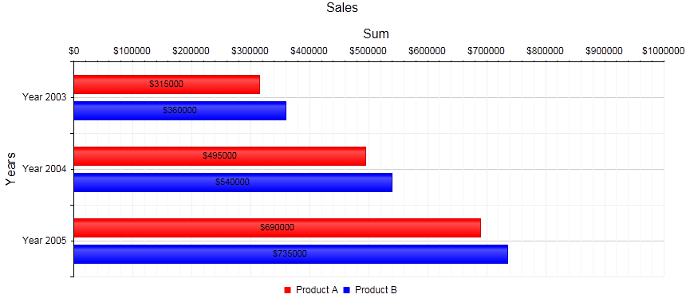

# Bar Chart

A Bar chart displays data as horizontal bars whose lengths vary according to their value. You can use a Bar chart to show a comparison between several sets of data (for example, summaries of sales data for different time periods). Each series is automatically colored differently for easier reading. This article describes some of the ways you can customize a Bar chart and **Example 1** (at the end of this article) shows how to set properties for **Figure 1**.

>caption Figure 1: A basic Bar chart showing values by date.



>note The y-axis is placed horizontally in this chart type, as this is where the item values must be positioned, whereas the x-axis that holds the items themselves is	vertical because this is where the base of the bars is.

You can customize the Bar chart in several ways:

* The color of each series is controlled via the **BackgroundColor** property of the **BarSeries > Appearance > FillStyle** inner tag.

* The name that is shown in the legend is set via the `Name` property of the series. You can hide the series from the legend either by omitting it, or by setting the `VisibleInLegend` property to `false`.

* The height of a bar is controlled by its **Y** property of the **CategorySeriesItem**.

* Each item can have a label and a tooltip which follow the common pattern defined in the **DataFormatString** property of the **LabelsAppearance** and **TooltipsAppearance** sections of the series.The format string uses the **Y** of the item. You can also load custom text from data source fields in labels and tooltips by using the composite [ClientTemplate]() property.

* The axes are also fully customizable — they automatically adjust their scale to accommodate the data that comes in and for finer tuning, there are numerous properties that can change each aspect:

	* Directly in the axis tag you can use its properties to control color, major and minor tick types and sizes, minimal and maximal values for the y-axis (plus a step size), whereas the x-axis requires a set of items to match the number of **SeriesItems** the series have. This is also the place where the crossing value with the other axis can be set (the index of an item for an item axis) and whether the axis will be reversed.
	
	* The inner tags of the axis tag can control the major and minor grid lines in terms of color and size and the labels can have a **DataFormatString**, position and visibility set through each inner tag's properties.

* Setting the **Stacked** property of the first series stacks them all next to each other.Series that will be stacked in separate clusters	must have the same cluster name set in their [GroupName]() property.

* The title, background colors and legend are controlled via the inner properties of the **RadHtmlChart** control and are common for all charts. You can find more information in the [Server-side Programming Basic Configuration]() and in the [Element structure]() articles.

**Example 1** shows how to set properties and generate **Figure 1**.

>tip Not all properties are necessary. The **RadHtmlChart** will match the axes to the values if you do not declare explicit values, steps and tick properties (although the **Items** for axes that need them are necessary).

>caption Example 1: Configuring a basic Bar chart (the one shown in **Figure 1**).

````ASP.NET
<telerik:RadHtmlChart runat="server" ID="BarChart1" Transitions="true">
	<PlotArea>
		<Series>
			<telerik:BarSeries Name="Product A" Stacked="false">
				<Appearance>
					<FillStyle BackgroundColor="Red" />
				</Appearance>
				<LabelsAppearance DataFormatString="${0}" Position="Center" />
				<TooltipsAppearance BackgroundColor="White" DataFormatString="${0}" />
				<SeriesItems>
					<telerik:CategorySeriesItem Y="315000" />
					<telerik:CategorySeriesItem Y="495000" />
					<telerik:CategorySeriesItem Y="690000" />
				</SeriesItems>
			</telerik:BarSeries>
			<telerik:BarSeries Name="Product B">
				<Appearance>
					<FillStyle BackgroundColor="Blue" />
				</Appearance>
				<LabelsAppearance DataFormatString="${0}" Position="Center" />
				<TooltipsAppearance BackgroundColor="Gray" DataFormatString="${0}" />
				<SeriesItems>
					<telerik:CategorySeriesItem Y="360000" />
					<telerik:CategorySeriesItem Y="540000" />
					<telerik:CategorySeriesItem Y="735000" />
				</SeriesItems>
			</telerik:BarSeries>
		</Series>
		<XAxis AxisCrossingValue="0" Color="Black" MajorTickType="Outside" MinorTickType="Outside"
			Reversed="false">
			<Items>
				<telerik:AxisItem LabelText="2003" />
				<telerik:AxisItem LabelText="2004" />
				<telerik:AxisItem LabelText="2005" />
			</Items>
			<LabelsAppearance DataFormatString="Year {0}" RotationAngle="0" />
			<MajorGridLines Color="#EFEFEF" Width="1" />
			<MinorGridLines Color="Black" Width="1" />
			<TitleAppearance Position="Center" RotationAngle="0" Text="Years" />
		</XAxis>
		<YAxis AxisCrossingValue="0" Color="Black" MajorTickSize="1" MajorTickType="Outside"
			MaxValue="1000000" MinorTickSize="1" MinorTickType="Outside" MinValue="0" Reversed="false"
			Step="100000">
			<LabelsAppearance DataFormatString="${0}" RotationAngle="0" />
			<MajorGridLines Color="#EFEFEF" Width="1" />
			<MinorGridLines Color="#F7F7F7" Width="1" />
			<TitleAppearance Position="Center" RotationAngle="0" Text="Sum" />
		</YAxis>
	</PlotArea>
	<ChartTitle Text="Sales">
	</ChartTitle>
	<Legend>
		<Appearance Position="Bottom" />
	</Legend>
</telerik:RadHtmlChart>
````
## Data Binding

You can bind a Bar Chart to a using the following properties:

* **DataSourceID** in the main tag sets the declarative data source for the entire chart. You can use	the **DataSource** property for a programmatic data source if you create the connection in the code-behind.

* **DataFieldY** property for the *BarSeries* to point it to the desired data values field.

* **ColorField** property for the *BarSeries* to point it to the desired colors field (you can set different color per each series item).

* **DataLabelsField** for the x-axis labels to populate the items for the axis.

>caption Example 1: A sample Bar Chart bound to a DataTable.

````ASP.NET
<telerik:RadHtmlChart runat="server" ID="BarChart1" Transitions="true">
    <PlotArea>
        <Series>
            <telerik:BarSeries Name="Product A" DataFieldY="valuesProductA" ColorField="colorsA">
            </telerik:BarSeries>
            <telerik:BarSeries Name="Product B" DataFieldY="valuesProductB" ColorField="colorsB">
            </telerik:BarSeries>
        </Series>
        <XAxis AxisCrossingValue="0" Color="Black" DataLabelsField="years">
            <TitleAppearance Position="Center" RotationAngle="0" Text="Years" />
        </XAxis>
    </PlotArea>
    <ChartTitle Text="Sales">
    </ChartTitle>
</telerik:RadHtmlChart>
````
````C#
protected void Page_Load(object sender, EventArgs e)
{
    if (!IsPostBack)
    {
        BarChart1.DataSource = GetData();
    }
}

private DataTable GetData()
{
    DataTable dt = new DataTable();
    dt.Columns.Add("valuesProductA", typeof(Int32));
    dt.Columns.Add("valuesProductB", typeof(Int32));
    dt.Columns.Add("years", typeof(String));
    dt.Columns.Add("colorsA", typeof(String));
    dt.Columns.Add("colorsB", typeof(String));

    dt.Rows.Add(315000, 360000, "2003", "red", "#0000ff");
    dt.Rows.Add(495000, 540000, "2004", "red", "#0000ff");
    dt.Rows.Add(690000, 735000, "2005", "red", "#0000ff");

    return dt;
}
````
````VB
Protected Sub Page_Load(ByVal sender As Object, ByVal e As EventArgs)
    If Not IsPostBack Then
        BarChart1.DataSource = GetData()
    End If
End Sub

Private Function GetData() As DataTable
    Dim dt As DataTable = New DataTable()
    dt.Columns.Add("valuesProductA", GetType(Int32))
    dt.Columns.Add("valuesProductB", GetType(Int32))
    dt.Columns.Add("years", GetType(String))
    dt.Columns.Add("colorsA", GetType(String))
    dt.Columns.Add("colorsB", GetType(String))
    dt.Rows.Add(315000, 360000, "2003", "red", "#0000ff")
    dt.Rows.Add(495000, 540000, "2004", "red", "#0000ff")
    dt.Rows.Add(690000, 735000, "2005", "red", "#0000ff")
    Return dt
End Function
````

## See Also

 * [Choose a Data Source for Your RadHtmlChart:]()

 * [- Configuration Wizard]()
 
 * [- Data Binding Overview]()

 * [- SqlDataSource]()

 * [- LinqDataSource]()

 * [- EntityDataSource]()

 * [- ObjectDataSource]()

 * [- XmlDataSource]()

 * [- Generic List]()

 * [- DataSet]()

 * [- Array]()

 * [RadHtmlChart Element Structure]()

 * [RadHtmlChart Server-side API Overview]()

 * [RadHtmlChart Stacked Series]()
