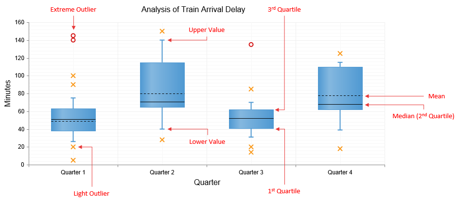

# Box Plot Chart

A Box Plot chart depicts graphically numerical data by displaying a data distribution summary with six indicators (i.e., lower value, first quartile, median, mean, third quartile, upper value) and outliers for each set of data.

A single Box Plot **SeriesItem** (**Figure 1**) consists of **Box**, **Whiskers** and **Outliers** elements. You can find a brief description of each element below.

**Box** - the wide part of the **BoxPlotSeriesItem** represents:

* 1st Quartile as the bottom of the box.

* Mean as the dotted line inside the box.

* Median (i.e., 2nd Quartile) as the solid line inside the box.

* 3rd Quartile as the top of the box.

**Whiskers** - the long thin lines located above and below the box that represent the **Upper** and **Lower** values. The top of the upper whisker represents the **Upper** value while the bottom of the lower whisker represents the **Lower** value.

**Outliers** - The data that is not included between the whiskers is considered as light and extreme outliers that can be displayed as **Circle** (default shape for extreme outliers), **Cross** (default shape for light outliers), **Square** or **Triangle** shapes.

>caption Figure 1: Describing the elements of Box Plot chart's SeriesItems.



You can customize the Box Plot Chart:

* The color of the **BoxPlotSeriesItem** of each series is controlled via the **BackgroundColor** property of the **BoxPlotSeries -> Appearance -> FillStyle** inner tag for a declaratively/programmatically created chart. For a data bound chart, you can use the **ColorField** property.

* The name that is shown in the legend is set via the `Name` property of the series. You can hide the series from the legend either by omitting it, or by setting the `VisibleInLegend` property to `false`.

* Lower value, first quartile, median, third quartile, upper value, mean and outliers of each item are controlled respectively by:

	* **Lower**, **Q1**, **Median**, **Q3**,**Upper** and **Mean** properties and **Outliers** collection of the **BoxPlotSeriesItem** object for a declaratively/programmatically created chart.

	* **DataLowerField**, **DataQ1Field**, **DataMedianField**, **DataQ3Field**, **DataUpperField**, **DataMeanField** and **DataOutliersField** properties of the **BoxPlotSeries** for a data bound chart.

		>note The **DataOutliersField** property must reference a data source field that contains an array of decimal numbers.

* You can customize the **Outliers**' appearance:

	* The shape and background color is controlled via **MarkersType** and **BackgroundColor** properties exposed by the **OutliersAppearance** and **ExtremesAppearance** elements for light and extreme outliers, respectively.

	* The width and color of the border is controlled via **BorderAppearance.Color** and **BorderAppearance.Width** properties exposed by **OutliersAppearance** and **ExtremesAppearance** elements for light and extreme outliers, respectively.

* Each item can have a tooltip with an already predefined pattern by design. You can modify the tooltip pattern through the **DataFormatString** property of the **TooltipsAppearance** sections of the series. The format string uses the **Lower**, **Q1**, **Median**, **Q3**, **Upper**, **Mean** and the corresponding **x-axis item's value**. *(Series Labels in BoxPlotSeries are not supported.)*

* The axes are also fully customizable - they automatically adjust their scale to accommodate the data that comes in and for finer tuning, there are numerous properties that can change each aspect:

	* Directly in the axis tag you can use its properties to control color, major and minor tick types and sizes,minimal and maximal values for the y-axis (plus a step size) whereas the x-axis requires a set of items to match the number of **SeriesItems** the series have. This is also the place where the crossing value with the other axis can be set (the index of an item for an item axis) and whether the axis will be reversed.

	* The inner tags of the axis tag can control the major and minor grid lines in terms of color and size and the labels can have a **DataFormatString**, position and visibility set through each inner tag's properties.

* The title, background colors and legend are controlled via the inner properties of the **RadHtmlChart** control and are common for all charts.You can find more information in the [Server-side API]() and in the [Element structure]() articles.

The chart in **Figure 1** is created with the code in **Example 1**.

>tip Not all properties are necessary; the **RadHtmlChart** will match the axes to the values if you do not declare explicit values, steps and tick properties (although the **Items** for axes that need them are necessary).

>caption Example 1: The markup that creates the Box Plot chart in **Figure 1**.

````ASP.NET
<telerik:RadHtmlChart runat="server" ID="BoxPlotChart" Width="800px" Height="400px">
	<ChartTitle Text="Analysis of Train Arrival Delay"></ChartTitle>
	<PlotArea>
		<Series>
			<telerik:BoxPlotSeries>
				<SeriesItems>
					<telerik:BoxPlotSeriesItem Lower="26" Q1="38" Median="51" Q3="63" Upper="75" Mean="49">
						<Outliers>
							<telerik:Outlier Value="20" />
							<telerik:Outlier Value="140" />
							<telerik:Outlier Value="145" />
							<telerik:Outlier Value="5" />
							<telerik:Outlier Value="90" />
							<telerik:Outlier Value="100" />
						</Outliers>
					</telerik:BoxPlotSeriesItem>
					<telerik:BoxPlotSeriesItem Lower="40" Q1="65" Median="71" Q3="115" Upper="140" Mean="80">
						<Outliers>
							<telerik:Outlier Value="150" />
							<telerik:Outlier Value="28" />
						</Outliers>
					</telerik:BoxPlotSeriesItem>
					<telerik:BoxPlotSeriesItem Lower="31" Q1="41" Median="52" Q3="62" Upper="70" Mean="52">
						<Outliers>
							<telerik:Outlier Value="14" />
							<telerik:Outlier Value="20" />
							<telerik:Outlier Value="85" />
							<telerik:Outlier Value="135" />
						</Outliers>
					</telerik:BoxPlotSeriesItem>
					<telerik:BoxPlotSeriesItem Lower="39" Q1="62" Median="68" Q3="110" Upper="115" Mean="78">
						<Outliers>
							<telerik:Outlier Value="125" />
							<telerik:Outlier Value="18" />
						</Outliers>
					</telerik:BoxPlotSeriesItem>
				</SeriesItems>
				<OutliersAppearance MarkersType="Cross">
					<BorderAppearance Color="#fa9819" />
				</OutliersAppearance>
				<ExtremesAppearance MarkersType="Circle">
					<BorderAppearance Color="#d41414" />
				</ExtremesAppearance>
				<Appearance FillStyle-BackgroundColor="#4f99d2"></Appearance>
				<TooltipsAppearance Visible="false"></TooltipsAppearance>
			</telerik:BoxPlotSeries>
		</Series>
		<YAxis>
			<TitleAppearance Text="Minutes"></TitleAppearance>
			<MajorGridLines Color="#EFEFEF" Width="1"></MajorGridLines>
			<MinorGridLines Color="#F7F7F7" Width="1"></MinorGridLines>
		</YAxis>
		<XAxis>
			<TitleAppearance Text="Quarter">
			</TitleAppearance>
			<MajorGridLines Color="#EFEFEF" Width="1"></MajorGridLines>
			<MinorGridLines Color="#F7F7F7" Width="1"></MinorGridLines>
			<Items>
				<telerik:AxisItem LabelText="Quarter 1" />
				<telerik:AxisItem LabelText="Quarter 2" />
				<telerik:AxisItem LabelText="Quarter 3" />
				<telerik:AxisItem LabelText="Quarter 4" />
			</Items>
		</XAxis>
	</PlotArea>
</telerik:RadHtmlChart>
````

## See Also

 * [Choose a Data Source for Your RadHtmlChart:]()

 * [- Configuration Wizard]()

 * [- SqlDataSource]()

 * [- LinqDataSource]()

 * [- EntityDataSource]()

 * [- ObjectDataSource]()

 * [- XmlDataSource]()

 * [- Generic List]()

 * [- DataSet]()

 * [- Array]()

 * [RadHtmlChart Element Structure]()

 * [RadHtmlChart Server-side API overview]()
