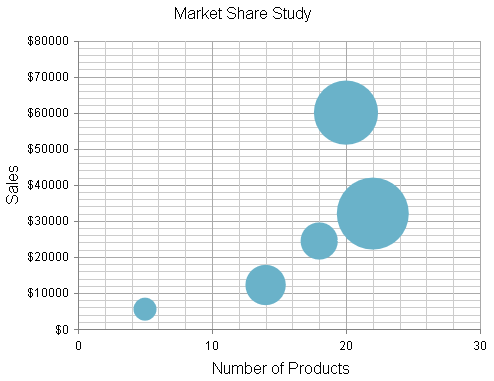

# Bubble Chart


## 

A Bubble chart shows the data as points with coordinates and size defined by their items' values. You might think of a Bubble chart as a variation of the Scatter chart, in which the data points are replaced with bubbles. This allows a Bubble chart to display three dimensional data — two values for the items' coordinates and one for their size. A Bubble chart is useful for visualizingdifferent scientific relationships (e.g, economical, social, etc.). This chart type's x-axis is also numerical and does not require items.This help article will describe how to set various properties for a Bubble chart and then __Example 1__ at the end of the article shows the codefor how to create __Figure 1__.

The size of the bubbles is scaled according to the values of the items in the current series.This means that items with different values that belong to separate series may be represented with the same bubble size, yet everybubble will be bigger than bubbles with smaller values from the same series and smaller than bubbles with higher values from the same series.
>caption Figure 1: A Bubble chart that shows correlation between sales, number of products and market share for different economic agents.



You can customize a Bubble chart in several ways:

* The color of each series is controlled via the __BackgroundColor__ property of the__BubbleSeries > Appearance > FillStyle__ inner tag.

* The name that is shown in the legend is set via the __Name__ property of the __BubbleSeries__.

* The position of each item on the y-axis is controlled by the __Y__ property of the __BubbleSeriesItem__.	The position according to the x-axis is set with the __X__ property.

* The size of each item is controlled by the __Size__ property of the __BubbleSeriesItem__.

* Each item can have a label and a tooltip that follows the common pattern defined in the __DataFormatString__ property of the__LabelsAppearance__ and __TooltipsAppearance__ sections of the series.The format string uses the __X__ of the item for the __first__ placeholder, the__Y__ for the __second__ placeholder, the __Size__ for the__third__ placeholder and __Tooltip__ for the __fourth__ placeholder.The text in the tooltip can also be configured directly in the __Tooltip__ property.You can also load custom text from data source fields in labels and tooltips by using the composite [ClientTemplate]() property.

* The axes are also fully customizable — they automatically adjust the scale to accomodate the data that comes in and for finer tuning there are numerous properties that can change each aspect:

* Directly in the axis tag you can use its properties to control color, major and minor tick types and sizes, minimal and maximal values for the y-axis (plus a step size).This is also the place where the crossing value with the other axis can be set and whether the axis will be reversed.

* The inner tags of the axis tag can control the major and minor grid lines in terms of color and sizeand the labels can have a __DataFormatString__, position and visibility set through each inner tag's properties.

* The title, background colors and legend are controlled via the inner properties of the __RadHtmlChart__ control and are common for all charts.You can find more information in the [Server-side Programming Basic Configuration]()and in the [Element structure]() articles.

__Example 1__ shows how to create the Bubble chart shown in __Figure 1__.

>tip Not all properties are necessary. The __RadHtmlChart__ will match the axes to the values ifyou do not declare explicit values, steps and tick properties.
>


__Example 1__: Setting properties to configure the Bubble chart shown in __Figure 1__.

````ASPNET
	        <telerik:RadHtmlChart runat="server" ID="BubbleChart" Width="500" Height="400">
	            <ChartTitle Text="Market Share Study">
	            </ChartTitle>
	            <PlotArea>
	                <Appearance>
	                    <FillStyle BackgroundColor="White"></FillStyle>
	                </Appearance>
	                <XAxis MinValue="0" MaxValue="30" Step="10">
	                    <TitleAppearance Text="Number of Products"></TitleAppearance>
	                </XAxis>
	                <YAxis MinValue="0" MaxValue="80000" Step="10000">
	                    <LabelsAppearance DataFormatString="${0}"></LabelsAppearance>
	                    <TitleAppearance Text="Sales"></TitleAppearance>
	                </YAxis>
	                <Series>
	                    <telerik:BubbleSeries>
	                        <Appearance FillStyle-BackgroundColor="#6ab2c9">
	                        </Appearance>
	                        <TooltipsAppearance DataFormatString="Percentage of Market Share: {2}%<br /> Number of products: {0}<br /> Sales: ${1}" />                    
	                        <SeriesItems>
	                            <telerik:BubbleSeriesItem Size="3" X="5" Y="5500" />
	                            <telerik:BubbleSeriesItem Size="12" X="14" Y="12200" />
	                            <telerik:BubbleSeriesItem Size="33" X="20" Y="60000" />
	                            <telerik:BubbleSeriesItem Size="10" X="18" Y="24400" />
	                            <telerik:BubbleSeriesItem Size="42" X="22" Y="32000" />
	                        </SeriesItems>
	                    </telerik:BubbleSeries>
	                </Series>
	            </PlotArea>
	            <Legend>
	                <Appearance Position="Right"></Appearance>
	            </Legend>
	        </telerik:RadHtmlChart>
````


# See Also

 * [Choose a Data Source for Your RadHtmlChart:]()

 * [- Configuration Wizard]()

 * [- SqlDataSource]()

 * [- LinqDataSource]()

 * [- EntityDataSource]()

 * [- ObjectDataSource]()

 * [- XmlDataSource]()

 * [- Generic List]()

 * [- DataSet]()

 * [- Array]()

 * [RadHtmlChart Element Structure]()

 * [RadHtmlChart Scatter Chart]()

 * [RadHtmlChart Server-side API Overview]()
