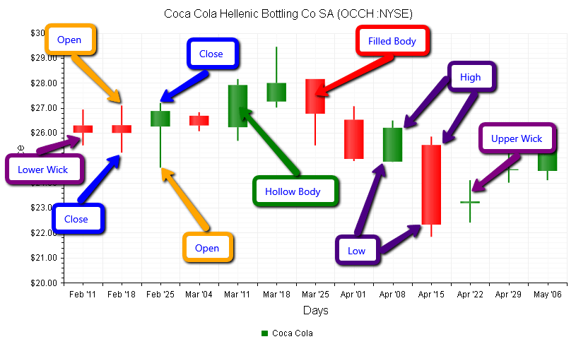

# Candlestick Chart

The **CandlestickChart** describes the price movements of a financial instrument (e.g security or currency) over time. It is a combination of [BarChart]() and [LineChart]() where each SeriesItem (a Candlestick) displays the **Open, High, Low** and **Close** prices for a single day. A Candlestick consists of:

* **Body** - the wide part of the CandlestickSeriesItem that shows the Open and Close prices.

	* If the Close price is higher than the Open price, the body is called **Hollow** (usually colored white or green)and the **BackgroundColor** property of the **CandlestickSeries -> Appearance -> FillStyle** inner tag controls its color.

	* If, however, the Close price is lower than the Open price, the body is called **Filled** (usually colored black or red) and the **DownColor** property of the CandlestickSeries tag controls its color.

* **Wicks** - the **long thin lines** located above and below the body, also called **shadows** that show the High and Low prices. The High price is represented by the top of the **Upper Wick**, while the bottom of the **Lower Wick** indicates the Low price. 
	


The CandlestickChart can be fully customized:

* The color of the Hollow CandlestickSeriesItems (Open Price < Close Price) of each series is controlled via the **BackgroundColor** property of the **CandlestickSeries -> Appearance -> FillStyle** inner tag. The color the Filled CandlestickSeriesItems (Open Price > Close Price) of each series is controlled via the **DownColor** property of the CandlestickSeries tag.

* The name that is shown in the legend is set via the `Name` property of the series. You can hide the series from the legend either by omitting it, or by setting the `VisibleInLegend` property to `false`.

* Open, High, Low and Close values of each item are controlled respectively by **Open**, **High**, **Low** and **Close** properties of the **CandlestickSeries**.

* Each item can have a tooltip with an already predefined pattern by design. The tooltip pattern can be modified through the **DataFormatString** property of the **TooltipsAppearance** sections of the series. The format string uses the **Open, High, Low, Close** and the corresponding **XAxis item's value**. *(Series Labels in CandlestickSeries are not supported)*

* The axes are also fully customizable - they automatically adjust their scale to accommodate the data that comes in and for finer tuning there are numerous properties that can change each aspect:

	* Directly in the axis tag you can use its properties to control color, major and minor tick types and sizes,minimal and maximal values for the Y axis (plus a step size) whereas the X-axis requires a set of items to match the number of SeriesItems the series have. This is also the place where the crossing value with the other axis can be set (the index of an item for an item axis) and whether the axis will be reversed

	* The inner tags of the axis tag can control the major and minor grid lines in terms of colour and size and the labels can have a DataFormatString, position and visibility set through each inner tag's properties

* The title, background colors and legend are controlled via the inner properties of the **RadHtmlChart** control and are common for all charts. More information on the matter is available in the [Server-side API]() and in the [Element structure]() articles.

The chart from the image above is created with the code below:

>tip Not all properties are necessary, the RadHtmlChart will match the axes to the values if you do not declare explicit values, steps and tick properties (although the	Items for axes that need them are necessary).

````ASP.NET
<telerik:RadHtmlChart runat="server" ID="CandlestickChart" Width="800" Height="500"
	Transitions="true">
	<Appearance>
		<FillStyle BackgroundColor="White"></FillStyle>
	</Appearance>
	<ChartTitle Text="Coca Cola Hellenic Bottling Co SA (OCCH :NYSE)">
		<Appearance Align="Center" BackgroundColor="White" Position="Top">
		</Appearance>
	</ChartTitle>
	<Legend>
		<Appearance BackgroundColor="White" Position="Bottom">
		</Appearance>
	</Legend>
	<PlotArea>
		<Appearance>
			<FillStyle BackgroundColor="White"></FillStyle>
		</Appearance>
		<XAxis AxisCrossingValue="0" Color="Black" MajorTickType="Outside" MinorTickType="Outside"
			Reversed="false">
			<TitleAppearance Text="Days">
			</TitleAppearance>
			<LabelsAppearance RotationAngle="0">
			</LabelsAppearance>
			<MajorGridLines Color="#EFEFEF" Width="1"></MajorGridLines>
			<MinorGridLines Color="#F7F7F7" Width="1"></MinorGridLines>
			<Items>
				<telerik:AxisItem LabelText="Feb \'11" />
				<telerik:AxisItem LabelText="Feb \'18" />
				<telerik:AxisItem LabelText="Feb \'25" />
				<telerik:AxisItem LabelText="Mar \'04" />
				<telerik:AxisItem LabelText="Mar \'11" />
				<telerik:AxisItem LabelText="Mar \'18" />
				<telerik:AxisItem LabelText="Mar \'25" />
				<telerik:AxisItem LabelText="Apr \'01" />
				<telerik:AxisItem LabelText="Apr \'08" />
				<telerik:AxisItem LabelText="Apr \'15" />
				<telerik:AxisItem LabelText="Apr \'22" />
				<telerik:AxisItem LabelText="Apr \'29" />
				<telerik:AxisItem LabelText="May \'06" />
			</Items>
			<TitleAppearance Position="Center" RotationAngle="0" Text="Days">
			</TitleAppearance>
		</XAxis>
		<YAxis AxisCrossingValue="0" Color="Black" MajorTickType="Outside" MinorTickType="Outside"
			Reversed="false" MinValue="20" MaxValue="30" Step="1">
			<LabelsAppearance DataFormatString="{0:C}">
			</LabelsAppearance>
			<MajorGridLines Color="#EFEFEF" Width="1"></MajorGridLines>
			<MinorGridLines Color="#F7F7F7" Width="1"></MinorGridLines>
			<TitleAppearance Position="Center" RotationAngle="0" Text="Price">
			</TitleAppearance>
		</YAxis>
		<Series>
			<telerik:CandlestickSeries Name="Coca Cola" DownColor="Red">
				<Appearance>
					<FillStyle BackgroundColor="Green"></FillStyle>
				</Appearance>
				<TooltipsAppearance BackgroundColor="LightGray"></TooltipsAppearance>
				<SeriesItems>
					<telerik:CandlestickSeriesItem Open="26.29" High="26.93" Low="25.49" Close="26.00" />
					<telerik:CandlestickSeriesItem Open="26.30" High="27.09" Low="25.20" Close="25.99" />
					<telerik:CandlestickSeriesItem Open="26.25" High="27.189" Low="24.60" Close="26.87" />
					<telerik:CandlestickSeriesItem Open="26.68" High="26.82" Low="26.06" Close="26.29" />
					<telerik:CandlestickSeriesItem Open="26.22" High="28.15" Low="25.676" Close="27.91" />
					<telerik:CandlestickSeriesItem Open="27.25" High="29.44" Low="27.01" Close="27.99" />
					<telerik:CandlestickSeriesItem Open="28.15" High="28.15" Low="25.49" Close="26.76" />
					<telerik:CandlestickSeriesItem Open="26.52" High="27.06" Low="24.865" Close="24.95" />
					<telerik:CandlestickSeriesItem Open="24.84" High="26.49" Low="24.83" Close="26.20" />
					<telerik:CandlestickSeriesItem Open="25.51" High="25.845" Low="21.83" Close="22.32" />
					<telerik:CandlestickSeriesItem Open="23.18" High="24.10" Low="22.40" Close="23.25" />
					<telerik:CandlestickSeriesItem Open="24.50" High="25.90" Low="24.00" Close="24.538" />
					<telerik:CandlestickSeriesItem Open="24.47" High="26.14" Low="24.10" Close="26.14" />
				</SeriesItems>
			</telerik:CandlestickSeries>
		</Series>
	</PlotArea>
</telerik:RadHtmlChart>
````


