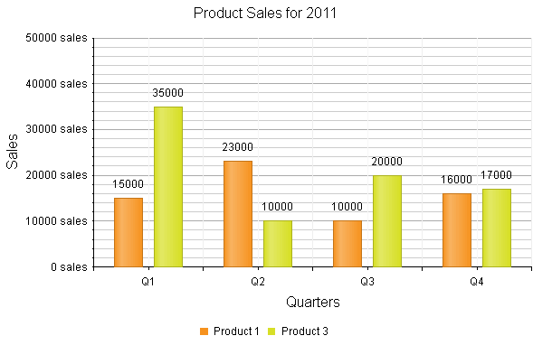

# Column Chart


## 

The Column chart shows data as vertical bars whose heights vary according to their value. It can be useful for showing a comparisonbetween several sets of data (e.g., snapshots of data across different points in time). Column charts are very similar to	[Bar charts](), but the orientation of the bars is vertical instead ofhorizontal. This help article describes how to set some properties in a Column chart and __Example 1__(near the end of this article) shows the code used to create __Figure 1__.
>caption Figure 1: A basic Column chart showing product sales numbers by quarters.



You can customize a Column chart in several ways:

* The color of each series is controlled via the __BackgroundColor__ property of the__ColumnSeries > Appearance > FillStyle__ inner tag.

* The name that is shown in the legend is set via the __Name__ property of the __ColumnSeries__.

* The height of a column is controlled by its __Y__ property of the __CategorySeriesItem__.

* Each item can have a label and a tooltip which follow the common pattern defined in the __DataFormatString__ property of the__LabelsAppearance__ and __TooltipsAppearance__ sections of the series.The format string uses the __Y__ of the item. You can also load custom text from data source fields in labels and tooltips by using the composite [ClientTemplate]() property.

* The axes are also fully customizable — they automatically adjust their scale to accomodate the data that comes in and for finer tuning,there are numerous properties that can change each aspect:

* Directly in the axis tag you can use its properties to control color, major and minor tick types and sizes,minimal and maximal values for the y-axis (plus a step size), whereas the x-axis requires a set of items to matchthe number of __SeriesItems__ the series have. This is also the place where the crossing valuewith the other axis can be set (the index of an item for an item axis) and whether the axis will be reversed.

* The inner tags of the axis tag can control the major and minor grid lines in terms of color and sizeand the labels can have a __DataFormatString__, position and visibility set through each inner tag's properties.

* Setting the __Stacked__ property of the first series stacks them all next to each other. Series that will be stacked in separate clusters must have the same cluster name set in their [GroupName]() property.

* The title, background colors and legend are controlled via the inner properties of the __RadHtmlChart__ control and are common for all charts.You can find more information in the [Server-side Programming Basic Configuration]()and in the [Element structure]() articles.

__Example 1__ demonstrates how to configure the Column chart shown in __Figure 1__.

>tip Not all properties are necessary. The __RadHtmlChart__ will match the axes to the values if you do not declare explicit values, steps and tick properties (although the	Items for axes that need them are necessary).
>


__Figure 1__: Configuring a Column chart to show product sales data.

````ASPNET
	    <telerik:RadHtmlChart runat="server" ID="ColumnChart1" Transitions="true">
	        <PlotArea>
	            <Series>
	                <telerik:ColumnSeries Name="Product 1">
	                    <TooltipsAppearance BackgroundColor="Orange" DataFormatString="{0} sales" />
	                    <SeriesItems>
	                        <telerik:CategorySeriesItem Y="15000" />
	                        <telerik:CategorySeriesItem Y="23000" />
	                        <telerik:CategorySeriesItem Y="10000" />
	                        <telerik:CategorySeriesItem Y="16000" />
	                    </SeriesItems>
	                </telerik:ColumnSeries>
	                <telerik:ColumnSeries Name="Product 3">
	                    <TooltipsAppearance BackgroundColor="Orange" DataFormatString="{0} sales" />
	                    <SeriesItems>
	                        <telerik:CategorySeriesItem Y="35000" />
	                        <telerik:CategorySeriesItem Y="10000" />
	                        <telerik:CategorySeriesItem Y="20000" />
	                        <telerik:CategorySeriesItem Y="17000" />
	                    </SeriesItems>
	                </telerik:ColumnSeries>
	            </Series>
	            <XAxis AxisCrossingValue="0" Color="Black" MajorTickType="Outside" MinorTickType="Outside"
	                Reversed="false">
	                <Items>
	                    <telerik:AxisItem LabelText="1" />
	                    <telerik:AxisItem LabelText="2" />
	                    <telerik:AxisItem LabelText="3" />
	                    <telerik:AxisItem LabelText="4" />
	                </Items>
	                <LabelsAppearance DataFormatString="Q{0}" RotationAngle="0" />
	                <MajorGridLines Color="#EFEFEF" Width="1" />
	                <MinorGridLines Color="#F7F7F7" Width="1" />
	                <TitleAppearance Position="Center" RotationAngle="0" Text="Quarters" />
	            </XAxis>
	            <YAxis AxisCrossingValue="0" Color="Black" MajorTickSize="1" MajorTickType="Outside"
	                MaxValue="50000" MinorTickSize="1" MinorTickType="Outside" MinValue="0" Reversed="false"
	                Step="10000">
	                <LabelsAppearance DataFormatString="{0} sales" RotationAngle="0" />
	                <TitleAppearance Position="Center" RotationAngle="0" Text="Sales" />
	            </YAxis>
	        </PlotArea>
	        <ChartTitle Text="Product Sales for 2011">
	        </ChartTitle>
	        <Legend>
	            <Appearance Position="Bottom" />
	        </Legend>
	    </telerik:RadHtmlChart>
````


# See Also

 * [Choose a Data Source for Your RadHtmlChart:]()

 * [- Configuration Wizard]()

 * [- SqlDataSource]()

 * [- LinqDataSource]()

 * [- EntityDataSource]()

 * [- ObjectDataSource]()

 * [- XmlDataSource]()

 * [- Generic List]()

 * [- DataSet]()

 * [- Array]()

 * [RadHtmlChart Element Structure]()

 * [RadHtmlChart Server-side API Overview]()

 * [RadHtmlChart Stacked Series]()
