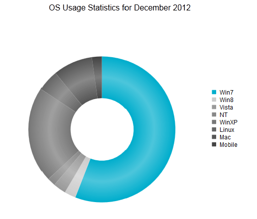

# Donut Chart

The Donut chart (**Figure 1**) displays data as sectors from a circle and is therefore useful for displaying data as parts of a whole. A Donut chart is a Pie chart variation with the ability to display single series of data in a two-dimensional circle. This help article will describe how to customize a Donut chart and provides code in **Example 1** that shows how to create **Figure 1**.

>caption Figure 1: A simple example of a Donut chart.



You can customize a Donut chart.

* The color is controlled via the **BackgroundColor** property of the **PieSeriesItem**.

* You can fine tune the diameter of the donut hole via the `HoleSize` property exposed by the `DonutSeries`.

* The name that is shown in the legend is set via the `Name` property of the series item. You can hide the series item from the legend either by omitting it, or by setting the `VisibleInLegend` property to `false`.

* Whether the sector is separated from the rest of the circle is controlled via the **Exploded** property of the **PieSeriesItem**. This and the Pie chart are the only chart types in whose context the **Exploded** property is meaningful and will have effect.

* How big of a section of a Donut chart is is controlled by its **Y** property of the **PieSeriesItem** and its relation to the other items' value.

	>important Only positive values have meaning in the context of a Donut chart and the developer must make sure that positive value data is passed to the chart.

* Each item can have a label and a tooltip that follow the common pattern defined in the **DataFormatString** property of the **LabelsAppearance** and **TooltipsAppearance** sections of the series. The format string uses the **Y** of the item. You can also load custom text from data source fields in labels and tooltips by using the composite [ClientTemplate]() property.

* The title, background colors and legend are controlled via the inner properties of the **RadHtmlChart** control and are common for all charts. You can find more information in the [Server-side API]() and in the [Element structure]() articles.

The Donut chart in **Figure 1** is created with the code in **Example 1**.

>caption Example 1: Creating the simple Donut chart in **Figure 1** using hard coded data.

````ASP.NET
<telerik:RadHtmlChart runat="server" ID="DonutChart" Width="500" Height="500" Transitions="true">
	<Appearance>
		<FillStyle BackgroundColor="White"></FillStyle>
	</Appearance>
	<ChartTitle Text="OS Usage Statistics for December 2012">
		<Appearance Align="Center" Position="Top"></Appearance>
	</ChartTitle>
	<PlotArea>
		<Series>
			<telerik:DonutSeries HoleSize="50">
				<LabelsAppearance Visible="false">
				</LabelsAppearance>
				<TooltipsAppearance DataFormatString="{0}%" BackgroundColor="White"></TooltipsAppearance>
				<SeriesItems>
					<telerik:PieSeriesItem BackgroundColor="#00adcc" Name="Win7"
						Y="55.6"></telerik:PieSeriesItem>
					<telerik:PieSeriesItem BackgroundColor="#cccccc" Name="Win8" Y="2.5"></telerik:PieSeriesItem>
					<telerik:PieSeriesItem BackgroundColor="#999999" Name="Vista" Y="2.8"></telerik:PieSeriesItem>
					<telerik:PieSeriesItem BackgroundColor="#888888" Name="NT" Y="1.8"></telerik:PieSeriesItem>
					<telerik:PieSeriesItem BackgroundColor="#777777" Name="WinXP" Y="21.1"></telerik:PieSeriesItem>
					<telerik:PieSeriesItem BackgroundColor="#666666" Name="Linux" Y="4.7"></telerik:PieSeriesItem>
					<telerik:PieSeriesItem BackgroundColor="#555555" Name="Mac" Y="8.7"></telerik:PieSeriesItem>
					<telerik:PieSeriesItem BackgroundColor="#444444" Name="Mobile" Y="2.2"></telerik:PieSeriesItem>
				</SeriesItems>
			</telerik:DonutSeries>
		</Series>
	</PlotArea>
</telerik:RadHtmlChart>
````

>note The Donut chart does not have axes as they are not applicable in its context.

## See Also

 * [Choose a Data Source for Your RadHtmlChart:]()

 * [- Configuration Wizard]()

 * [- SqlDataSource]()

 * [- LinqDataSource]()

 * [- EntityDataSource]()

 * [- ObjectDataSource]()

 * [- XmlDataSource]()

 * [- Generic List]()

 * [- DataSet]()

 * [- Array]()

 * [RadHtmlChart Element Structure]()

 * [RadHtmlChart Pie Chart]()

 * [RadHtmlChart Server-side API Overview]()
