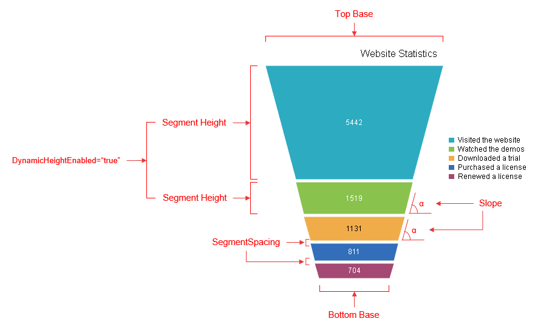
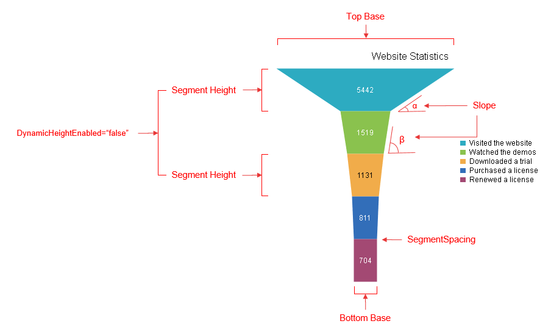

# Funnel Chart

A Funnel chart displays a single series of data in progressively decreasing or increasing proportions, organized in segments, where each segment represents the value for the particular item from the series. The items' values can also influence the height and the shape of the corresponding segments.

Funnel charts are usually used to represent stages in a sales process (e.g., show the amount of potential revenue for each stage);identify a potential problematic areas in any company's process; visualize website visitors trends, etc. This chart type is well suited for displaying several values.

The Funnel series has several properties that control the way a chart's segments are rendered.

* **SegmentSpacing** - The property specifies the space between the different segments of the funnel chart in pixels.

* **DynamicHeightEnabled** - A Boolean property that indicates whether all the segments will share the same size (when **DynamicHeightEnabled="false"**) or the height of each segment is determined according to its value (when **DynamicHeightEnabled="true"**).Default value is **true**.

* **NeckRatio** - The property specifies the ratio between the top and the bottom bases of the whole funnel series. The property can take effect only if the **DynamicSlopeEnabled** property is set to "**false**" (see the next line).

* **DynamicSlopeEnabled** - A Boolean property that indicates whether the form of each segment will be based on the ratio between the value from the current and the next segment. Default value is **false**.

>note If the **DynamicSlopeEnabled** property is set to **true** , **NeckRatio** property is neglected.

The code in **Example 1** will show you how to build a **FunnelSeries** that has its **NeckRatio** and **SegmentSpacing** properties set (**Figure 1**), while **DynamicHeightEnabled** is enabled.

The code in **Example 2** will show you how to build a **FunnelSeries** that has its **DynamicSlopeEnabled** property enabled (**Figure 2**), while **DynamicHeightEnabled** is disabled.

>caption Figure 1: Display a Funnel chart that has its bottom base four times smaller than its top base and five pixels space between all segments. The code in	Example 1 shows this setup.



>caption Example 1: Creating a **FunnelSeries** that has its **NeckRatio** and **SegmentSpacing** properties set while **DynamicHeightEnabled** is enabled.

````ASP.NET
<telerik:RadHtmlChart runat="server" ID="FunnelChart1" Width="450" Height="400" Skin="Silk">
	<PlotArea>
		<Series>
			<telerik:FunnelSeries DynamicSlopeEnabled="false" DynamicHeightEnabled="true" SegmentSpacing="5" NeckRatio="0.4">
				<SeriesItems>
					<telerik:FunnelSeriesItem Y="5442" Name="Visited the website" />
					<telerik:FunnelSeriesItem Y="1519" Name="Watched the demos" />
					<telerik:FunnelSeriesItem Y="1131" Name="Downloaded a trial" />
					<telerik:FunnelSeriesItem Y="811" Name="Purchased a license" />
					<telerik:FunnelSeriesItem Y="704" Name="Renewed a license" />
				</SeriesItems>
			</telerik:FunnelSeries>
		</Series>
	</PlotArea>
	<ChartTitle Text="Website Statistics">
	</ChartTitle>
</telerik:RadHtmlChart>
````

>caption Figure 2: Illustrates how the widths of the bases for each segment are based on the ratio currentValue/nextValue. The code in	Example 2 shows this setup.



>caption Example 2: Creating a **FunnelSeries** that has its **DynamicSlopeEnabled** property enabled while **DynamicHeightEnabled** is disabled.

````ASP.NET
<telerik:RadHtmlChart runat="server" ID="FunnelChart2" Width="450" Height="400" Skin="Silk">
	<PlotArea>
		<Series>
			<telerik:FunnelSeries DynamicHeightEnabled="false" DynamicSlopeEnabled="true">
				<SeriesItems>
					<telerik:FunnelSeriesItem Y="5442" Name="Visited the website" />
					<telerik:FunnelSeriesItem Y="1519" Name="Watched the demos" />
					<telerik:FunnelSeriesItem Y="1131" Name="Downloaded a trial" />
					<telerik:FunnelSeriesItem Y="811" Name="Purchased a license" />
					<telerik:FunnelSeriesItem Y="704" Name="Renewed a license" />
				</SeriesItems>
			</telerik:FunnelSeries>
		</Series>
	</PlotArea>
	<ChartTitle Text="Website Statistics">
	</ChartTitle>
</telerik:RadHtmlChart>
````

## See Also

 * [Choose a Data Source for Your RadHtmlChart:]()

 * [- Configuration Wizard]()

 * [- SqlDataSource]()

 * [- LinqDataSource]()

 * [- EntityDataSource]()

 * [- ObjectDataSource]()

 * [- XmlDataSource]()

 * [- Generic List]()

 * [- DataSet]()

 * [- Array]()

 * [RadHtmlChart Element Structure]()

 * [RadHtmlChart Server-side API Overview]()
