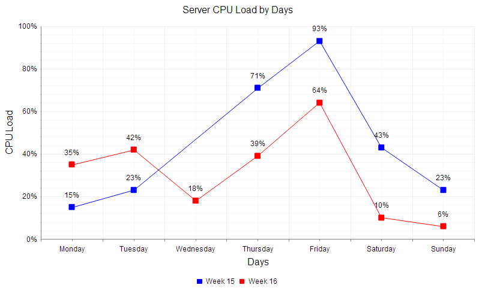

# Line Chart

A Line chart shows data as continuous lines that pass through points defined by their items' values. It can be useful for showing a trend over time and comparing several sets of similar data. Since Q1 2014 **LineSeries** can be visualized with [spline curves]() and [step-like progression](). This Help article will show how you can customize a Line chart, and the code in **Example 1** will show how to build the simple Line chart in **Figure 1**.

>caption Figure 1: A simple Line chart comparing two sets of data over time. The code in Example 1 shows how to customize the chart using the MissingValues property to account for a gap in data.



You can customize the Line chart:

* The color of each series is controlled via the **BackgroundColor** property of the **LineSeries > Appearance > FillStyle** inner tag.

* The width of the line in each series is controlled via the **Width** property of the **LineSeries > LineAppearance** tag.

* The name that is shown in the legend is set via the `Name` property of the series. You can hide the series from the legend either by omitting it, or by setting the `VisibleInLegend` property to `false`.

* The position of each item on the Y-axis is controlled by its **Y** property of the **CategorySeriesItem** and each **CategorySeriesItem** is placed with regard to one **AxisItem** on the X-axis.

* Each item can have a label and a tooltip which follow the common pattern defined either in the **DataFormatString** property or using the **ClientTemplate** section in the **LabelsAppearance** or the **TooltipsAppearance** inner tags of the series.The format string uses the **Y** of the item.

* The markers are fully customizable—the type, background color, size, border's width and color can be controlled respectively through **MarkersType**, **BackgroundColor**, **Size**, **BorderWidth** and **BorderColor** properties, exposed by the **LineSeries > MarkersAppearance** tag.

* The axes are also fully customizable—the y-axis automatically adjusts the scale to accommodate the data that comes in and for finer tuningthere are numerous properties that can change each aspect:

	* Directly in the axis tag you can use its properties to control color, major and minor tick types and sizes, minimal and maximal values for the y-axis (plus a step size)whereas the x-axis requires a set of items to match the number of **CategorySeriesItem** the series have. This is also the place where the crossing value with the other axis can be set (the index of an item for an item axis) and whether the axis will be reversed.

	* The inner tags of the axis tag can control the major and minor grid lines in terms of color and sizeand the labels can have a **DataFormatString**, position and visibility set through each inner tag's properties.

* If some values are missing (i.e. they are null/Nothing) from the series data you can have the chart work around this by setting the **MissingValues** property of the series to the desired behavior—interpolate, missing or gap.

* The title, background colors and legend are controlled via the inner properties of the **RadHtmlChart** control and are common for all charts.You can find more information in the [Server-side API]() and in the [Element structure]() articles.

The chart from **Figure 1** was created with the code in **Example 1**:

>tip Not all properties are necessary. The **RadHtmlChart** will match the axes to the values if you do not declare explicit values, steps and tick properties (although the	Items for axes that need them are necessary).

>caption Example 1: Creating a Line chart that compares two sets of data over a time period with customized properties. The property for **MissingValues** shows the effect of setting **Interpolate** to **Gap** for the two **LineSeries**.

````ASP.NET
	<telerik:RadHtmlChart runat="server" ID="LineChart" Width="800" Height="500" Transitions="true">
	<PlotArea>
		<Series>
			<telerik:LineSeries Name="Week 15" MissingValues="Interpolate">
				<Appearance>
					<FillStyle BackgroundColor="Blue" />
				</Appearance>
				<LabelsAppearance DataFormatString="{0}%" Position="Above" />
				<MarkersAppearance MarkersType="Square" BackgroundColor="Blue" />
				<SeriesItems>
					<telerik:CategorySeriesItem Y="15" />
					<telerik:CategorySeriesItem Y="23" />
					<telerik:CategorySeriesItem />
					<telerik:CategorySeriesItem Y="71" />
					<telerik:CategorySeriesItem Y="93" />
					<telerik:CategorySeriesItem Y="43" />
					<telerik:CategorySeriesItem Y="23" />
				</SeriesItems>
			</telerik:LineSeries>
			<telerik:LineSeries Name="Week 16" MissingValues="Gap">
				<Appearance>
					<FillStyle BackgroundColor="Red" />
				</Appearance>
				<LabelsAppearance DataFormatString="{0}%" Position="Above" />
				<MarkersAppearance MarkersType="Square" BackgroundColor="Red" />
				<SeriesItems>
					<telerik:CategorySeriesItem Y="35" />
					<telerik:CategorySeriesItem Y="42" />
					<telerik:CategorySeriesItem Y="18" />
					<telerik:CategorySeriesItem Y="39" />
					<telerik:CategorySeriesItem Y="64" />
					<telerik:CategorySeriesItem Y="10" />
					<telerik:CategorySeriesItem Y="6" />
				</SeriesItems>
			</telerik:LineSeries>
		</Series>
		<XAxis MajorTickType="Outside" MinorTickType="Outside">
			<Items>
				<telerik:AxisItem LabelText="Monday" />
				<telerik:AxisItem LabelText="Tuesday" />
				<telerik:AxisItem LabelText="Wednesday" />
				<telerik:AxisItem LabelText="Thursday" />
				<telerik:AxisItem LabelText="Friday" />
				<telerik:AxisItem LabelText="Saturday" />
				<telerik:AxisItem LabelText="Sunday" />
			</Items>
			<MajorGridLines Color="#EFEFEF" Width="1" />
			<MinorGridLines Color="#F7F7F7" Width="1" />
			<TitleAppearance Position="Center" RotationAngle="0" Text="Days" />
		</XAxis>
		<YAxis MajorTickSize="1" MajorTickType="Outside" MaxValue="100" MinorTickSize="1"
			MinorTickType="Outside" MinValue="0">
			<LabelsAppearance DataFormatString="{0}%" RotationAngle="0" />
			<MajorGridLines Color="#EFEFEF" Width="1" />
			<MinorGridLines Color="#F7F7F7" Width="1" />
			<TitleAppearance Position="Center" RotationAngle="0" Text="CPU Load" />
		</YAxis>
	</PlotArea>
	<ChartTitle Text="Server CPU Load By Days">
	</ChartTitle>
	<Legend>
		<Appearance Position="Bottom" />
	</Legend>
</telerik:RadHtmlChart>
````

## See Also

 * [Choose a Data Source for Your RadHtmlChart:]()

 * [- Configuration Wizard]()

 * [- SqlDataSource]()

 * [- LinqDataSource]()

 * [- EntityDataSource]()

 * [- ObjectDataSource]()

 * [- XmlDataSource]()

 * [- Generic List]()

 * [- DataSet]()

 * [- Array]()

 * [RadHtmlChart Element Structure]()

 * [RadHtmlChart Server-side API Overview]()

 * [RadHtmlChart Spline Chart]()

 * [RadHtmlChart Step Line Chart]()
