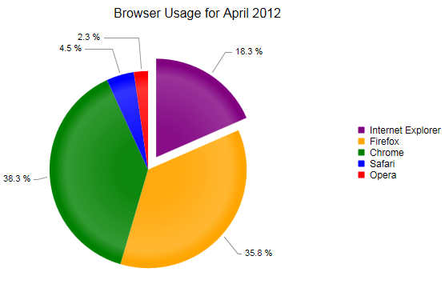

# Pie Chart

The Pie chart displays the data as sectors from a circle and is therefore useful for displaying data as parts of a whole.The Pie chart displays a single series of data in a two-dimensional circle. This help article shows which properties to use to customize a Pie chart (**Figure 1**) and shows sample code (**Example 1**) to create one.

>caption Figure 1: A Pie chart with one item exploded.



You can customize a Pie chart:

* The color is controlled via the **BackgroundColor** property of the **PieSeriesItem**.

* The name that is shown in the legend is set via the **Name** property of the **PieSeriesItem**.

* Whether the sector is separated from the rest of the circle is controlled via the **Exploded** property of the **PieSeriesItem**. The Pie chart and the Donut chart are the only chart types in whose context the **Exploded** property is meaningful and will have effect.

* The size of a segment of the Pie is controlled by its **Y** property of the **PieSeriesItem** and its relation to the other items' value.

	>important Only positive values have meaning in the context of a Pie chart and the developer must make sure that only positive value data is passed to the chart.

* Each item can have a label and a tooltip that follow the common pattern defined in the **DataFormatString** property of the **LabelsAppearance** and **TooltipsAppearance** sections of the series.The format string uses the **Y** of the item. You can also load custom text from data source fields in labels and tooltips by using the composite [ClientTemplate]() property.

* The title, background colors and legend are controlled via the inner properties of the **RadHtmlChart** control and are common for all charts.You can find more information on the matter is available in the [Server-side API]() and in the [Element structure]() articles.

The Pie chart from **Figure 1** was created with the code in **Example 1**.

>caption Example 1: Creating the simple Pie chart in **Figure 1** using hard coded data.

````ASP.NET
<telerik:RadHtmlChart runat="server" ID="PieChart1" Transitions="true">
	<PlotArea>
		<Series>
			<telerik:PieSeries StartAngle="90">
				<LabelsAppearance Position="OutsideEnd" DataFormatString="{0} %" />
				<TooltipsAppearance DataFormatString="{0} %" />
				<SeriesItems>
					<telerik:PieSeriesItem BackgroundColor="Purple" Exploded="true" Name="Internet Explorer" Y="18.3" />
					<telerik:PieSeriesItem BackgroundColor="Orange" Exploded="false" Name="Firefox" Y="35.8" />
					<telerik:PieSeriesItem BackgroundColor="Green" Exploded="false" Name="Chrome" Y="38.3" />
					<telerik:PieSeriesItem BackgroundColor="Blue" Exploded="false" Name="Safari" Y="4.5" />
					<telerik:PieSeriesItem BackgroundColor="Red" Exploded="false" Name="Opera" Y="2.3" />
				</SeriesItems>
			</telerik:PieSeries>
		</Series>
	</PlotArea>
	<ChartTitle Text="Browser Usage for April 2012">
	</ChartTitle>
</telerik:RadHtmlChart>
````

>note The Pie chart does not have axes as they are not applicable in its context.

>caution Currently the **RadHtmlChart** supports only one Pie series per chart. Adding more than one will result in overlapping charts and an extended legend.

## See Also

 * [Choose a Data Source for Your RadHtmlChart:]()

 * [- Configuration Wizard]()

 * [- SqlDataSource]()

 * [- LinqDataSource]()

 * [- EntityDataSource]()

 * [- ObjectDataSource]()

 * [- XmlDataSource]()

 * [- Generic List]()

 * [- DataSet]()

 * [- Array]()

 * [RadHtmlChart Element Structure]()

 * [RadHtmlChart Donut Chart]()

 * [RadHtmlChart Server-side API Overview]()
