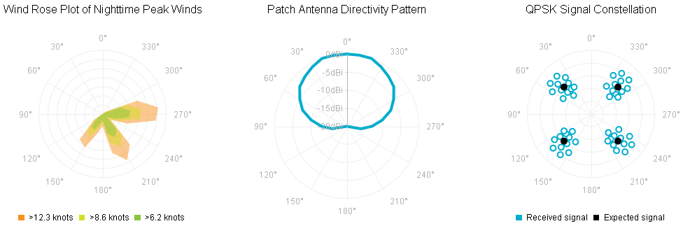

# Polar Chart


## 

The __Polar__ chart shows data in a circular plot area in polar coordinates where each data point is represented by adistance/radius and an angle, beginning of the coordinate system.A point's location in the polar coordinate systems is defined by the __Value__ property of the __PolarSeriesItem__, which determinesthe radial coordinate (the radius) and the __Angle__ property, which determines the angular coordinate. __Polar__ charts are useful for visualizing scientific data like precipitation/heat distribution in the Earth's poles and other multivariate data.

__RadHtmlChart__ supports three types of Polar series. They are only different in the graphical primitives that are drawn.The primitives are a polyline, polygon and point.

* __PolarAreaSeries__ - In this series type, the data points are connected with straight line segments that enclose a filled areatogether with the chart pole.

* __PolarLineSeries__ - This series types are represented on the chart as data points connected with straight line segments.

* __PolarScatterSeries__ - This series type is represented on the chart as data points that are not connected.

__PolarAreaSeries__ and __PolarLineSeries__ can also be visualized with[spline curves]().

The code from __Example 1__ shows how to build the __PolarAreaSeries__,__PolarLineSeries__ and __PolarScatterSeries__ that are shown in __Figure 1__.
>caption Figure 1: You can see plot data in polar coordinate system with Polar charts. The code in Example 1 shows how to setup PolarAreaSeries (i.e., the "Wind Rose Plot of Nighttime Peak Winds" chart), PolarLineSeries (i.e., the "Patch Antenna Directivity Pattern" chart) and PolarScatterSeries (i.e., the "QPSK Signal Constellation" chart).



__Example 1__: Creating __PolarAreaSeries__, __PolarLineSeries__ and__PolarScatterSeries__ that plot data in a circular plot area in a polar coordinate system.

````ASPNET
		<telerik:RadHtmlChart runat="server" ID="PolarAreaChart" Width="345" Height="345" Transitions="true">
			<PlotArea>
				<Series>
					<telerik:PolarAreaSeries Name=">12.3 knots">
						<MarkersAppearance Visible="false" />
						<SeriesItems>
							<telerik:PolarSeriesItem Angle="125" Radius="2.4"></telerik:PolarSeriesItem>
							<telerik:PolarSeriesItem Angle="138" Radius="7.5"></telerik:PolarSeriesItem>
							<telerik:PolarSeriesItem Angle="152" Radius="8.3"></telerik:PolarSeriesItem>
							<telerik:PolarSeriesItem Angle="166" Radius="4.3"></telerik:PolarSeriesItem>
							<telerik:PolarSeriesItem Angle="180" Radius="2.7"></telerik:PolarSeriesItem>
							<telerik:PolarSeriesItem Angle="194" Radius="8.8"></telerik:PolarSeriesItem>
							<telerik:PolarSeriesItem Angle="208" Radius="11.5"></telerik:PolarSeriesItem>
							<telerik:PolarSeriesItem Angle="222" Radius="9"></telerik:PolarSeriesItem>
							<telerik:PolarSeriesItem Angle="235" Radius="2.2"></telerik:PolarSeriesItem>
							<telerik:PolarSeriesItem Angle="249" Radius="5.8"></telerik:PolarSeriesItem>
							<telerik:PolarSeriesItem Angle="263" Radius="11.8"></telerik:PolarSeriesItem>
							<telerik:PolarSeriesItem Angle="277" Radius="12.3"></telerik:PolarSeriesItem>
							<telerik:PolarSeriesItem Angle="291" Radius="8.2"></telerik:PolarSeriesItem>
							<telerik:PolarSeriesItem Angle="305" Radius="1"></telerik:PolarSeriesItem>
						</SeriesItems>
					</telerik:PolarAreaSeries>
					<telerik:PolarAreaSeries Name=">8.6 knots">
						<MarkersAppearance Visible="false" />
						<SeriesItems>
							<telerik:PolarSeriesItem Angle="125" Radius="1.9"></telerik:PolarSeriesItem>
							<telerik:PolarSeriesItem Angle="138" Radius="5.1"></telerik:PolarSeriesItem>
							<telerik:PolarSeriesItem Angle="152" Radius="5.7"></telerik:PolarSeriesItem>
							<telerik:PolarSeriesItem Angle="166" Radius="3.1"></telerik:PolarSeriesItem>
							<telerik:PolarSeriesItem Angle="180" Radius="1.7"></telerik:PolarSeriesItem>
							<telerik:PolarSeriesItem Angle="194" Radius="6.4"></telerik:PolarSeriesItem>
							<telerik:PolarSeriesItem Angle="208" Radius="8.1"></telerik:PolarSeriesItem>
							<telerik:PolarSeriesItem Angle="222" Radius="6.5"></telerik:PolarSeriesItem>
							<telerik:PolarSeriesItem Angle="235" Radius="1.7"></telerik:PolarSeriesItem>
							<telerik:PolarSeriesItem Angle="249" Radius="4.2"></telerik:PolarSeriesItem>
							<telerik:PolarSeriesItem Angle="263" Radius="8.2"></telerik:PolarSeriesItem>
							<telerik:PolarSeriesItem Angle="277" Radius="8.6"></telerik:PolarSeriesItem>
							<telerik:PolarSeriesItem Angle="291" Radius="5.6"></telerik:PolarSeriesItem>
							<telerik:PolarSeriesItem Angle="305" Radius="0.9"></telerik:PolarSeriesItem>
						</SeriesItems>
					</telerik:PolarAreaSeries>
					<telerik:PolarAreaSeries Name=">6.2 knots">
						<MarkersAppearance Visible="false" />
						<SeriesItems>
							<telerik:PolarSeriesItem Angle="125" Radius="1.3"></telerik:PolarSeriesItem>
							<telerik:PolarSeriesItem Angle="138" Radius="3.6"></telerik:PolarSeriesItem>
							<telerik:PolarSeriesItem Angle="152" Radius="4"></telerik:PolarSeriesItem>
							<telerik:PolarSeriesItem Angle="166" Radius="2.2"></telerik:PolarSeriesItem>
							<telerik:PolarSeriesItem Angle="180" Radius="1.3"></telerik:PolarSeriesItem>
							<telerik:PolarSeriesItem Angle="194" Radius="4.5"></telerik:PolarSeriesItem>
							<telerik:PolarSeriesItem Angle="208" Radius="5.8"></telerik:PolarSeriesItem>
							<telerik:PolarSeriesItem Angle="222" Radius="4.6"></telerik:PolarSeriesItem>
							<telerik:PolarSeriesItem Angle="235" Radius="1.1"></telerik:PolarSeriesItem>
							<telerik:PolarSeriesItem Angle="249" Radius="3"></telerik:PolarSeriesItem>
							<telerik:PolarSeriesItem Angle="263" Radius="5.8"></telerik:PolarSeriesItem>
							<telerik:PolarSeriesItem Angle="277" Radius="6.2"></telerik:PolarSeriesItem>
							<telerik:PolarSeriesItem Angle="291" Radius="4.1"></telerik:PolarSeriesItem>
							<telerik:PolarSeriesItem Angle="305" Radius="0.4"></telerik:PolarSeriesItem>
						</SeriesItems>
					</telerik:PolarAreaSeries>
				</Series>
				<XAxis Color="#b3b3b3" Reversed="false" Step="30" StartAngle="90">
					<LabelsAppearance RotationAngle="0" DataFormatString="{0}&#176;">
					</LabelsAppearance>
					<MajorGridLines Color="#EFEFEF" Width="1"></MajorGridLines>
					<MinorGridLines Visible="false"></MinorGridLines>
				</XAxis>
				<YAxis Visible="false">
					<MajorGridLines Color="#EFEFEF" Width="1"></MajorGridLines>
					<MinorGridLines Visible="false"></MinorGridLines>
				</YAxis>
			</PlotArea>
			<ChartTitle Text="Wind Rose Plot of Nighttime Peak Winds">
				<Appearance Align="Center" Position="Top">
				</Appearance>
			</ChartTitle>
			<Legend>
				<Appearance Visible="true" Position="Bottom">
				</Appearance>
			</Legend>
		</telerik:RadHtmlChart>
````


````ASPNET
		<telerik:RadHtmlChart runat="server" ID="PolarLineChart" Width="345" Height="345" Transitions="true">
			<PlotArea>
				<Series>
					<telerik:PolarLineSeries Name="Antenna">
						<SeriesItems>
							<telerik:PolarSeriesItem Angle="0" Radius="0"></telerik:PolarSeriesItem>
							<telerik:PolarSeriesItem Angle="10" Radius="0"></telerik:PolarSeriesItem>
							<telerik:PolarSeriesItem Angle="20" Radius="0"></telerik:PolarSeriesItem>
							<telerik:PolarSeriesItem Angle="30" Radius="-1"></telerik:PolarSeriesItem>
							<telerik:PolarSeriesItem Angle="40" Radius="-2"></telerik:PolarSeriesItem>
							<telerik:PolarSeriesItem Angle="50" Radius="-3"></telerik:PolarSeriesItem>
							<telerik:PolarSeriesItem Angle="60" Radius="-5"></telerik:PolarSeriesItem>
							<telerik:PolarSeriesItem Angle="70" Radius="-7"></telerik:PolarSeriesItem>
							<telerik:PolarSeriesItem Angle="80" Radius="-10"></telerik:PolarSeriesItem>
							<telerik:PolarSeriesItem Angle="90" Radius="-13"></telerik:PolarSeriesItem>
							<telerik:PolarSeriesItem Angle="100" Radius="-16"></telerik:PolarSeriesItem>
							<telerik:PolarSeriesItem Angle="110" Radius="-20"></telerik:PolarSeriesItem>
							<telerik:PolarSeriesItem Angle="250" Radius="-20"></telerik:PolarSeriesItem>
							<telerik:PolarSeriesItem Angle="260" Radius="-16"></telerik:PolarSeriesItem>
							<telerik:PolarSeriesItem Angle="270" Radius="-13"></telerik:PolarSeriesItem>
							<telerik:PolarSeriesItem Angle="280" Radius="-10"></telerik:PolarSeriesItem>
							<telerik:PolarSeriesItem Angle="290" Radius="-7"></telerik:PolarSeriesItem>
							<telerik:PolarSeriesItem Angle="300" Radius="-5"></telerik:PolarSeriesItem>
							<telerik:PolarSeriesItem Angle="310" Radius="-3"></telerik:PolarSeriesItem>
							<telerik:PolarSeriesItem Angle="320" Radius="-2"></telerik:PolarSeriesItem>
							<telerik:PolarSeriesItem Angle="330" Radius="-1"></telerik:PolarSeriesItem>
							<telerik:PolarSeriesItem Angle="340" Radius="0"></telerik:PolarSeriesItem>
							<telerik:PolarSeriesItem Angle="350" Radius="0"></telerik:PolarSeriesItem>
							<telerik:PolarSeriesItem Angle="0" Radius="0"></telerik:PolarSeriesItem>
						</SeriesItems>
						<Appearance FillStyle-BackgroundColor="#00adcc">
						</Appearance>
						<MarkersAppearance Visible="false"></MarkersAppearance>
						<TooltipsAppearance Color="White"></TooltipsAppearance>
					</telerik:PolarLineSeries>
				</Series>
				<XAxis Color="#b3b3b3" Reversed="false" Step="30" StartAngle="90">
					<LabelsAppearance RotationAngle="0" DataFormatString="{0}&#176;">
					</LabelsAppearance>
					<MajorGridLines Color="#EFEFEF" Width="1"></MajorGridLines>
					<MinorGridLines Visible="false"></MinorGridLines>
				</XAxis>
				<YAxis Color="#b3b3b3" MajorTickSize="1" MajorTickType="Outside" Reversed="false">
					<LabelsAppearance DataFormatString="{0}dBi" RotationAngle="0" Skip="0" Step="1">
					</LabelsAppearance>
					<MajorGridLines Color="#EFEFEF" Width="1"></MajorGridLines>
					<MinorGridLines Visible="false"></MinorGridLines>
				</YAxis>
			</PlotArea>
			<ChartTitle Text="Patch Antenna Directivity Pattern">
				<Appearance Align="Center" Position="Top">
				</Appearance>
			</ChartTitle>
			<Legend>
				<Appearance Visible="false">
				</Appearance>
			</Legend>
		</telerik:RadHtmlChart>
````


````ASPNET
		<telerik:RadHtmlChart runat="server" ID="PolarScatterChart" Width="345" Height="345" Transitions="true">
			<PlotArea>
				<Series>
					<telerik:PolarScatterSeries Name="Received signal">
						<Appearance FillStyle-BackgroundColor="#00adcc">
						</Appearance>
						<TooltipsAppearance Color="White"></TooltipsAppearance>
						<SeriesItems>
							<telerik:PolarSeriesItem Angle="35" Radius="7"></telerik:PolarSeriesItem>
							<telerik:PolarSeriesItem Angle="42" Radius="8"></telerik:PolarSeriesItem>
							<telerik:PolarSeriesItem Angle="47" Radius="5"></telerik:PolarSeriesItem>
							<telerik:PolarSeriesItem Angle="36" Radius="6"></telerik:PolarSeriesItem>
							<telerik:PolarSeriesItem Angle="43" Radius="4"></telerik:PolarSeriesItem>
							<telerik:PolarSeriesItem Angle="51" Radius="6"></telerik:PolarSeriesItem>
							<telerik:PolarSeriesItem Angle="53" Radius="8"></telerik:PolarSeriesItem>
							<telerik:PolarSeriesItem Angle="48" Radius="7"></telerik:PolarSeriesItem>
							<telerik:PolarSeriesItem Angle="60" Radius="7"></telerik:PolarSeriesItem>
							<telerik:PolarSeriesItem Angle="61" Radius="5"></telerik:PolarSeriesItem>
							<telerik:PolarSeriesItem Angle="38" Radius="5"></telerik:PolarSeriesItem>
							<telerik:PolarSeriesItem Angle="32" Radius="5"></telerik:PolarSeriesItem>
							<telerik:PolarSeriesItem Angle="125" Radius="7"></telerik:PolarSeriesItem>
							<telerik:PolarSeriesItem Angle="132" Radius="8"></telerik:PolarSeriesItem>
							<telerik:PolarSeriesItem Angle="137" Radius="5"></telerik:PolarSeriesItem>
							<telerik:PolarSeriesItem Angle="126" Radius="6"></telerik:PolarSeriesItem>
							<telerik:PolarSeriesItem Angle="133" Radius="4"></telerik:PolarSeriesItem>
							<telerik:PolarSeriesItem Angle="141" Radius="6"></telerik:PolarSeriesItem>
							<telerik:PolarSeriesItem Angle="143" Radius="8"></telerik:PolarSeriesItem>
							<telerik:PolarSeriesItem Angle="138" Radius="7"></telerik:PolarSeriesItem>
							<telerik:PolarSeriesItem Angle="150" Radius="7"></telerik:PolarSeriesItem>
							<telerik:PolarSeriesItem Angle="151" Radius="5"></telerik:PolarSeriesItem>
							<telerik:PolarSeriesItem Angle="128" Radius="5"></telerik:PolarSeriesItem>
							<telerik:PolarSeriesItem Angle="122" Radius="5"></telerik:PolarSeriesItem>
							<telerik:PolarSeriesItem Angle="215" Radius="7"></telerik:PolarSeriesItem>
							<telerik:PolarSeriesItem Angle="222" Radius="8"></telerik:PolarSeriesItem>
							<telerik:PolarSeriesItem Angle="227" Radius="5"></telerik:PolarSeriesItem>
							<telerik:PolarSeriesItem Angle="216" Radius="6"></telerik:PolarSeriesItem>
							<telerik:PolarSeriesItem Angle="223" Radius="4"></telerik:PolarSeriesItem>
							<telerik:PolarSeriesItem Angle="231" Radius="6"></telerik:PolarSeriesItem>
							<telerik:PolarSeriesItem Angle="233" Radius="8"></telerik:PolarSeriesItem>
							<telerik:PolarSeriesItem Angle="228" Radius="7"></telerik:PolarSeriesItem>
							<telerik:PolarSeriesItem Angle="240" Radius="7"></telerik:PolarSeriesItem>
							<telerik:PolarSeriesItem Angle="241" Radius="5"></telerik:PolarSeriesItem>
							<telerik:PolarSeriesItem Angle="218" Radius="5"></telerik:PolarSeriesItem>
							<telerik:PolarSeriesItem Angle="212" Radius="5"></telerik:PolarSeriesItem>
							<telerik:PolarSeriesItem Angle="305" Radius="7"></telerik:PolarSeriesItem>
							<telerik:PolarSeriesItem Angle="312" Radius="8"></telerik:PolarSeriesItem>
							<telerik:PolarSeriesItem Angle="317" Radius="5"></telerik:PolarSeriesItem>
							<telerik:PolarSeriesItem Angle="306" Radius="6"></telerik:PolarSeriesItem>
							<telerik:PolarSeriesItem Angle="313" Radius="4"></telerik:PolarSeriesItem>
							<telerik:PolarSeriesItem Angle="321" Radius="6"></telerik:PolarSeriesItem>
							<telerik:PolarSeriesItem Angle="323" Radius="8"></telerik:PolarSeriesItem>
							<telerik:PolarSeriesItem Angle="318" Radius="7"></telerik:PolarSeriesItem>
							<telerik:PolarSeriesItem Angle="330" Radius="7"></telerik:PolarSeriesItem>
							<telerik:PolarSeriesItem Angle="331" Radius="5"></telerik:PolarSeriesItem>
							<telerik:PolarSeriesItem Angle="308" Radius="5"></telerik:PolarSeriesItem>
							<telerik:PolarSeriesItem Angle="302" Radius="5"></telerik:PolarSeriesItem>
						</SeriesItems>
					</telerik:PolarScatterSeries>
					<telerik:PolarScatterSeries Name="Expected signal">
						<Appearance FillStyle-BackgroundColor="black">
						</Appearance>
						<MarkersAppearance BackgroundColor="black" />
						<TooltipsAppearance Visible="false"></TooltipsAppearance>
						<SeriesItems>
							<telerik:PolarSeriesItem Angle="45" Radius="6"></telerik:PolarSeriesItem>
							<telerik:PolarSeriesItem Angle="135" Radius="6"></telerik:PolarSeriesItem>
							<telerik:PolarSeriesItem Angle="225" Radius="6"></telerik:PolarSeriesItem>
							<telerik:PolarSeriesItem Angle="315" Radius="6"></telerik:PolarSeriesItem>
						</SeriesItems>
					</telerik:PolarScatterSeries>
				</Series>
				<XAxis Color="#b3b3b3" Reversed="false" Step="30" StartAngle="90">
					<LabelsAppearance RotationAngle="0" DataFormatString="{0}&#176;">
					</LabelsAppearance>
					<MajorGridLines Color="#EFEFEF" Width="1"></MajorGridLines>
					<MinorGridLines Visible="false"></MinorGridLines>
				</XAxis>
				<YAxis Visible="false" MaxValue="10">
					<MajorGridLines Color="#EFEFEF" Width="1"></MajorGridLines>
					<MinorGridLines Visible="false"></MinorGridLines>
				</YAxis>
			</PlotArea>
			<ChartTitle Text="QPSK Signal Constellation">
				<Appearance Align="Center" Position="Top">
				</Appearance>
			</ChartTitle>
			<Legend>
				<Appearance Visible="true" Position="Bottom">
				</Appearance>
			</Legend>
		</telerik:RadHtmlChart>
````


# See Also

 * [Choose a Data Source for Your RadHtmlChart:]()

 * [- Configuration Wizard]()

 * [- SqlDataSource]()

 * [- LinqDataSource]()

 * [- EntityDataSource]()

 * [- ObjectDataSource]()

 * [- XmlDataSource]()

 * [- Generic List]()

 * [- DataSet]()

 * [- Array]()

 * [RadHtmlChart Element Structure]()

 * [RadHtmlChart Server-side API Overview]()

 * [RadHtmlChart Spline Chart]()
