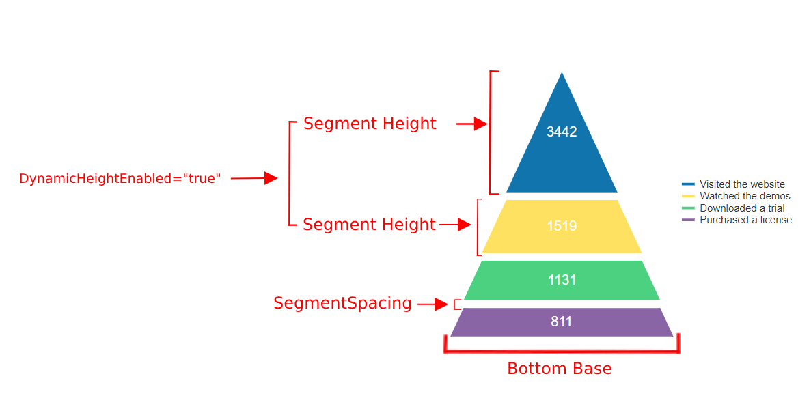
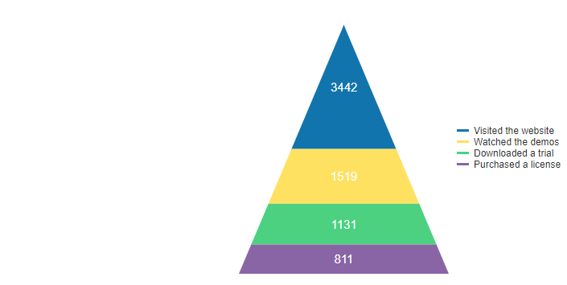

# Pyramid Chart

A **Pyramid** chart, as part of the [ASP.NET AJAX Chart](https://www.telerik.com/products/aspnet-ajax/html-chart.aspx), displays a single series of data in progressively increasing proportions, organized into segments, where each segment represents the value for the particular item from the series. The items' values can also influence the height of the corresponding segments.

Pyramid charts are usually used to represent stages in a sales process: 

- Show the amount of potential revenue for each stage.
- Identify a potential problematic area in any company's process
- Visualize website visitor trends

This chart type is well suited for displaying several values. Pyramid Charts are similar to the [Funnel Charts]() and are well suited for displaying several values.

The Pyramid series has several properties that control the way a chart's segments are rendered

* **SegmentSpacing** - The property specifies the space between the different segments of the funnel chart in pixels.
* **DynamicHeightEnabled** - A Boolean property that indicates whether all the segments will share the same size (when **DynamicHeightEnabled="false"**) or the height of each segment is determined according to its value (when **DynamicHeightEnabled="true"**). Default value is true.

The code in **Example 1** will show you how to build a **PyramidSeries** that has its **SegmentSpacing** property set (**Figure 1**), while **DynamicHeightEnabled** is enabled.

>caption Figure 1: Display a Pyramid chart that has spacing  between all segments. The code in	Example 1 shows this setup.



>caption Example 1: Creating a **PyramidSeries** that has its **SegmentSpacing** property set while **DynamicHeightEnabled** is enabled.

````ASP.NET
<telerik:RadHtmlChart runat="server" ID="PyramidChart1" Width="420" Height="320">
    <PlotArea>
        <Series>
            <telerik:PyramidSeries DynamicHeightEnabled="true" SegmentSpacing="30">
                <SeriesItems>
                    <telerik:PyramidSeriesItem Y="3442" BackgroundColor="#1274ac" Name="Visited the website" />
                    <telerik:PyramidSeriesItem Y="1519" BackgroundColor="#ffe162" Name="Watched the demos" />
                    <telerik:PyramidSeriesItem Y="1131" BackgroundColor="#4cd180" Name="Downloaded a trial" />
                    <telerik:PyramidSeriesItem Y="811" BackgroundColor="#8a65a5" Name="Purchased a license" />
                </SeriesItems>
                <LabelsAppearance Align="Center" Position="Center" Color="Black" >
                    <TextStyle FontSize="10px" />
                </LabelsAppearance>
                <TooltipsAppearance>
                    <ClientTemplate>#= category #</ClientTemplate>
                </TooltipsAppearance>
            </telerik:PyramidSeries>
        </Series>
    </PlotArea>
    <Legend>
        <Appearance Visible="true"></Appearance>
    </Legend>
</telerik:RadHtmlChart>
````
>caption Figure 2: Display a Pyramid chart with no SegmentSpacing. The code in Example 2 shows this setup.



>caption Example 2: Creating a **PyramidSeries** that has its **SegmentSpacing** property not set  while **DynamicHeightEnabled** is enabled.

````ASP.NET
<telerik:RadHtmlChart runat="server" ID="PyramidChart1" Width="420" Height="320">
    <PlotArea>
        <Series>
            <telerik:PyramidSeries DynamicHeightEnabled="true">
                <SeriesItems>
                    <telerik:PyramidSeriesItem Y="3442" BackgroundColor="#1274ac" Name="Visited the website" />
                    <telerik:PyramidSeriesItem Y="1519" BackgroundColor="#ffe162" Name="Watched the demos" />
                    <telerik:PyramidSeriesItem Y="1131" BackgroundColor="#4cd180" Name="Downloaded a trial" />
                    <telerik:PyramidSeriesItem Y="811" BackgroundColor="#8a65a5" Name="Purchased a license" />
                </SeriesItems>
                <LabelsAppearance Align="Center" Position="Center" Color="Black" >
                    <TextStyle FontSize="10px" />
                </LabelsAppearance>
                <TooltipsAppearance>
                    <ClientTemplate>#= category #</ClientTemplate>
                </TooltipsAppearance>
            </telerik:PyramidSeries>
        </Series>
    </PlotArea>
    <Legend>
        <Appearance Visible="true"></Appearance>
    </Legend>
</telerik:RadHtmlChart>
````

## See Also

 * [Choose a Data Source for Your RadHtmlChart:]()

 * [- Configuration Wizard]()

 * [- SqlDataSource]()

 * [- LinqDataSource]()

 * [- EntityDataSource]()

 * [- ObjectDataSource]()

 * [- XmlDataSource]()

 * [- Generic List]()

 * [- DataSet]()

 * [- Array]()

 * [RadHtmlChart Element Structure]()

 * [RadHtmlChart Server-side API Overview]()
