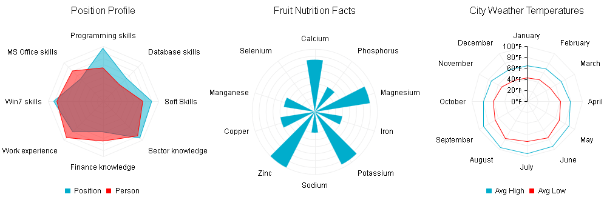

# Radar Chart


## 

A __Radar__ chart is a two-dimensional chart that has at least three quantitative factors, illustrated on axes that share the same starting point. Thischart type is useful in making comparisons between units that depend on such quantitative factors/variables. The closer the point/column of the particularvariable is to the center of the chart, the lower its value is. The nearest the point/column of the particular variable is to the edge of thechart, the higher its value is.

__RadHtmlChart__ supports three types of Radar series. They are only different in the graphical primitives that are drawn.The primitives are a polyline, column and polygon, respectively.

* __RadarAreaSeries__ - In this series type, the data points are connected with straight line segments that enclose a filled area.

* __RadarColumnSeries__ - This series type are represented on the chart as data columns whose height varies according to their value.

* __RadarLineSeries__ - This series type are represented on the chart as data points connected with straight lines.

__RadarAreaSeries__ and __RadarLineSeries__ can also be visualized with[spline curves]().

The code in __Example 1__ will show you how to build the __RadarAreaSeries__,__RadarColumnSeries__ and__RadarLineSeries__ in __Figure 1__.
>caption Figure 1: Compare units that depend on quantitative factors with Radar charts. The code in Example 1 shows how to setup RadarAreaSeries (i.e., the "Position Profile" chart), RadarColumnSeries (i.e., the "Fruit Nutrition Facts" chart) and RadarLineSeries (i.e., the "City Weather Temperatures" chart).



__Example 1__: Creating __RadarAreaSeries__, __RadarLineSeries__ and__RadarColumnSeries__ that compare units depending on quantitative factors.

````ASPNET
		<telerik:RadHtmlChart runat="server" ID="RadarAreaChart" Width="345" Height="345" Transitions="true">
			<PlotArea>
				<Series>
					<telerik:RadarAreaSeries Name="Position" MissingValues="Gap">
						<Appearance>
							<FillStyle BackgroundColor="#00adcc"></FillStyle>
						</Appearance>
						<LineAppearance Width="1" />
						<MarkersAppearance Visible="false" />
						<LabelsAppearance Visible="false"></LabelsAppearance>
						<SeriesItems>
							<telerik:CategorySeriesItem Y="159"></telerik:CategorySeriesItem>
							<telerik:CategorySeriesItem Y="170"></telerik:CategorySeriesItem>
							<telerik:CategorySeriesItem Y="100"></telerik:CategorySeriesItem>
							<telerik:CategorySeriesItem Y="140"></telerik:CategorySeriesItem>
							<telerik:CategorySeriesItem Y="160"></telerik:CategorySeriesItem>
							<telerik:CategorySeriesItem Y="103"></telerik:CategorySeriesItem>
							<telerik:CategorySeriesItem Y="173"></telerik:CategorySeriesItem>
							<telerik:CategorySeriesItem Y="107"></telerik:CategorySeriesItem>
						</SeriesItems>
					</telerik:RadarAreaSeries>
					<telerik:RadarAreaSeries Name="Person" MissingValues="Gap">
						<Appearance>
							<FillStyle BackgroundColor="red"></FillStyle>
						</Appearance>
						<LabelsAppearance Visible="false">
						</LabelsAppearance>
						<LineAppearance Width="1" />
						<MarkersAppearance Visible="false"></MarkersAppearance>
						<SeriesItems>
							<telerik:CategorySeriesItem Y="130"></telerik:CategorySeriesItem>
							<telerik:CategorySeriesItem Y="160"></telerik:CategorySeriesItem>
							<telerik:CategorySeriesItem Y="130"></telerik:CategorySeriesItem>
							<telerik:CategorySeriesItem Y="168"></telerik:CategorySeriesItem>
							<telerik:CategorySeriesItem Y="150"></telerik:CategorySeriesItem>
							<telerik:CategorySeriesItem Y="140"></telerik:CategorySeriesItem>
							<telerik:CategorySeriesItem Y="109"></telerik:CategorySeriesItem>
							<telerik:CategorySeriesItem Y="76"></telerik:CategorySeriesItem>
						</SeriesItems>
					</telerik:RadarAreaSeries>
				</Series>
				<XAxis Color="Black" Reversed="false" StartAngle="180">
					<MajorGridLines Color="#EFEFEF" Width="1"></MajorGridLines>
					<MinorGridLines Visible="false"></MinorGridLines>
					<Items>
						<telerik:AxisItem LabelText="Soft Skills"></telerik:AxisItem>
						<telerik:AxisItem LabelText="Sector knowledge"></telerik:AxisItem>
						<telerik:AxisItem LabelText="Finance knowledge"></telerik:AxisItem>
						<telerik:AxisItem LabelText="Work experience"></telerik:AxisItem>
						<telerik:AxisItem LabelText="Win7 skills"></telerik:AxisItem>
						<telerik:AxisItem LabelText="MS Office skills"></telerik:AxisItem>
						<telerik:AxisItem LabelText="Programming skills"></telerik:AxisItem>
						<telerik:AxisItem LabelText="Database skills"></telerik:AxisItem>
					</Items>
				</XAxis>
				<YAxis Visible="false">
					<MajorGridLines Color="#EFEFEF" Width="1"></MajorGridLines>
					<MinorGridLines Visible="false"></MinorGridLines>
					<LabelsAppearance Step="1"></LabelsAppearance>
				</YAxis>
				<CommonTooltipsAppearance Color="White"></CommonTooltipsAppearance>
			</PlotArea>
			<ChartTitle Text="Position Profile">
				<Appearance Align="Center" BackgroundColor="White" Position="Top">
				</Appearance>
			</ChartTitle>
			<Legend>
				<Appearance BackgroundColor="White" Position="Bottom">
				</Appearance>
			</Legend>
		</telerik:RadHtmlChart>
````


````ASPNET
		<telerik:RadHtmlChart runat="server" ID="RadarColumnChart" Width="345" Height="345" Transitions="true">
			<PlotArea>
				<Series>
					<telerik:RadarColumnSeries Name="Fruit">
						<Appearance>
							<FillStyle BackgroundColor="#00adcc"></FillStyle>
						</Appearance>
						<LabelsAppearance Visible="false">
						</LabelsAppearance>
						<TooltipsAppearance Color="White"></TooltipsAppearance>
						<SeriesItems>
							<telerik:CategorySeriesItem Y="15"></telerik:CategorySeriesItem>
							<telerik:CategorySeriesItem Y="8"></telerik:CategorySeriesItem>
							<telerik:CategorySeriesItem Y="16"></telerik:CategorySeriesItem>
							<telerik:CategorySeriesItem Y="8"></telerik:CategorySeriesItem>
							<telerik:CategorySeriesItem Y="17"></telerik:CategorySeriesItem>
							<telerik:CategorySeriesItem Y="6"></telerik:CategorySeriesItem>
							<telerik:CategorySeriesItem Y="18"></telerik:CategorySeriesItem>
							<telerik:CategorySeriesItem Y="10"></telerik:CategorySeriesItem>
							<telerik:CategorySeriesItem Y="9"></telerik:CategorySeriesItem>
						</SeriesItems>
					</telerik:RadarColumnSeries>
				</Series>
				<XAxis Color="Black" Reversed="false" StartAngle="90">
					<MajorGridLines Color="#EFEFEF" Width="1"></MajorGridLines>
					<MinorGridLines Visible="false"></MinorGridLines>
					<Items>
						<telerik:AxisItem LabelText="Calcium"></telerik:AxisItem>
						<telerik:AxisItem LabelText="Phosphorus"></telerik:AxisItem>
						<telerik:AxisItem LabelText="Magnesium"></telerik:AxisItem>
						<telerik:AxisItem LabelText="Iron"></telerik:AxisItem>
						<telerik:AxisItem LabelText="Potassium"></telerik:AxisItem>
						<telerik:AxisItem LabelText="Sodium"></telerik:AxisItem>
						<telerik:AxisItem LabelText="Zinc"></telerik:AxisItem>
						<telerik:AxisItem LabelText="Copper"></telerik:AxisItem>
						<telerik:AxisItem LabelText="Manganese"></telerik:AxisItem>
						<telerik:AxisItem LabelText="Selenium"></telerik:AxisItem>
					</Items>
				</XAxis>
				<YAxis Color="Black" Reversed="false" Visible="false">
					<MajorGridLines Color="#EFEFEF" Width="1"></MajorGridLines>
					<MinorGridLines Visible="false"></MinorGridLines>
				</YAxis>
			</PlotArea>
			<ChartTitle Text="Fruit Nutrition Facts">
				<Appearance Align="Center" BackgroundColor="White" Position="Top">
				</Appearance>
			</ChartTitle>
			<Legend>
				<Appearance Visible="false">
				</Appearance>
			</Legend>
		</telerik:RadHtmlChart>
````


````ASPNET
		<telerik:RadHtmlChart runat="server" ID="RadarLineChart" Width="345" Height="345" Transitions="true">
			<PlotArea>
				<Series>
					<telerik:RadarLineSeries Name="Avg High" MissingValues="Gap">
						<Appearance>
							<FillStyle BackgroundColor="#00adcc"></FillStyle>
						</Appearance>
						<LabelsAppearance Visible="false">
						</LabelsAppearance>
						<LineAppearance Width="1" />
						<MarkersAppearance Visible="false"></MarkersAppearance>
						<SeriesItems>
							<telerik:CategorySeriesItem Y="65"></telerik:CategorySeriesItem>
							<telerik:CategorySeriesItem Y="69"></telerik:CategorySeriesItem>
							<telerik:CategorySeriesItem Y="72"></telerik:CategorySeriesItem>
							<telerik:CategorySeriesItem Y="79"></telerik:CategorySeriesItem>
							<telerik:CategorySeriesItem Y="88"></telerik:CategorySeriesItem>
							<telerik:CategorySeriesItem Y="94"></telerik:CategorySeriesItem>
							<telerik:CategorySeriesItem Y="95"></telerik:CategorySeriesItem>
							<telerik:CategorySeriesItem Y="96"></telerik:CategorySeriesItem>
							<telerik:CategorySeriesItem Y="91"></telerik:CategorySeriesItem>
							<telerik:CategorySeriesItem Y="79"></telerik:CategorySeriesItem>
							<telerik:CategorySeriesItem Y="74"></telerik:CategorySeriesItem>
							<telerik:CategorySeriesItem Y="66"></telerik:CategorySeriesItem>
						</SeriesItems>
					</telerik:RadarLineSeries>
					<telerik:RadarLineSeries Name="Avg Low" MissingValues="Gap">
						<Appearance>
							<FillStyle BackgroundColor="Red"></FillStyle>
						</Appearance>
						<LabelsAppearance Visible="false">
						</LabelsAppearance>
						<LineAppearance Width="1" />
						<MarkersAppearance Visible="false"></MarkersAppearance>
						<SeriesItems>
							<telerik:CategorySeriesItem Y="43"></telerik:CategorySeriesItem>
							<telerik:CategorySeriesItem Y="46"></telerik:CategorySeriesItem>
							<telerik:CategorySeriesItem Y="49"></telerik:CategorySeriesItem>
							<telerik:CategorySeriesItem Y="61"></telerik:CategorySeriesItem>
							<telerik:CategorySeriesItem Y="68"></telerik:CategorySeriesItem>
							<telerik:CategorySeriesItem Y="76"></telerik:CategorySeriesItem>
							<telerik:CategorySeriesItem Y="72"></telerik:CategorySeriesItem>
							<telerik:CategorySeriesItem Y="77"></telerik:CategorySeriesItem>
							<telerik:CategorySeriesItem Y="66"></telerik:CategorySeriesItem>
							<telerik:CategorySeriesItem Y="61"></telerik:CategorySeriesItem>
							<telerik:CategorySeriesItem Y="53"></telerik:CategorySeriesItem>
							<telerik:CategorySeriesItem Y="44"></telerik:CategorySeriesItem>
						</SeriesItems>
					</telerik:RadarLineSeries>
				</Series>
				<XAxis Color="Black" Reversed="false" StartAngle="90">
					<MajorGridLines Color="#EFEFEF" Width="1"></MajorGridLines>
					<MinorGridLines Visible="false"></MinorGridLines>
					<Items>
						<telerik:AxisItem LabelText="January"></telerik:AxisItem>
						<telerik:AxisItem LabelText="February"></telerik:AxisItem>
						<telerik:AxisItem LabelText="March"></telerik:AxisItem>
						<telerik:AxisItem LabelText="April"></telerik:AxisItem>
						<telerik:AxisItem LabelText="May"></telerik:AxisItem>
						<telerik:AxisItem LabelText="June"></telerik:AxisItem>
						<telerik:AxisItem LabelText="July"></telerik:AxisItem>
						<telerik:AxisItem LabelText="August"></telerik:AxisItem>
						<telerik:AxisItem LabelText="September"></telerik:AxisItem>
						<telerik:AxisItem LabelText="October"></telerik:AxisItem>
						<telerik:AxisItem LabelText="November"></telerik:AxisItem>
						<telerik:AxisItem LabelText="December"></telerik:AxisItem>
					</Items>
				</XAxis>
				<YAxis Color="Black" MajorTickType="Outside" Reversed="false" Step="20">
					<MajorGridLines Color="#EFEFEF" Width="1"></MajorGridLines>
					<MinorGridLines Visible="false"></MinorGridLines>
					<LabelsAppearance Step="1" Skip="0" DataFormatString="{0}&#8457;"></LabelsAppearance>
				</YAxis>
				<CommonTooltipsAppearance Color="White" DataFormatString="{0}&#8457;"></CommonTooltipsAppearance>
			</PlotArea>
			<ChartTitle Text="City Weather Temperatures">
				<Appearance Align="Center" BackgroundColor="White" Position="Top">
				</Appearance>
			</ChartTitle>
			<Legend>
				<Appearance BackgroundColor="White" Position="Bottom">
				</Appearance>
			</Legend>
		</telerik:RadHtmlChart>
````


# See Also

 * [Choose a Data Source for Your RadHtmlChart:]()

 * [- Configuration Wizard]()

 * [- SqlDataSource]()

 * [- LinqDataSource]()

 * [- EntityDataSource]()

 * [- ObjectDataSource]()

 * [- XmlDataSource]()

 * [- Generic List]()

 * [- DataSet]()

 * [- Array]()

 * [RadHtmlChart Element Structure]()

 * [RadHtmlChart Server-side API Overview]()

 * [RadHtmlChart Spline Chart]()
