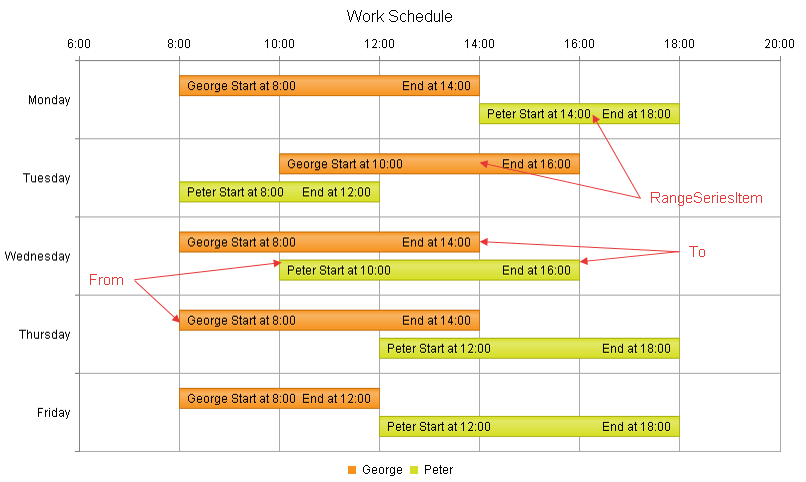

# Range Bar Chart


## 

A __Range Bar__ chart type (__Figure 1__) shows data as bars where each bar represents a value range that spans between its minimum (i.e., __From__ property) and maximum (i.e., __To__ property) levels. A __Range Bar__ chart type has floating bars unlike the standard [Bar]() chart type that has anchored bars to its x-axis.

A __Range Bar__ chart type is useful for comparing the low and high levels of value ranges (e.g., employees' working time, blood glucose levels per day, average minimum and maximum temperatures and rainfalls over time,etc.). This chart type can also be used as a simple [Gantt](7486d196-d862-42d4-846f-79a13222aca1) chart where the lowest and highest values of each bar represents the portion of task completion over time. A __Range Bar__ chart differs from the [Candlestick]() chart in its horizontal bars orientation and in the lack of weeks.

The sample in __Figure 1__ (which is generated by the code in __Example 1__) shows a company's work schedule. For example, such a chart could easily help management reassign employees responsibilities according to their work schedule.
>caption Figure 1: A basic Range Bar chart. Example 1 shows the markup used to create it.



>note The y-axis is placed horizontally in this chart type, as this is where the item values must be positioned, whereas the x-axis that holds the items themselves is vertical because this is where the base of the bars is.
>


## Customizing a Range Bar Chart

The following list shows the most common areas and elements of the Range Bar chart that you can modify. To explore the full list of options, start from the [Visual Structure of the RadHtmlChart Control’s Tag Hierarchy]() help article.

* The fill color of each series is controlled via the __BackgroundColor__ property of the __RangeBarSeries > Appearance > FillStyle__ inner tag.

* The name that is shown in the legend is set via the __Name__ property of the __RangeBarSeries__.

* The position of each item on the y-axis is controlled by its __From__ and __To__ properties of the __RangeSeriesItem__. Each __RangeSeriesItem__ is placed with regard to one __AxisItem__ on the x-axis.

* Each item can have a label and a tooltip that follow the common pattern defined in the __DataFormatString__ property of the __LabelsAppearance.FromLabelsAppearance__ / __LabelsAppearance.ToLabelsAppearance__ and __TooltipsAppearance__ sections of the series. The format string uses the __From__ and __To__ of the item. You can create more complex content via the [ClientTemplate]() of the tooltips and labels.

* The axes are also fully customizable—the y-axis automatically adjusts the scale to accommodate the data that comes in and for finer tuning there are numerous properties that can change each aspect:

* Directly in the axis tag you can use the tag's properties to control color, major and minor tick types and sizes, minimal and maximal values for the y-axis (plus a step size) whereas the x-axis requires a set of items to match the number of __RangeSeriesItem__ the series have. This tag is also the place where the crossing value with the other axis can be set (the index of an item for an item axis) and whether the axis will be reversed.

* The inner tags of the axis tag can control the major and minor grid lines in terms of color and size and the labels can have a __DataFormatString__, position and visibility set through each inner tag's properties.

* The title, background colors and legend are controlled via the inner properties of the __RadHtmlChart__ control and are common for all charts. You can find more information in the [Server-side API]() and in the [Element structure]() articles.

>tip Not all properties are necessary. The __RadHtmlChart__ will match the axes to the values if you do not declare explicit values, steps and tick properties (although the Items for axes that need them are necessary).
>


## The Example that Creates Figure 1

__Example 1__: The code that creates the chart from __Figure 1__. It shows a company's work schedule.

````ASPNET
		<telerik:RadHtmlChart runat="server" ID="RangeBarChart1" Width="800" Height="500">
			<PlotArea>
				<Series>
					<telerik:RangeBarSeries Name="George">
						<TooltipsAppearance Visible="false"></TooltipsAppearance>
						<LabelsAppearance Visible="true">
							<FromLabelsAppearance Position="InsideEnd">
								<ClientTemplate>
	                                    #=series.name #  Start at #= value.from #:00
								</ClientTemplate>
							</FromLabelsAppearance>
							<ToLabelsAppearance Position="InsideEnd">
								<ClientTemplate>
	                                    End at #= value.to #:00
								</ClientTemplate>
							</ToLabelsAppearance>
						</LabelsAppearance>
						<SeriesItems>
							<telerik:RangeSeriesItem From="8" To="14" />
							<telerik:RangeSeriesItem From="10" To="16" />
							<telerik:RangeSeriesItem From="8" To="14" />
							<telerik:RangeSeriesItem From="8" To="14" />
							<telerik:RangeSeriesItem From="8" To="12" />
						</SeriesItems>
					</telerik:RangeBarSeries>
					<telerik:RangeBarSeries Name="Peter">
						<TooltipsAppearance Visible="false"></TooltipsAppearance>
						<LabelsAppearance Visible="true">
							<FromLabelsAppearance Position="InsideEnd">
								<ClientTemplate>
	                                    #=series.name #  Start at #= value.from #:00
								</ClientTemplate>
							</FromLabelsAppearance>
							<ToLabelsAppearance Position="InsideEnd">
								<ClientTemplate>
	                                    End at #= value.to #:00
								</ClientTemplate>
							</ToLabelsAppearance>
						</LabelsAppearance>
						<SeriesItems>
							<telerik:RangeSeriesItem From="14" To="18" />
							<telerik:RangeSeriesItem From="8" To="12" />
							<telerik:RangeSeriesItem From="10" To="16" />
							<telerik:RangeSeriesItem From="12" To="18" />
							<telerik:RangeSeriesItem From="12" To="18" />
						</SeriesItems>
					</telerik:RangeBarSeries>
				</Series>
				<XAxis AxisCrossingValue="0">
					<MinorGridLines Visible="false" />
					<Items>
						<telerik:AxisItem LabelText="Monday"></telerik:AxisItem>
						<telerik:AxisItem LabelText="Tuesday"></telerik:AxisItem>
						<telerik:AxisItem LabelText="Wednesday"></telerik:AxisItem>
						<telerik:AxisItem LabelText="Thursday"></telerik:AxisItem>
						<telerik:AxisItem LabelText="Friday"></telerik:AxisItem>
					</Items>
				</XAxis>
				<YAxis MinValue="6" MaxValue="20">
					<LabelsAppearance DataFormatString="{0}:00"></LabelsAppearance>
					<MinorGridLines Visible="false" />
				</YAxis>
			</PlotArea>
			<ChartTitle Text="Work Schedule">
				<Appearance Align="Center" Position="Top"></Appearance>
			</ChartTitle>
			<Legend>
				<Appearance Position="Bottom"></Appearance>
			</Legend>
		</telerik:RadHtmlChart>
````


# See Also

 * [Server-side Programming Overview]()

 * [Design-time Creation]()

 * [Chart Types: Bar]()

 * [Chart Types: Candlestick]()

 * [Chart Types: Range Column]()

 * [Data Binding: SqlDataSource]()

 * [Data Binding: Generic List of Objects]()[RadGantt Overview](7486d196-d862-42d4-846f-79a13222aca1)
