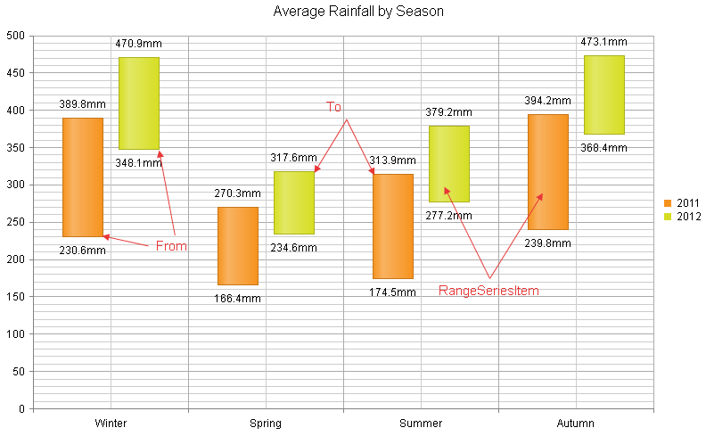

# Range Column Chart

A **Range Column** chart type (**Figure 1**) shows data as vertical bars where each bar represents a value range that spans between its minimum (i.e., **From** property) and maximum (i.e., **To** property) levels. A **Range Column** chart type has floating columns unlike the standard [Column]() chart type that has anchored bars to its x-axis. It is very similar to [Range Bar]() chart, but the orientation of the bars is vertical instead of horizontal.

A **Range Column** chart type is useful for comparing the low and high levels of value ranges (e.g., employees' working time, blood glucose levels per day, average minimum and maximum temperatures and rainfalls over time, etc.). This chart type looks like a vertical oriented simple [Gantt]() chart where the lowest and highest values of each bar represent the portion of task completion over time. A **Range Column** chart differs from the [Candlestick]() chart in the lack of weeks.

The sample in **Figure 1** (which is generated by the code in **Example 1**) shows average rainfalls by season. For example, such a chart could easily provide yearly weather information about the extreme rainfalls distributed by seasons.

>caption Figure 1: A basic Range Column chart. Example 1 shows the markup used to create it.



## Customizing a Range Column Chart

The following list shows the most common areas and elements of the Range Column chart that you can modify. To explore the full list of options, start from the [Visual Structure of the RadHtmlChart Control’s Tag Hierarchy]() help article.

* The fill color of each series is controlled via the **BackgroundColor** property of the **RangeColumnSeries > Appearance > FillStyle** inner tag.

* The name that is shown in the legend is set via the `Name` property of the series. You can hide the series from the legend either by omitting it, or by setting the `VisibleInLegend` property to `false`.

* The position of each item on the y-axis is controlled by its **From** and **To** properties of the **RangeSeriesItem**. Each **RangeSeriesItem** is placed with regard to one **AxisItem** on the x-axis.

* Each item can have a label and a tooltip that follow the common pattern defined in the **DataFormatString** property of the **LabelsAppearance.FromLabelsAppearance** / **LabelsAppearance.ToLabelsAppearance** and **TooltipsAppearance** sections of the series. The format string uses the **From** and **To** of the item. You can create more complex content via the [ClientTemplate]() of the tooltips and labels.

* The axes are also fully customizable—the y-axis automatically adjusts the scale to accommodate the data that comes in and for finer tuning there are numerous properties that can change each aspect:

	* Directly in the axis tag you can use the tag's properties to control color, major and minor tick types and sizes, minimal and maximal values for the y-axis (plus a step size) whereas the x-axis requires a set of items to match the number of **RangeSeriesItem** the series have. This tag is also the place where the crossing value with the other axis can be set (the index of an item for an item axis) and whether the axis will be reversed.

	* The inner tags of the axis tag can control the major and minor grid lines in terms of color and size and the labels can have a **DataFormatString**, position and visibility set through each inner tag's properties.

* The title, background colors and legend are controlled via the inner properties of the **RadHtmlChart** control and are common for all charts. You can find more information in the [Server-side API]() and in the [Element structure]() articles.

>tip Not all properties are necessary. The **RadHtmlChart** will match the axes to the values if you do not declare explicit values, steps and tick properties (although the Items for axes that need them are necessary).

## The Example that Creates Figure 1

>caption Example 1: The code that creates the chart from **Figure 1**. It shows tasks completion of a project.

````ASP.NET
<telerik:RadHtmlChart ID="RangeColumnChart1" runat="server" Width="800px" Height="500px">
	<PlotArea>
		<Series>
			<telerik:RangeColumnSeries Name="2011">
				<SeriesItems>
					<telerik:RangeSeriesItem From="230.6" To="389.8" />
					<telerik:RangeSeriesItem From="166.4" To="270.3" />
					<telerik:RangeSeriesItem From="174.5" To="313.9" />
					<telerik:RangeSeriesItem From="239.8" To="394.2" />
				</SeriesItems>
				<LabelsAppearance>
					<FromLabelsAppearance Visible="true" DataFormatString="{0}mm">
					</FromLabelsAppearance>
					<ToLabelsAppearance Visible="true" DataFormatString="{1}mm">
					</ToLabelsAppearance>
				</LabelsAppearance>
				<TooltipsAppearance>
					<ClientTemplate>
						Avg Min Rainfall : #= value.from # mm <br/>
						Avg Max Rainfall : #= value.to # mm
					</ClientTemplate>
				</TooltipsAppearance>
			</telerik:RangeColumnSeries>
			<telerik:RangeColumnSeries Name="2012">
				<SeriesItems>
					<telerik:RangeSeriesItem From="348.1" To="470.9" />
					<telerik:RangeSeriesItem From="234.6" To="317.6" />
					<telerik:RangeSeriesItem From="277.2" To="379.2" />
					<telerik:RangeSeriesItem From="368.4" To="473.1" />
				</SeriesItems>
				<LabelsAppearance>
					<FromLabelsAppearance Visible="true" DataFormatString="{0}mm">
					</FromLabelsAppearance>
					<ToLabelsAppearance Visible="true" DataFormatString="{1}mm">
					</ToLabelsAppearance>
				</LabelsAppearance>
				<TooltipsAppearance>
					<ClientTemplate>
						Avg Min Rainfall : #= value.from # mm <br/>
						Avg Max Rainfall : #= value.to # mm
					</ClientTemplate>
				</TooltipsAppearance>
			</telerik:RangeColumnSeries>
		</Series>
		<XAxis>
			<Items>
				<telerik:AxisItem LabelText="Winter" />
				<telerik:AxisItem LabelText="Spring" />
				<telerik:AxisItem LabelText="Summer" />
				<telerik:AxisItem LabelText="Autumn" />
			</Items>
		</XAxis>
	</PlotArea>
	<ChartTitle Text="Average Rainfall by Season"></ChartTitle>
</telerik:RadHtmlChart>
````

## See Also

 * [Server-side Programming Overview]()

 * [Design-time Creation]()

 * [Chart Types: Candlestick]()

 * [Chart Types: Column]()

 * [Chart Types: Range Bar]()

 * [Data Binding: SqlDataSource]()

 * [Data Binding: Generic List of Objects]()
 
 * [RadGantt Overview]()
