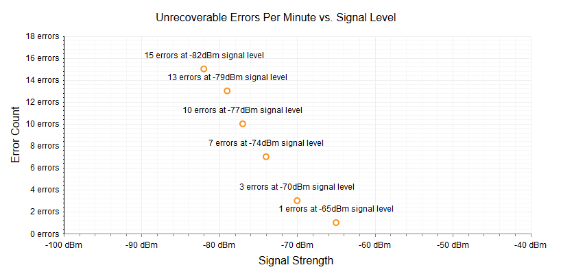

# Scatter Chart

A Scatter chart shows data as points defined by their items' values. Its x-axis is also numerical and does not require items. Scatter charts are useful for showing the relation between different sets of data, for example scientific (experimental) results.This Help article shows which properties to use to customize a Scatter chart (**Figure 1**) and shows sample code (**Example 1**) to create one.

>caption Figure 1: A simple Scatter chart.



You can fully customize the Scatter chart:

* The color of each series is controlled via the **BackgroundColor** property of the **ScatterSeries > Appearance > FillStyle** inner tag.

* The name that is shown in the legend is set via the `Name` property of the series. You can hide the series from the legend either by omitting it, or by setting the `VisibleInLegend` property to `false`.

* The position of each item on the y-axis is controlled by its **Y** property of the **ScatterSeriesItem**. The position according to the x-axis is set with the **X** property.

* Each item can have a label and a tooltip that follows the common pattern defined in the **DataFormatString** property of the **LabelsAppearance** and **TooltipsAppearance** sections of the series.The format string uses the **X** of the item for the **first** placeholder and the **Y** for the **second** placeholder. You can also load custom text from data source fields in labels and tooltips by using the composite [ClientTemplate]() property.

* The markers are fully customizable—the type, background color, size, border's width and color can be conrolled respectively through **MarkersType**, **BackgroundColor**, **Size**, **BorderWidth** and **BorderColor** properties, exposed by the **ScatterSeries > MarkersAppearance** tag.

* The axes are also fully customizable—they automatically adjust the scale to accommodate the data that comes in and for finer tuning,there are numerous properties that can change each aspect:

	* Directly in the axis tag you can use its properties to control color, major and minor tick types and sizes, minimal and maximal values for the y-axis (plus a step size).This is also the place where the crossing value with the other axis can be set and whether the axis will be reversed.

	* The inner tags of the axis tag can control the major and minor grid lines in terms of color and sizeand the labels can have a **DataFormatString**, position and visibility set through each inner tag's properties.

* The title, background colors and legend are controlled via the inner properties of the **RadHtmlChart** control and are common for all charts. You can find more information in the [Server-side API]()and in the [Element structure]() articles.

The Scatter chart in **Figure 1** is created with the code in **Example 1**:

>tip Not all properties are necessary. The **RadHtmlChart** will match the axes to the values if you do not declare explicit values, steps and tick properties.

>caption Example 1: The simple Scatter chart shown in Figure 1 using static data.

````ASP.NET
<telerik:RadHtmlChart runat="server" ID="ScatterChart1" Transitions="true" Width="800px">
	<PlotArea>
		<Series>
			<telerik:ScatterSeries Name="Applicance 1">
				<TooltipsAppearance Visible="false" />
				<LabelsAppearance DataFormatString="{1} errors at {0}dBm signal level" />
				<SeriesItems>
					<telerik:ScatterSeriesItem X="-82" Y="15" />
					<telerik:ScatterSeriesItem X="-79" Y="13" />
					<telerik:ScatterSeriesItem X="-77" Y="10" />
					<telerik:ScatterSeriesItem X="-74" Y="7" />
					<telerik:ScatterSeriesItem X="-70" Y="3" />
					<telerik:ScatterSeriesItem X="-65" Y="1" />
				</SeriesItems>
			</telerik:ScatterSeries>
		</Series>
		<XAxis MajorTickType="Outside" MinorTickType="Outside" Reversed="false" AxisCrossingValue="-100" MinValue="-100" MaxValue="-40">
			<LabelsAppearance DataFormatString="{0} dBm" RotationAngle="0" />
			<MajorGridLines Color="#EFEFEF" Width="1" />
			<MinorGridLines Color="#F7F7F7" Width="1" />
			<TitleAppearance Position="Center" RotationAngle="0" Text="Signal Strength" />
		</XAxis>
		<YAxis AxisCrossingValue="0" Color="Black" MajorTickSize="1" MajorTickType="Outside"
			MinorTickSize="1" MinorTickType="Outside" Reversed="false" MaxValue="18">
			<LabelsAppearance DataFormatString="{0} errors" RotationAngle="0" />
			<MajorGridLines Color="#EFEFEF" Width="1" />
			<MinorGridLines Color="#F7F7F7" Width="1" />
			<TitleAppearance Position="Center" RotationAngle="0" Text="Error Count" />
		</YAxis>
	</PlotArea>
	<ChartTitle Text="Unrecoverable Errors Per Minute vs. Signal Level">
		<Appearance Align="Center" BackgroundColor="White" Position="Top" />
	</ChartTitle>
	<Legend>
		<Appearance Visible="false" />
	</Legend>
</telerik:RadHtmlChart>
````

## See Also

 * [RadHtmlChart Server-side API overview]()

 * [RadHtmlChart Element Structure]()
