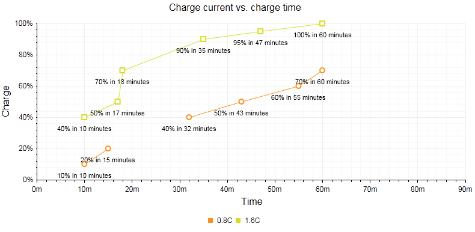

# ScatterLine Chart


## 

The ScatterLine chart is very similar to the [Scatter chart]()—it shows data as points defined by their items'	values. Its x-axis is also numerical and does not require items. The main difference between ScatterLine charts and Scatter charts is that thesubsequent points are connected with lines and thus it can account for missing values in a series.You'll use ScatterLine charts for showing the relation between different sets of data, for example scientific (experimental) results, or when you need to havetwo numerical axes on a line-type chart. Since Q1 2014 __ScatterLineSeries__ can be visualized with	[spline curves](). This Help article shows which properties to use to customize a ScatterLine chart(__Figure 1__) and shows sample code (__Example 1__) to create one.
>caption Figure 1: A simple ScatterLine chart comparing two sets of data over time. The code in Example 1 shows how to customize	the chart using the MissingValues property to account for a gap in data in the 0.8C ScatterLineSeries.



You can customize the ScatterLine chart:

* The color of each series is controlled via the __BackgroundColor__ property of the__ScatterLineSeries -> Appearance -> FillStyle__ inner tag.

* The width of the line in each series is controlled via the __Width__ property of the__ScatterLineSeries -> LineAppearance__ tag.

* The name that is shown in the legend is set via the __Name__ property of the __ScatterLineSeries__

* The position of each item on the y-axis is controlled by its __Y__ property of the __ScatterSeriesItem__and the position of those items according to the x-axis is set with the __X__ property.

* Each item can have a label and a tooltip that follows the common pattern defined in the __DataFormatString__ property of the__LabelsAppearance__ and __TooltipsAppearance__ sections of the series.The format string uses the __X__ of the item for the __first__ placeholder and the__Y__ for the __second__ placeholder. You can also load custom text from data source fields in labels andtooltips by using the composite [ClientTemplate]() property.

* The markers are fully customizable—the type, background color, size, border's width and color can becontrolled respectively through __MarkersType__, __BackgroundColor__, __Size__,	__BorderWidth__ and __BorderColor__ properties, exposed by the__ScatterLineSeries -> MarkersAppearance__ tag.

* The axes are also fully customizable—they automatically adjust the scale to accomodate the data that comes in and for finer tuningthere are numerous properties that can change each aspect:

* Directly in the axis tag you can use its properties to control color, major and minor tick types and sizes, minimal and maximal values for the-Y axis (plus a step size).This is also the place where the crossing value with the other axis can be set and whether the axis will be reversed.

* The inner tags of the axis tag can control the major and minor grid lines in terms of colour and sizeand the labeles can have a __DataFormatString__, position and visibility set through each inner tag's properties.

* If some values are missing (i.e. they are null/Nothing) from the series data you can have the chart work around this by setting the__MissingValues__ property of the series to the desired behavior—interpolate, missing or gap.

* The title, background colors and legend are controlled via the inner properties of the __RadHtmlChart__ control and are common for all charts.You can find more information in the [Server-side API]()and in the [Element structure]() articles.

The ScatterLine chart from __Figure 1__ is created with the code in __Example 1__:

>tip Not all properties are necessary. The __RadHtmlChart__ will match the axes to the values if you do not declare explicit values, steps and tick properties.
>


__Example 1__: Creating a ScatterLine chart that compares two sets of static data over a time period with customized properties. The property for	__MissingValues__ is set to __Gap__ for the 0.8C __ScatterLineSeries__.

````ASPNET
	    <telerik:RadHtmlChart runat="server" ID="ScatterLineChart1" Transitions="true">
	        <PlotArea>
	            <Series>
	                <telerik:ScatterLineSeries Name="0.8C" MissingValues="Gap">
	                    <LabelsAppearance DataFormatString="{1}% in {0} minutes" Position="Below" />
	                    <MarkersAppearance MarkersType="Circle" />
	                    <SeriesItems>
	                        <telerik:ScatterSeriesItem X="10" Y="10" />
	                        <telerik:ScatterSeriesItem X="15" Y="20" />
	                        <telerik:ScatterSeriesItem />
	                        <telerik:ScatterSeriesItem X="32" Y="40" />
	                        <telerik:ScatterSeriesItem X="43" Y="50" />
	                        <telerik:ScatterSeriesItem X="55" Y="60" />
	                        <telerik:ScatterSeriesItem X="60" Y="70" />
	                    </SeriesItems>
	                </telerik:ScatterLineSeries>
	                <telerik:ScatterLineSeries Name="1.6C">
	                    <LabelsAppearance DataFormatString="{1}% in {0} minutes" Position="Below" />
	                    <MarkersAppearance MarkersType="Square" />
	                    <SeriesItems>
	                        <telerik:ScatterSeriesItem X="10" Y="40" />
	                        <telerik:ScatterSeriesItem X="17" Y="50" />
	                        <telerik:ScatterSeriesItem X="18" Y="70" />
	                        <telerik:ScatterSeriesItem X="35" Y="90" />
	                        <telerik:ScatterSeriesItem X="47" Y="95" />
	                        <telerik:ScatterSeriesItem X="60" Y="100" />
	                    </SeriesItems>
	                </telerik:ScatterLineSeries>
	            </Series>
	            <XAxis AxisCrossingValue="0" Color="Black" MajorTickType="Outside" MinorTickType="Outside"
	                Reversed="false" MinValue="0" MaxValue="90" Step="10">
	                <LabelsAppearance DataFormatString="{0}m" RotationAngle="0" />
	                <MajorGridLines Color="#EFEFEF" Width="1" />
	                <MinorGridLines Color="#F7F7F7" Width="1" />
	                <TitleAppearance Position="Center" RotationAngle="0" Text="Time" />
	            </XAxis>
	            <YAxis AxisCrossingValue="0" Color="Black" MajorTickSize="1" MajorTickType="Outside"
	                MaxValue="100" MinorTickSize="1" MinorTickType="Outside" MinValue="0" Reversed="false"
	                Step="20">
	                <LabelsAppearance DataFormatString="{0}%" RotationAngle="0" />
	                <MajorGridLines Color="#EFEFEF" Width="1" />
	                <MinorGridLines Color="#F7F7F7" Width="1" />
	                <TitleAppearance Position="Center" RotationAngle="0" Text="Charge" />
	            </YAxis>
	        </PlotArea>
	        <ChartTitle Text="Charge Current vs. Charge Time">
	        </ChartTitle>
	        <Legend>
	            <Appearance Position="Bottom" />
	        </Legend>
	    </telerik:RadHtmlChart>
````


# See Also

 * [RadHtmlChart Server-side API Overview]()

 * [RadHtmlChart Element Structure]()

 * [RadHtmlChart Spline Chart]()
