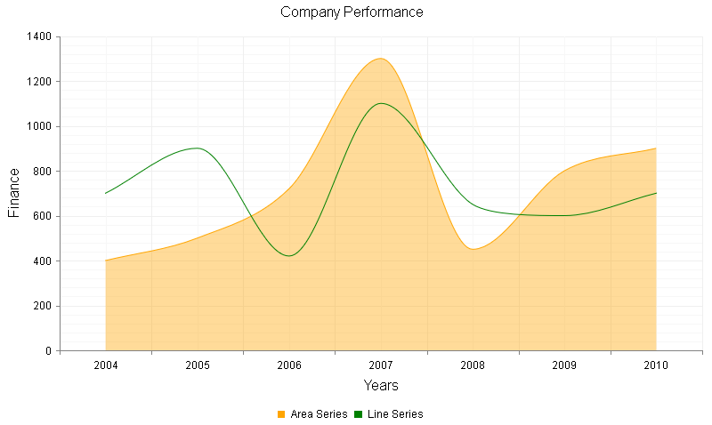

# Spline Chart

A Spline chart is a form of line/area chart where each data point from the series is connected with a fitted curve that represents a rough approximation of the missing data points. You could plot the following series with a spline interpolation: **AreaSeries**, **LineSeries**, **ScatterLineSeries**, **RadarLineSeries**, **RadarAreaSeries**, **PolarLineSeries** and **PolarAreaSeries**. Telerik added the spline chart in **Q1 2014**.

You can display a fitted curve through the data points from the series by setting the **LineAppearance.LineStyle** property of the series to "**Smooth**". For example:

````ASP.NET
<telerik:AreaSeries Name="Area Series">
	<LineAppearance LineStyle="Smooth" />
</telerik:AreaSeries>
````

The code in **Example 1** will show you how to build spline series in **Figure 1**.

>caption Figure 1: Data points in area and line series are connected through interpolated curves. The code in Example 1	illustrates how to setup spline area and line series.



>caption Example 1: Creating a chart that has two spline series - **AreaSeries** and **LineSeries**. Spline functionality is enabled by simply setting the **LineAppearance.LineStyle** property of the series to "**Smooth**"

````ASP.NET
<telerik:RadHtmlChart runat="server" ID="AreaLineSplineChart" Width="800" Height="500" Transitions="true">
	<PlotArea>
		<Series>
			<telerik:AreaSeries Name="Area Series">
				<LineAppearance LineStyle="Smooth" />
				<Appearance>
					<FillStyle BackgroundColor="Orange" />
				</Appearance>
				<LabelsAppearance Visible="false" />
				<MarkersAppearance Visible="false" />
				<SeriesItems>
					<telerik:CategorySeriesItem Y="400" />
					<telerik:CategorySeriesItem Y="500" />
					<telerik:CategorySeriesItem Y="720" />
					<telerik:CategorySeriesItem Y="1300" />
					<telerik:CategorySeriesItem Y="450" />
					<telerik:CategorySeriesItem Y="800" />
					<telerik:CategorySeriesItem Y="900" />
				</SeriesItems>
			</telerik:AreaSeries>
			<telerik:LineSeries Name="Line Series">
				<LineAppearance LineStyle="Smooth" />
				<Appearance>
					<FillStyle BackgroundColor="Green" />
				</Appearance>
				<LabelsAppearance Visible="false" />
				<MarkersAppearance Visible="false" />
				<SeriesItems>
					<telerik:CategorySeriesItem Y="700" />
					<telerik:CategorySeriesItem Y="900" />
					<telerik:CategorySeriesItem Y="420" />
					<telerik:CategorySeriesItem Y="1100" />
					<telerik:CategorySeriesItem Y="650" />
					<telerik:CategorySeriesItem Y="600" />
					<telerik:CategorySeriesItem Y="700" />
				</SeriesItems>
			</telerik:LineSeries>
		</Series>
		<CommonTooltipsAppearance Color="White"></CommonTooltipsAppearance>
		<XAxis>
			<MajorGridLines Color="#EFEFEF" Width="1" />
			<MinorGridLines Color="#F7F7F7" Width="1" />
			<Items>
				<telerik:AxisItem LabelText="2004" />
				<telerik:AxisItem LabelText="2005" />
				<telerik:AxisItem LabelText="2006" />
				<telerik:AxisItem LabelText="2007" />
				<telerik:AxisItem LabelText="2008" />
				<telerik:AxisItem LabelText="2009" />
				<telerik:AxisItem LabelText="2010" />
			</Items>
			<TitleAppearance Position="Center" Text="Years" />
		</XAxis>
		<YAxis>
			<MajorGridLines Color="#EFEFEF" Width="1" />
			<MinorGridLines Color="#F7F7F7" Width="1" />
			<TitleAppearance Position="Center" Text="Finance" />
		</YAxis>
	</PlotArea>
	<ChartTitle Text="Company Performance">
		<Appearance Align="Center" Position="Top" />
	</ChartTitle>
	<Legend>
		<Appearance Position="Bottom" />
	</Legend>
</telerik:RadHtmlChart>
````

## See Also

 * [Choose a Data Source for Your RadHtmlChart:]()

 * [- Configuration Wizard]()

 * [- SqlDataSource]()

 * [- LinqDataSource]()

 * [- EntityDataSource]()

 * [- ObjectDataSource]()

 * [- XmlDataSource]()

 * [- Generic List]()

 * [- DataSet]()

 * [- Array]()

 * [RadHtmlChart Element Structure]()

 * [RadHtmlChart Server-side API Overview]()
