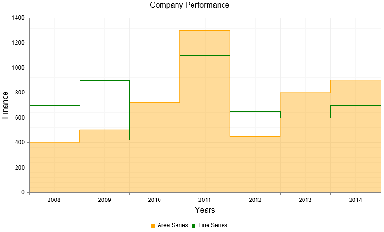

# Step Line Chart


## 

A Step line chart is a form of line/area chart where each data point from the series is connected with vertical andhorizontal lines to form a step-like progression. This type of line/area visualization is useful in displaying theintermittent changes of a quantity that remains a constant during stages. The **AreaSeries** and **LineSeries** support Step line rendering. Telerik introduced the Step line chart in **Q1 2014**.

You can display horizontal and vertical lines through the data points from the series by setting the	**LineAppearance.LineStyle** property of the series to "**Step**".For example:

````ASPNET
		<telerik:AreaSeries Name="Area Series">
			<LineAppearance LineStyle="Step" />
		</telerik:AreaSeries>
````


The code in **Example 1** will show you how to build a Step line series in **Figure 1**.
>caption Figure 1: Data points in area and line series are connected through horizontal and vertical lines. The code in Example 1	illustrates how to setup a Step line area and line series.



**Example 1**: Creating a chart that has two Step line series - **AreaSeries** and**LineSeries**. The Step line functionality is enabled by simply setting the **LineAppearance.LineStyle**property of the series to "**Step**".

````ASPNET
		<telerik:RadHtmlChart runat="server" ID="AreaLineSteplineChart" Width="800" Height="500" Transitions="true">
			<PlotArea>
				<Series>
					<telerik:AreaSeries Name="Area Series">
						<LineAppearance LineStyle="Step" />
						<Appearance>
							<FillStyle BackgroundColor="Orange" />
						</Appearance>
						<LabelsAppearance Visible="false" />
						<MarkersAppearance Visible="false" />
						<SeriesItems>
							<telerik:CategorySeriesItem Y="400" />
							<telerik:CategorySeriesItem Y="500" />
							<telerik:CategorySeriesItem Y="720" />
							<telerik:CategorySeriesItem Y="1300" />
							<telerik:CategorySeriesItem Y="450" />
							<telerik:CategorySeriesItem Y="800" />
							<telerik:CategorySeriesItem Y="900" />
						</SeriesItems>
					</telerik:AreaSeries>
					<telerik:LineSeries Name="Line Series">
						<LineAppearance LineStyle="Step" />
						<Appearance>
							<FillStyle BackgroundColor="Green" />
						</Appearance>
						<LabelsAppearance Visible="false" />
						<MarkersAppearance Visible="false" />
						<SeriesItems>
							<telerik:CategorySeriesItem Y="700" />
							<telerik:CategorySeriesItem Y="900" />
							<telerik:CategorySeriesItem Y="420" />
							<telerik:CategorySeriesItem Y="1100" />
							<telerik:CategorySeriesItem Y="650" />
							<telerik:CategorySeriesItem Y="600" />
							<telerik:CategorySeriesItem Y="700" />
						</SeriesItems>
					</telerik:LineSeries>
				</Series>
				<CommonTooltipsAppearance Color="White"></CommonTooltipsAppearance>
				<XAxis>
					<MajorGridLines Color="#EFEFEF" Width="1" />
					<MinorGridLines Color="#F7F7F7" Width="1" />
					<Items>
						<telerik:AxisItem LabelText="2008" />
						<telerik:AxisItem LabelText="2009" />
						<telerik:AxisItem LabelText="2010" />
						<telerik:AxisItem LabelText="2011" />
						<telerik:AxisItem LabelText="2012" />
						<telerik:AxisItem LabelText="2013" />
						<telerik:AxisItem LabelText="2014" />
					</Items>
					<TitleAppearance Position="Center" Text="Years" />
				</XAxis>
				<YAxis>
					<MajorGridLines Color="#EFEFEF" Width="1" />
					<MinorGridLines Color="#F7F7F7" Width="1" />
					<TitleAppearance Position="Center" Text="Finance" />
				</YAxis>
			</PlotArea>
			<ChartTitle Text="Company Performance">
				<Appearance Align="Center" Position="Top" />
			</ChartTitle>
			<Legend>
				<Appearance Position="Bottom" />
			</Legend>
		</telerik:RadHtmlChart>
````


# See Also

 * [Choose a Data Source for Your RadHtmlChart:]()

 * [- Configuration Wizard]()

 * [- SqlDataSource]()

 * [- LinqDataSource]()

 * [- EntityDataSource]()

 * [- ObjectDataSource]()

 * [- XmlDataSource]()

 * [- Generic List]()

 * [- DataSet]()

 * [- Array]()

 * [RadHtmlChart Element Structure]()

 * [RadHtmlChart Server-side API Overview]()
