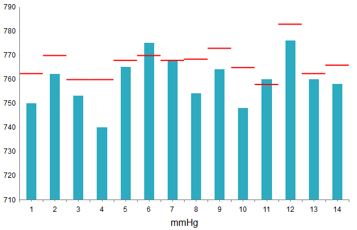

# Vertical Bullet Chart


The Bullet chart is a variation of the [Column Chart]() and can be used as a replacement for dashboard gauges and meters. This help article describes how to set some properties in a  Vertical Bullet chart and **Example 1** (near the end of this article) shows the code used to create **Figure 1**.

The vertical bullet graph compares a given quantitative measure (such as temperature) against qualitative ranges (e.g. warm, hot, mild, cool, chilly, cold, freezing, icy, frosty) and a symbol marker that encodes the comparative measure (for example the max temperature a year ago).

>caption Figure 1: A basic Vertical Bullet showing a comparison between the target and actual pressure levels.



You can customize the Vertical Bullet chart in several ways:

* The color of each series is controlled via the **BackgroundColor** property of the **VerticalBulletSeries > Appearance > FillStyle** inner tag.

* You can get horizontal bars by using a **BulletSeries** or vertical columns by using a **VerticalBulletSeries** series types. 

* The target and the actual levels of each Bullet series item can be controlled from the **`<item>.Target`** and **`<item>.Current`** properties. 

* The name that is shown in the legend is set via the `Name` property of the series. You can hide the series from the legend either by omitting it, or by setting the `VisibleInLegend` property to `false`.

* Each item can have a tooltip which follows the common pattern defined in the **DataFormatString** property of the **TooltipsAppearance** section of the series. The format string uses the **Current** and the **Target** of the item. You can also load custom text from data source fields in labels and tooltips by using the composite [ClientTemplate]() property.

* The axes are also fully customizable — they automatically adjust their scale to accommodate the data that comes in and for finer tuning, there are numerous properties that can change each aspect:

	* Directly in the axis tag you can use its properties to control color, major and minor tick types and sizes, minimal and maximal values for the y-axis (plus a step size), whereas the x-axis requires a set of items to match the number of **SeriesItems** the series have. This is also the place where the crossing value with the other axis can be set (the index of an item for an item axis) and whether the axis will be reversed.
	
	* The inner tags of the axis tag can control the major and minor grid lines in terms of color and size and the labels can have a **DataFormatString**, position and visibility set through each inner tag's properties.

* The title, background colors and legend are controlled via the inner properties of the **RadHtmlChart** control and are common for all charts. You can find more information in the [Server-side Programming Basic Configuration]() and in the [Element structure]() articles.

**Example 1** shows how to set properties and generate **Figure 1**.

>tip Not all properties are necessary. The **RadHtmlChart** will match the axes to the values if you do not declare explicit values, steps and tick properties (although the **Items** for axes that need them are necessary).

>caption Example 1: Configuring a basic Vertical Bullet chart (the one shown in **Figure 1**).

````ASP.NET
<telerik:RadHtmlChart runat="server" ID="VerticalBulletChart1" Width="600" Height="400" Transitions="true" Skin="Silk">
    <PlotArea>
        <Series>
            <telerik:VerticalBulletSeries>
                <SeriesItems>
                    <telerik:BulletSeriesItem Current="750" Target="762.5" />
                    <telerik:BulletSeriesItem Current="762" Target="770" />
                    <telerik:BulletSeriesItem Current="753" Target="760" />
                    <telerik:BulletSeriesItem Current="740" Target="760" />
                    <telerik:BulletSeriesItem Current="765" Target="768" />
                    <telerik:BulletSeriesItem Current="775" Target="770" />
                    <telerik:BulletSeriesItem Current="768" Target="768" />
                    <telerik:BulletSeriesItem Current="754" Target="768.5" />
                    <telerik:BulletSeriesItem Current="764" Target="773" />
                    <telerik:BulletSeriesItem Current="748" Target="765" />
                    <telerik:BulletSeriesItem Current="760" Target="758" />
                    <telerik:BulletSeriesItem Current="776" Target="783" />
                    <telerik:BulletSeriesItem Current="760" Target="762.5" />
                    <telerik:BulletSeriesItem Current="758" Target="766" />
                </SeriesItems>
            </telerik:VerticalBulletSeries>
        </Series>
        <XAxis AxisCrossingValue="0" MajorTickType="Outside" MinorTickType="Outside"
            Reversed="false">
            <Items>
                <telerik:AxisItem LabelText="1"></telerik:AxisItem>
                <telerik:AxisItem LabelText="2"></telerik:AxisItem>
                <telerik:AxisItem LabelText="3"></telerik:AxisItem>
                <telerik:AxisItem LabelText="4"></telerik:AxisItem>
                <telerik:AxisItem LabelText="5"></telerik:AxisItem>
                <telerik:AxisItem LabelText="6"></telerik:AxisItem>
                <telerik:AxisItem LabelText="7"></telerik:AxisItem>
                <telerik:AxisItem LabelText="8"></telerik:AxisItem>
                <telerik:AxisItem LabelText="9"></telerik:AxisItem>
                <telerik:AxisItem LabelText="10"></telerik:AxisItem>
                <telerik:AxisItem LabelText="11"></telerik:AxisItem>
                <telerik:AxisItem LabelText="12"></telerik:AxisItem>
                <telerik:AxisItem LabelText="13"></telerik:AxisItem>
                <telerik:AxisItem LabelText="14"></telerik:AxisItem>
            </Items>
            <TitleAppearance Position="Center" RotationAngle="0" Text="mmHg"></TitleAppearance>
            <MajorGridLines Visible="false" />
            <MinorGridLines Visible="false" />
        </XAxis>
        <YAxis AxisCrossingValue="0" MajorTickSize="1" MajorTickType="Outside"
            MinorTickType="None" Reversed="false">
            <MajorGridLines Visible="false" />
            <MinorGridLines Visible="false" />
        </YAxis>
    </PlotArea>
</telerik:RadHtmlChart>
````

## See Also

 * [Choose a Data Source for Your RadHtmlChart:]()

 * [- Configuration Wizard]()

 * [- SqlDataSource]()

 * [- LinqDataSource]()

 * [- EntityDataSource]()

 * [- ObjectDataSource]()

 * [- XmlDataSource]()

 * [- Generic List]()

 * [- DataSet]()

 * [- Array]()

 * [RadHtmlChart Element Structure]()

 * [RadHtmlChart Server-side API Overview]()

 * [RadHtmlChart Bullet Chart]()

