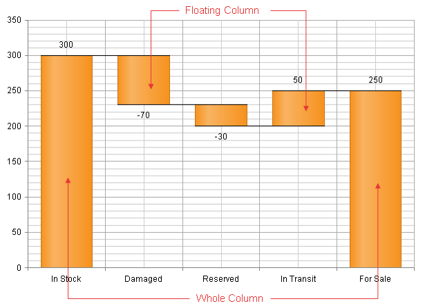

# Waterfall Chart

A **Waterfall** chart type (**Figure 1**) (a.k.a., flying bricks, bridge, etc.) shows the cumulative effect of positive or negative values on the starting point. Its purpose is to provide a better understanding of how an initial amount is influenced by subsequently added positive or negative values. Generally, the first and last items of a **Waterfall** series are denoted by whole columns while items in the middle are shown as floating columns. You can, however, control whether the last and middle items display the current value (e.g., a floating column set through the **Y** property) or the sum of all previous values (e.g., a whole column set through the **Summary** property).

A **Waterfall** chart is useful for different types of quantitative analysis related to inventory, cash flows, performance, etc. This chart type looks like a [Range Column]() chart where the low or high value of a subsequent item is connected to the preceding one with a thin line. It is very similar to [Horizontal Waterfall]() chart, but the orientation of the bars is vertical instead of horizontal.

The sample in **Figure 1** (which is generated by the code in **Example 1**) shows an inventory audit. For example, such a chart could easily let an inventory control specialist get acquainted with the status of an inventory. In **Example 2** you can see how to databind a **Waterfall** chart producing the same result.

>caption Figure 1: A basic Waterfall chart. Example 1 shows the markup used to create it.



## Customizing a Waterfall Chart

The following list shows the most common areas and elements of the Waterfall chart that you can modify. To explore the full list of options, start from the [Visual Structure of the RadHtmlChart Control’s Tag Hierarchy]() help article.

* The fill color of each series is controlled via the **BackgroundColor** property of the **WaterfallSeries > Appearance > FillStyle** inner tag.

* The name that is shown in the legend is set via the `Name` property of the series. You can hide the series from the legend either by omitting it, or by setting the `VisibleInLegend` property to `false`.

* The position of each item on the y-axis is controlled by its **Y** property of the **WaterfallSeriesItem**. You can also display:

	* The sum of all previous points since the last "RunningTotal" summary point by setting the **Summary** property to **RunningTotal**.

	* The sum of all previous points by setting the **Summary** property to **Total**. Each **WaterfallSeriesItem** is placed with regard to one **AxisItem** on the x-axis.

* Each item can have a label and a tooltip that follow the common pattern defined in the **DataFormatString** property of the **LabelsAppearance** and **TooltipsAppearance** sections of the series. The format string uses the **Y** / **Summary** of the item. You can create more complex content via the [ClientTemplate]() of the tooltips and labels.

* The axes are also fully customizable—the y-axis automatically adjusts the scale to accommodate the data that comes in and for finer tuning there are numerous properties that can change each aspect:

	* Directly in the axis tag you can use the tag's properties to control color, major and minor tick types and sizes, minimal and maximal values for the y-axis (plus a step size) whereas the x-axis requires a set of items to match the number of **WaterfallSeriesItem** the series have. This tag is also the place where the crossing value with the other axis can be set (the index of an item for an item axis) and whether the axis will be reversed.

	* The inner tags of the axis tag can control the major and minor grid lines in terms of color and size and the labels can have a **DataFormatString**, position and visibility set through each inner tag's properties.

* The title, background colors and legend are controlled via the inner properties of the **RadHtmlChart** control and are common for all charts. You can find more information in the [Server-side API]() and in the [Element structure]() articles.

>tip Not all properties are necessary. The **RadHtmlChart** will match the axes to the values if you do not declare explicit values, steps and tick properties (although the Items for axes that need them are necessary).

## The Example that Creates Figure 1

>caption Example 1: The code that creates the chart from **Figure 1**. It shows tasks completion of a project.

````ASP.NET
<telerik:RadHtmlChart ID="RadHtmlChart1" runat="server" Width="600px" Height="400px">
	<PlotArea>
		<Series>
			<telerik:WaterfallSeries>
				<SeriesItems>
					<telerik:WaterfallSeriesItem Y="300" />
					<telerik:WaterfallSeriesItem Y="-70" />
					<telerik:WaterfallSeriesItem Y="-30" />
					<telerik:WaterfallSeriesItem Y="50" />
					<telerik:WaterfallSeriesItem Summary="Total" />
				</SeriesItems>
				<LabelsAppearance Visible="true"></LabelsAppearance>
			</telerik:WaterfallSeries>
		</Series>
		<XAxis>
			<Items>
				<telerik:AxisItem LabelText="In Stock" />
				<telerik:AxisItem LabelText="Damaged" />
				<telerik:AxisItem LabelText="Reserved" />
				<telerik:AxisItem LabelText="In Transit" />
				<telerik:AxisItem LabelText="For Sale" />
			</Items>
		</XAxis>
	</PlotArea>
</telerik:RadHtmlChart>
````

## Databound Waterfall chart

>caption Example 2: The code that creates the chart from **Figure 1** by binding the Waterfall series' DataFieldY, DataSummaryField, ColorField fields and the DataLabelsField of the XAxis.

````ASP.NET
        <telerik:RadHtmlChart ID="RadHtmlChart1" runat="server" Width="600px" Height="400px">
            <PlotArea>
                <Series>
                    <telerik:WaterfallSeries DataFieldY="values" DataSummaryField="summary" ColorField="colors">
                        <LabelsAppearance Visible="true"></LabelsAppearance>
                    </telerik:WaterfallSeries>
                </Series>
                <XAxis DataLabelsField="labels">
                </XAxis>
            </PlotArea>
        </telerik:RadHtmlChart>
````

````CS
    protected void Page_Load(object sender, EventArgs e)
    {
        if (!IsPostBack)
        {
            RadHtmlChart1.DataSource = GetData(); //your datasource here
            RadHtmlChart1.DataBind();
        }
    }

    protected DataTable GetData()
    {
        DataTable dt = new DataTable();
        dt.Columns.Add("labels", typeof(string));
        dt.Columns.Add("values", typeof(int));
        dt.Columns.Add("summary", typeof(string));
        dt.Columns.Add("colors", typeof(string));

        dt.Rows.Add("In Stock", 300, null, "");
        dt.Rows.Add("Damaged", -70, null, "#ff0000");
        dt.Rows.Add("Reserved", -30, null, "#ff0000");
        dt.Rows.Add("In Transit", 50, null, "#ff0000");
        dt.Rows.Add("For Sale", null, "total", "");

        return dt;
    }
````
````VB
    Protected Sub Page_Load(ByVal sender As Object, ByVal e As EventArgs) Handles Me.Load
        If Not IsPostBack Then
            RadHtmlChart1.DataSource = GetData()
            RadHtmlChart1.DataBind()
        End If
    End Sub

    Protected Function GetData() As DataTable
        Dim dt As DataTable = New DataTable()
        dt.Columns.Add("labels", GetType(String))
        dt.Columns.Add("values", GetType(Integer))
        dt.Columns.Add("summary", GetType(String))
        dt.Columns.Add("colors", GetType(String))

        dt.Rows.Add("In Stock", 300, Nothing, "")
        dt.Rows.Add("Damaged", -70, Nothing, "#ff0000")
        dt.Rows.Add("Reserved", -30, Nothing, "#ff0000")
        dt.Rows.Add("In Transit", 50, Nothing, "#ff0000")
        dt.Rows.Add("For Sale", Nothing, "total", "")
        Return dt
    End Function
````

## See Also

 * [Server-side Programming Overview]()

 * [Design-time Creation]()

 * [Chart Types: Horizontal Waterfall]()

 * [Chart Types: Range Column]()

 * [Data Binding: SqlDataSource]()

 * [Data Binding: Generic List of Objects]()
 
 
