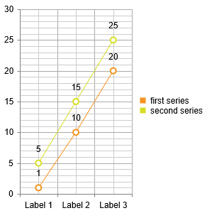

# Data Binding Overview

This help article describes the required data structure for RadHtmlChart. It explains how to use fields (columns) and rows.

A data bound series in RadHtmlChart expects a field (column) name and will take the data from all records (rows) in the provided data source. **Table 1** shows a supported data source structure and **Table 2** shows an unsuitable data source structure. You can see a sample implementation of a good data source in **Example 1**.

>caption Table 1: Expected structure of the RadHtmlChart data source

|  X_Axis_Labels  |  First_Series_Values  |  Second_Series_Values  |
| ----- | ----- | ----- |
| Label 1 | 1 | 5 |
| Label 2 | 10 | 15 |
| Label 3 | 20 | 25 |

>tip If your data source looks like **Table 2**, review the [Group RadHtmlChart Data Source](http://www.telerik.com/support/code-library/group-radhtmlchart-data-source) code library article. Alternatively, you can traverse your data source and [create series items programmatically]().

>caption Table 2: Unsupported data source structure for RadHtmlChart

|  X_Axis_Labels  |  series_group_name  |  value  |
| ----- | ----- | ----- |
| Label 1 | first | 1 |
| Label 2 | first | 10 |
| Label 3 | first | 20 |
| Label 1 | second | 5 |
| Label 2 | second | 15 |
| Label 3 | second | 25 |

>caption Example 1: Sample implementation of the supported data source for RadHtmlChart from Table 1. You can see the result in Figure 1.

````ASP.NET
<telerik:RadHtmlChart runat="server" ID="RadHtmlChart1" Width="300px" Height="300px">
	<PlotArea>
		<Series>
			<telerik:LineSeries DataFieldY="First_Series_Values" Name="first series"></telerik:LineSeries>
			<telerik:LineSeries DataFieldY="Second_Series_Values" Name="second series"></telerik:LineSeries>
		</Series>
		<XAxis DataLabelsField="X_Axis_Categories"></XAxis>
	</PlotArea>
</telerik:RadHtmlChart>
````

````C#
protected DataTable GetChartData()
{
	DataTable tbl = new DataTable();
	tbl.Columns.Add(new DataColumn("X_Axis_Categories", typeof(string)));
	tbl.Columns.Add(new DataColumn("First_Series_Values", typeof(decimal)));
	tbl.Columns.Add(new DataColumn("Second_Series_Values", typeof(decimal)));
	tbl.Rows.Add(new object[] {"Label 1", 1, 5 });
	tbl.Rows.Add(new object[] {"Label 2", 10, 15 });
	tbl.Rows.Add(new object[] {"Label 3", 20, 25 });

	return tbl;
}

protected void Page_Load(object sender, EventArgs e)
{
	if (!Page.IsPostBack)
	{
		RadHtmlChart1.DataSource = GetChartData();
		RadHtmlChart1.DataBind();
	}
}
````
````VB
Protected Function GetChartData() As DataTable
	Dim tbl As New DataTable()
	tbl.Columns.Add(New DataColumn("X_Axis_Categories", GetType(String)))
	tbl.Columns.Add(New DataColumn("First_Series_Values", GetType(Decimal)))
	tbl.Columns.Add(New DataColumn("Second_Series_Values", GetType(Decimal)))
	tbl.Rows.Add(New Object() {"Label 1", 1, 5})
	tbl.Rows.Add(New Object() {"Label 2", 10, 15})
	tbl.Rows.Add(New Object() {"Label 3", 20, 25})

	Return tbl
End Function

Protected Sub Page_Load(sender As Object, e As EventArgs) Handles Me.Load
	If Not Page.IsPostBack Then
		RadHtmlChart1.DataSource = GetChartData()
		RadHtmlChart1.DataBind()
	End If
End Sub	
````

>caption Figure 1: The result from Example 1 - correct series data binding.



## See Also

 * [Group RadHtmlChart Data Source](http://www.telerik.com/support/code-library/group-radhtmlchart-data-source)

 * [Setting Series Items Explicitly]()
