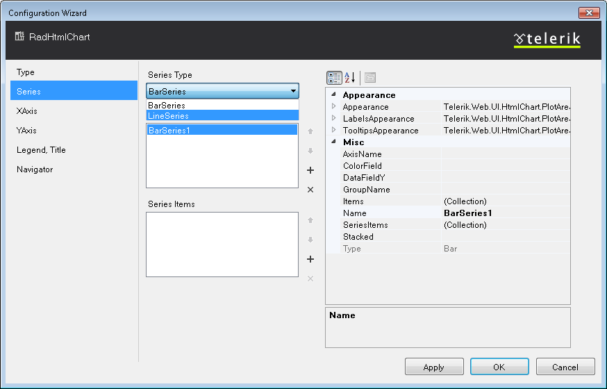
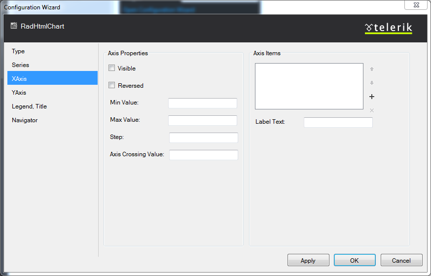

# Configuration Wizard

The Visual Designer lets you select a chart layout and chart type, configure series, set properties for	axes, set properties for a chart’s title and legend or configure a Navigator pane.	To use the __RadHtmlChart__ Visual Designer, open Visual Studio 2012, add a	ScriptManager, and then put a __RadHtmlChart__ on the page. Then choose the Design tab	and click Smart Tag to open the __RadHtmlChart__	Tasks window. Click the __Open Configuration Wizard__ link (__Figure 1__)	to open a dialog box (__Figure 2__), that provides a Visual Designer.
>caption Figure 1: Select Open Configuration Wizard from the Smart Tag of a RadHtmlChart.

>caption Figure 2: You can use the Configuration Wizard to select a chart layout and chart type, configure a series,set properties for axes, set properties for a chart’s title and legend or configure a Navigator pane.

The tabs and their functionality of the __RadHtmlChart__ Configuration Wizard are explained below.

## Type

The Type tab of the Configuration Wizard allows you to select the chart layout and thecorresponding chart type you will create.You need to select the layout and the type of the chart first because not all chart series can becombined in the same chart. Selecting the proper type will prevent you from adding a series that will not besupported by the chart layout and the corresponding chart type you will be creating. For example, a__PieSeries__ can be the only series in a chart with __Default__ or__Sparkline__ layout; a Scatter chart cannot host a Line chart because of the differentx-axis type, etc.

## Series

The Series tab is where you modify the series collection. In __Figure 3__,	a Bar chart has been selected in the Type tab, so only the BarSeries and LineSeries can be added. Also, onlythe properties that are applicable for the series' type are displayed.
>caption Figure 3: Selecting a Bar chart will limit the series properties and series items that the Configuration Wizard	displays to just the properties that are available for that type of chart.

As __Figure 4__ shows, you can set the desired column from the data source using the__DataField__ textbox.
>caption Figure 4: Setting a desired column from the data source to the BarSeries.

If you want to build a simple or static chart, you can choose to not set a data source and simply add itemsto the series in the Series Item collection editor below. Once again, the Configuration Wizardonly shows properties that are relevant to the type of chart you selected.

>note The Configuration Wizard doesn't override already defined series. That being said, in order to switch to a	different chart type, you must initially remove the inconsistent series and then add the new one.	This is done to prevent data loss. Having a Configuration Wizard does not mean that everything will be set	(or modified) by it, because this would make it very restrictive and unusable.
>

## X-Axis

You can configure the x-axis of the chart on the next tab - XAxis (__Figure 5__).The Configuration Wizard exposes the most common properties of the axis (even though setting them is notnecessary in most cases - the chart will adjust itself to the data). The right side of the XAxis tabfeatures an Axis Items collection editor that lets you add static x-axis items.
>caption Figure 5: The XAxis tab of the Configuration Wizard lets you set common x-axis properties or	add static axis items.

## Y-Axis

The YAxis tab of the Configuration Wizard (__Figure 6__) exposes the Y-Axis configuration.On the left is a set of common properties for the main y-axis. On the right, you'll seean AdditionalYAxes collection editor that lets a developer add	[additional Y-axes]() and set their basic settings.
>caption Figure 6: The YAxis tab lets you set y-axis properties or add additional Y-axes.

## Legend and Title

The Legend, Title tab (__Figure 7__) allows you to set the global properties of the chartrelated to the legend and the title. The available positions and alignmentsare provided in dropdowns and the color fill uses a color picker for fine-tuning without using additionalcolor converters. The Text property is, of course, a textbox into which you can enter a custom string.
>caption Figure 7: Use the Legend, Title tab of the Configuration Wizard to set properties for the legend and	title of the chart you selected on the Type tab.

## Navigator

If you want to take advantage of the [Data Navigation]()functionality, you can create and customize a Navigator panefrom the Navigator tab (__Figure 8__).

>note This functionality is available only for a Stock layout.
>

On the left is a set of properties for modifying the hint, x-axis appearance and the date rangesof the selector use calenders for easing the input of DateTime values. On the right, you'll see the availableSeries collection editor that lets a developer add an appropriate series and adjust their corresponding settings.
>caption Figure 8: Use the Navigator tab of the Configuration Wizard to create and customize a Navigator pane,	used for Data Navigation functionality of the Stock layout charts.

# See Also

 * [Series Configuration]()

 * [Series Items Configuration]()

 * [Axes Configuration]()

 * [Navigator Configuration]()

 * [Overview]()

 * [Data Navigation]()

 * [Multiple Y-Axes]()
