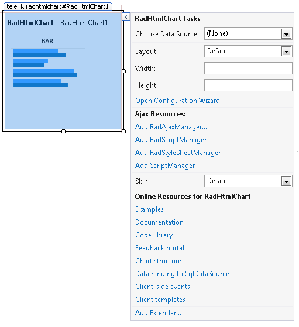
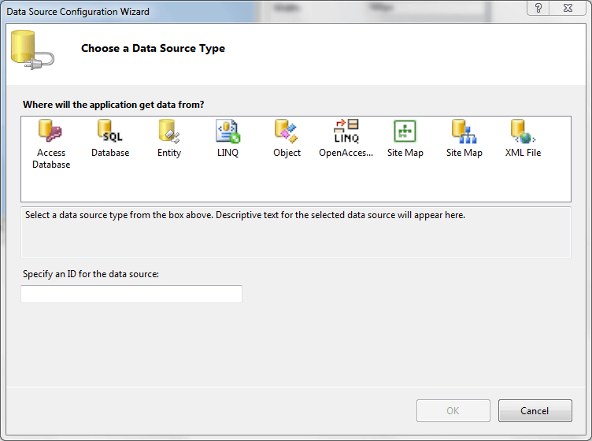
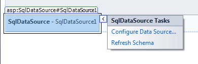

# Design Time Overview

__RadHtmlChart__ offers design-time support as of __Q2 2012 SP2__. The	advanced features are accessed through the __Smart Tag__ of the control	by clicking on the [Open Configuration Wizard]() link shown in __Figure 1__ between the __Layout__ and __Ajax Resources__ sections.
>caption Figure 1: The Smart Tag shown in the top right corner of the RadHtmlChart lets you do some quick RadHtmlChart tasks such as choose adata source, change the width and height, open the Configuration Wizard, add Ajax resources, choose a skin for your RadHtmlChart, or jump to the learning center.

The basic functionality is similar to what other Telerik controls offer, starting with data binding because __RadHtmlChart__ is a [data-bound]() control:

* choose and configure a data source

* modify layout properties

* add AJAX resources

* choose a skin

* check online learning resources

## Choose a Data Source for a RadHtmlChart

The Smart Tag of __RadHtmlChart__ begins with the data source configuration (__Figure2__). You can either choosean already existing declarative data source from the list, or add a new one.
>caption Figure 2: You can use the Data Source Configuration Wizard to set a data source for a RadHtmlChart.

The second option (__Figure 3__) is to configure the data source, regardless of whether it was just added or already exists.This is done either through the chart's Smart Tag (the __Configure Data Source__ option) or through the Smart Tag of the data source itself.
>caption Figure 3: Configure a data source in the design environment by clicking the RadHtmlChart Smart Tag and then select Configure Data Source.

## Change RadHtmlChart Height and Width

The Layout section of the Configuration Wizard lets you change the height and width of __RadHtmlChart__.

## Add Ajax Resources

You can add Ajax resources (__Figure 1__) to your __RadHtmlChart__ by clicking the Smart Tag while in the design view.

* The __Add RadAjaxManager...__ link adds a __RadAjaxManager__ component to your webpage, so you can configure partial postbacks through a comfortable control.

* The __Replace ScriptManager with RadScriptManager__ link replaces the default ScriptManager component that is usedfor AJAX-enabled websites with __RadScriptManager__. If there isn't a ScriptManager on the page this link will allow you to add one.

* The __AddRadStyleSheetManager__ link adds a __RadStyleSheetManager__ to your webpage.

## Choose the Skin for Your RadHtmlChart

You can change the skin that your __RadHtmlChart__ displays by clicking the Smart Tag and using the Configuration Wizard(__Figure 1__) to select from a list of skins. The __Skin__ dropdown lists all available skins for the controlso you can select one that matches the look and feel of the rest of the page. The skins are displayed via small images to give you a better idea ofthe color scheme they use.

## Use the RadHtmlChart Learning Center

__RadHtmlChart__ provides a section of the Configuration Wizard that lets you jump to online examples and the code library. The last section of the Smart Tag (__Figure 1__) provides several links that let you navigate to these __RadHtmlChart__ online resources. You can also search the Telerik web site for a given string.

# See Also

 * [SqlDataSource]()[RadAjaxManager Overview](546BFFA1-0A6D-4ACF-83E2-02D9592E7857)

 * [RadHtmlChart Data Binding to a SqlDataSource](http://demos.telerik.com/aspnet-ajax/htmlchart/examples/databinding/database/defaultcs.aspx)
