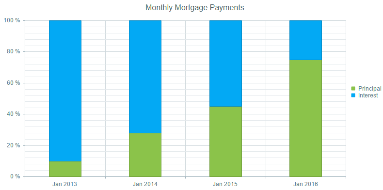
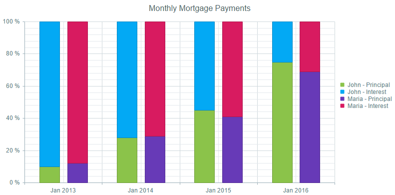

<<Comment: For better SEO, add RadHtmlChart to the title, description, tags and H1 and possibly H2.>>
# 100% Stacked Series

The 100% stacked series display the values from multiple series as stacks or group of stacks over the x-axis categories, where the values proportions from each stack totals 100%. This series type is useful for cases where the contribution of values within stacks is more meaningful than the amounts themselves.

The functionality is available for category series - bar, column, line, area and radar (area, line and column).

 * [Configure 100% Stacked Series](#configure-100-stacked-series)
 
 * [Configure 100% Stacked and Grouped Series](#configure-100-stacked-and-grouped-series)

## Configure 100% Stacked Series

To configure 100% stacked series you should set the following properties of the first series - `Stacked="true"` and `StackType="Stack100"`.

>caption Figure 1: Shows the output from Example 1, which demonstrates stacked 100% column series.



You can create **Figure 1** using the markup in **Example 1**.

>caption Example 1: Shows an implementation of chart with 100% stacked columns.

````ASP.NET
<telerik:RadHtmlChart runat="server" ID="RadHtmlChart1" Height="400px" Width="800px" Skin="Material">
	<PlotArea>
		<Series>
			<telerik:ColumnSeries Name="Principal" Stacked="true" StackType="Stack100">
				<SeriesItems>
					<telerik:CategorySeriesItem Y="100" />
					<telerik:CategorySeriesItem Y="280" />
					<telerik:CategorySeriesItem Y="450" />
					<telerik:CategorySeriesItem Y="750" />
				</SeriesItems>
				<LabelsAppearance Visible="false"></LabelsAppearance>
			</telerik:ColumnSeries>
			<telerik:ColumnSeries Name="Interest">
				<SeriesItems>
					<telerik:CategorySeriesItem Y="900" />
					<telerik:CategorySeriesItem Y="720" />
					<telerik:CategorySeriesItem Y="550" />
					<telerik:CategorySeriesItem Y="250" />
				</SeriesItems>
				<LabelsAppearance Visible="false"></LabelsAppearance>
			</telerik:ColumnSeries>
		</Series>
		<XAxis>
			<Items>
				<telerik:AxisItem LabelText="Jan 2013" />
				<telerik:AxisItem LabelText="Jan 2014" />
				<telerik:AxisItem LabelText="Jan 2015" />
				<telerik:AxisItem LabelText="Jan 2016" />
			</Items>
		</XAxis>
	</PlotArea>
	<ChartTitle Text="Monthly Mortgage Payments"></ChartTitle>
</telerik:RadHtmlChart>
````

## Configure 100% Stacked and Grouped Series

To configure 100% stacked and grouped series, you should do the following:

1. Set the the following property to the first series - `StackType="Stack100"`.

1. Set the same group name to the `GroupName` property of series that will be stacked in a separate group. 

>tip If you leave the `GroupName` property blank, all the series will be placed in one default stack. 
Setting the `GroupName` property of any series automatically sets the `Stacked` property of the first series to `true`, so it is not required to be explicitly set.

>caption Figure 2: Shows the outpue from Example 2, which demonstrates a 100% stacked and grouped column series.



You can create **Figure 2** using the markup in **Example 2**.

>caption Example 2: Shows an implementation of chart with 100% stacked and grouped columns.

````ASP.NET
<telerik:RadHtmlChart runat="server" ID="RadHtmlChart1" Height="400px" Width="800px" Skin="Material">
	<PlotArea>
		<Series>
			<telerik:ColumnSeries Name="Principal" StackType="Stack100" GroupName="John">
				<SeriesItems>
					<telerik:CategorySeriesItem Y="100" />
					<telerik:CategorySeriesItem Y="280" />
					<telerik:CategorySeriesItem Y="450" />
					<telerik:CategorySeriesItem Y="750" />
				</SeriesItems>
				<LabelsAppearance Visible="false"></LabelsAppearance>
			</telerik:ColumnSeries>
			<telerik:ColumnSeries Name="Interest" GroupName="John">
				<SeriesItems>
					<telerik:CategorySeriesItem Y="900" />
					<telerik:CategorySeriesItem Y="720" />
					<telerik:CategorySeriesItem Y="550" />
					<telerik:CategorySeriesItem Y="250" />
				</SeriesItems>
				<LabelsAppearance Visible="false"></LabelsAppearance>
			</telerik:ColumnSeries>
			<telerik:ColumnSeries Name="Principal" GroupName="Maria">
				<SeriesItems>
					<telerik:CategorySeriesItem Y="120" />
					<telerik:CategorySeriesItem Y="290" />
					<telerik:CategorySeriesItem Y="410" />
					<telerik:CategorySeriesItem Y="690" />
				</SeriesItems>
				<LabelsAppearance Visible="false"></LabelsAppearance>
			</telerik:ColumnSeries>
			<telerik:ColumnSeries Name="Interest" GroupName="Maria">
				<SeriesItems>
					<telerik:CategorySeriesItem Y="880" />
					<telerik:CategorySeriesItem Y="710" />
					<telerik:CategorySeriesItem Y="590" />
					<telerik:CategorySeriesItem Y="310" />
				</SeriesItems>
				<LabelsAppearance Visible="false"></LabelsAppearance>
			</telerik:ColumnSeries>
		</Series>
		<XAxis>
			<Items>
				<telerik:AxisItem LabelText="Jan 2013" />
				<telerik:AxisItem LabelText="Jan 2014" />
				<telerik:AxisItem LabelText="Jan 2015" />
				<telerik:AxisItem LabelText="Jan 2016" />
			</Items>
		</XAxis>
	</PlotArea>
	<ClientEvents OnLoad="setLegend" />
	<ChartTitle Text="Monthly Mortgage Payments"></ChartTitle>
</telerik:RadHtmlChart>
````

````JavaScript
<script>
	function setLegend(sender, args) {
		var kendoWidget = sender.get_kendoWidget();
		kendoWidget.options.legend.labels.template = "#=series.stack.group# - #=text#";
		kendoWidget.redraw();
	}
</script>
````


## See Also

 * [HtmlChart - 100% Stacked Series Live Demo](http://demos.telerik.com/aspnet-ajax/htmlchart/examples/functionality/100-stacked-series/defaultcs.aspx)

 * [Stacked Series]()

