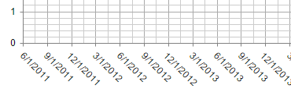

# Date Axis Base Unit Steps

This help article illustrates how to configure the step (**BaseUnitStep** and **AutoBaseUnitSteps**) of categories for a date axis in **RadHtmlChart**. 

You can control the step through which the categories will be plotted for all or particular base units through the following properties:

1. [XAxis.BaseUnitStep](#xaxisbaseunitstep)

1. [XAxis.AutoBaseUnitSteps](#xaxisautobaseunitsteps)

## XAxis.BaseUnitStep

The property is common for all the base units. It takes the following values:

1. Integer – The integer value is used for the **BaseUnitStep**.
 
	>caption Figure 1: Date axis with BaseUnitStep set to 3 created with Example 1.
	 
	
	 
	>caption Example 1: Date axis with BaseUnitStep set to 3 shown in Figure 1.
	 
	**ASP.NET**
	
		<telerik:RadHtmlChart ID="RadHtmlChart1" runat="server" Width="600" Height="400">
			<ClientEvents OnLoad="OnLoad" />
			<PlotArea>
				<Series>
					<telerik:LineSeries Name="Series 1" DataFieldY="SellQuantity">
					</telerik:LineSeries>
				</Series>
				<XAxis BaseUnit="Auto" BaseUnitStep="3" DataLabelsField="SellDate">
					<LabelsAppearance RotationAngle="45" DataFormatString="d"></LabelsAppearance>
				</XAxis>
			</PlotArea>
		</telerik:RadHtmlChart>
		

1. **"Auto"** - The **BaseUnitStep** is automatically calculated based on the maximum available x-axis categories, defined through the **MaxDateGroups** property.

	>caption Figure 2: Date axis with BaseUnitStep="Auto" and MaxDateGroups="5" created with Example 1.
	 
	
	 
	>caption Example 2: Date axis with BaseUnitStep="Auto" and MaxDateGroups="5" shown in Figure 2.
	 
	**ASP.NET**
	
		<telerik:RadHtmlChart ID="RadHtmlChart1" runat="server" Width="600" Height="400">
			<ClientEvents OnLoad="OnLoad" />
			<PlotArea>
				<Series>
					<telerik:LineSeries Name="Series 1" DataFieldY="SellQuantity">
					</telerik:LineSeries>
				</Series>
				<XAxis BaseUnit="Auto" BaseUnitStep="Auto" MaxDateGroups="5" DataLabelsField="SellDate">
					<LabelsAppearance RotationAngle="45" DataFormatString="d"></LabelsAppearance>
				</XAxis>
			</PlotArea>
		</telerik:RadHtmlChart>
		

		
## XAxis.AutoBaseUnitSteps

You can set certain steps for particular base units through the corresponding base unit collections.

>caption Figure 3: maxDateGroups is 16; baseUnitStep is 3. Detected baseUnit is Months

>caption Example 3: Setting different steps for the "Months" and "Days" units.

**ASP.NET**

	<telerik:RadHtmlChart ID="RadHtmlChart1" runat="server" Width="600" Height="400">
		<ClientEvents OnLoad="OnLoad" />
		<PlotArea>
			<Series>
				<telerik:LineSeries Name="Series 1" DataFieldY="SellQuantity">
				</telerik:LineSeries>
			</Series>
			<XAxis BaseUnit="Auto" MaxDateGroups="16" DataLabelsField="SellDate">
				<LabelsAppearance RotationAngle="45" DataFormatString="d"></LabelsAppearance>
				<AutoBaseUnitSteps>
					<Months>
						<telerik:BaseUnitStep Value="3" />
						<telerik:BaseUnitStep Value="5" />
					</Months>
					<Days>
						<telerik:BaseUnitStep Value="1" />
						<telerik:BaseUnitStep Value="3" />
					</Days>
				</AutoBaseUnitSteps>
			</XAxis>
		</PlotArea>
	</telerik:RadHtmlChart> 
	

If, however, you decrease the max date x-axis groups to  8, the higher baseUnitStep value in the Months collection will be considered.
..

## See Also

 * [Axes Configuration]()

 * [Format Dates]()

