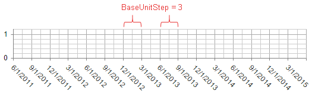
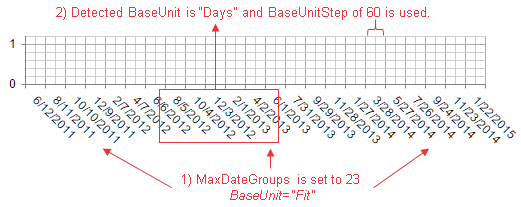

# Date Axis Base Unit Steps

This help article illustrates how to configure the step of categories for a date axis in **RadHtmlChart**. 

You can control the step through which the categories will be plotted for all or particular base units through the **BaseUnitStep**/**EnableBaseUnitStepAuto** properties and the **AutoBaseUnitSteps** tag.

1. [Configure a Common Step](#configure-a-common-step)

1. [Configure a Step for a Dynamic BaseUnit](#configure-a-step-for-a-dynamic-baseunit)

## Configure a Common Step

You can configure a common step for all the base units through the following properties:

1. **BaseUnitStep** - The property takes an integer value greater than 0.
 
	>caption Figure 1: Date axis with BaseUnitStep set to 3 created with Example 1.
	 
	
	 
	>caption Example 1: Date axis with BaseUnitStep set to 3 shown in Figure 1.
		 
	**ASP.NET**

		<telerik:RadHtmlChart ID="RadHtmlChart1" runat="server" Width="600" Height="400">
			<PlotArea>
				<XAxis BaseUnitStep="3" DataLabelsField="SellDate">
					<LabelsAppearance RotationAngle="45" DataFormatString="d"></LabelsAppearance>
				</XAxis>
				<Series>
					<telerik:LineSeries Name="Series 1" DataFieldY="SellQuantity">
					</telerik:LineSeries>
				</Series>
			</PlotArea>
		</telerik:RadHtmlChart>
		
	*Chart data source can be obtained from Example 2 below.*

1. **EnableBaseUnitStepAuto** - A boolean property that indicates whether the step will be automatically calculated based on the maximum available x-axis categories, defined through the **MaxDateGroups** property.

	>caption Figure 2: Date axis with MaxDateGroups="5" and EnableBaseUnitStepAuto="true", created with Example 2.
	 
	
	 
	>caption Example 2: Date axis with MaxDateGroups="5" and EnableBaseUnitStepAuto="true" shown in Figure 2.
	 
````ASP.NET
<telerik:RadHtmlChart ID="RadHtmlChart1" runat="server" Width="600" Height="400">
	<PlotArea>
		<XAxis MaxDateGroups="5" EnableBaseUnitStepAuto="true" DataLabelsField="SellDate">
			<LabelsAppearance RotationAngle="45" DataFormatString="d"></LabelsAppearance>
		</XAxis>
		<Series>
			<telerik:LineSeries Name="Series 1" DataFieldY="SellQuantity">
			</telerik:LineSeries>
		</Series>
	</PlotArea>
</telerik:RadHtmlChart>
````
````C#
protected void Page_Init(object sender, EventArgs e)
{
	
	RadHtmlChart1.DataSource = GetData();
	RadHtmlChart1.DataBind();
}

protected DataTable GetData()
{
	DataTable dt = new DataTable();

	dt.Columns.Add("ID", typeof(int));
	dt.Columns.Add("SellQuantity", typeof(int));
	dt.Columns.Add("SellDate", typeof(DateTime));

	dt.Rows.Add(1, 2, new DateTime(2011, 06, 12));
	dt.Rows.Add(2, 5, new DateTime(2011, 12, 12));
	dt.Rows.Add(3, 6, new DateTime(2012, 06, 17));
	dt.Rows.Add(4, 4, new DateTime(2012, 09, 18));
	dt.Rows.Add(5, 7, new DateTime(2015, 03, 18));

	return dt;
}
````
````VB
Protected Sub Page_Init(sender As Object, e As EventArgs) Handles Me.Init

	RadHtmlChart1.DataSource = GetData()
	RadHtmlChart1.DataBind()
	
End Sub

Protected Function GetData() As DataTable

	Dim dt As New DataTable()

	dt.Columns.Add("ID", GetType(Integer))
	dt.Columns.Add("SellQuantity", GetType(Integer))
	dt.Columns.Add("SellDate", GetType(DateTime))

	dt.Rows.Add(1, 2, New DateTime(2011, 6, 12))
	dt.Rows.Add(2, 5, New DateTime(2011, 12, 12))
	dt.Rows.Add(3, 6, New DateTime(2012, 6, 17))
	dt.Rows.Add(4, 4, New DateTime(2012, 9, 18))
	dt.Rows.Add(5, 7, New DateTime(2015, 3, 18))

	Return dt
	
End Function
````

>tip EnableBaseUnitStepAuto="true" will be ignored if the BaseUnit property is set to "Fit".

## Configure a Step for a Dynamic BaseUnit

You can set certain steps for particular base units through the **AutoBaseUnitSteps** collections. The functionality requires that you have enabled the dynamic **BaseUnit** detection by setting the **BaseUnit** property to **Fit**.

You can see how the **BaseUnit** property and the corresponding **BaseUnitStep** value change when you modify the **MaxDateGroups** in **Figure 3.1**, **Figure 3.2**, **Figure 3.3** and **Example 3**.

>caption Figure 3.1: A step of 60 is used for the detected "Days" BaseUnit when MaxDateGroups is 23. The code is shown in Example 3.



>caption Example 3: Setting arrays of steps for different units (e.g., "Months" and "Days"). The output is shown in Figure 3.1.

**ASP.NET**

	<telerik:RadHtmlChart ID="RadHtmlChart1" runat="server" Width="600" Height="400">
		<PlotArea>
			<XAxis BaseUnit="Fit" MaxDateGroups="23" DataLabelsField="SellDate">
				<AutoBaseUnitSteps>
					<Months>
						<telerik:BaseUnitStep Value="3" />
						<telerik:BaseUnitStep Value="6" />
					</Months>
					<Days>
						<telerik:BaseUnitStep Value="1" />
						<telerik:BaseUnitStep Value="60" />
					</Days>
				</AutoBaseUnitSteps>
				<LabelsAppearance RotationAngle="45" DataFormatString="d"></LabelsAppearance>
			</XAxis>
			<Series>
				<telerik:LineSeries Name="Series 1" DataFieldY="SellQuantity">
				</telerik:LineSeries>
			</Series>
		</PlotArea>
	</telerik:RadHtmlChart>

*Chart data source can be obtained from Example 2 above.*

If, however, you decrease the max date x-axis groups to 16, the step of 6 from the months base unit will be considered (**Figure 3.2**).

>caption Figure 3.2: Decreasing the MaxDateGroups will force the chart to switch its BaseUnit and BaseUnitStep.


A further decrease of the **MaxDateGroups** property to 8 will trigger the chart to select a higher value of 6 for the **BaseUnitStep** property (**Figure 3.3**). The current "Months" **BaseUnit** will be preserved.

>caption Figure 3.3: Setting MaxDateGroups to 8 forces the chart to select a higher BaseUnitStep of 6 and keeps the current "Months" BaseUnit.


>tip If there isn't an exact BaseUnitStep value defined that satisfies MaxDateGroups, the chart will round it to the closest value.

## See Also

 * [Date Axis]()
 
 * [Axes Configuration]()


