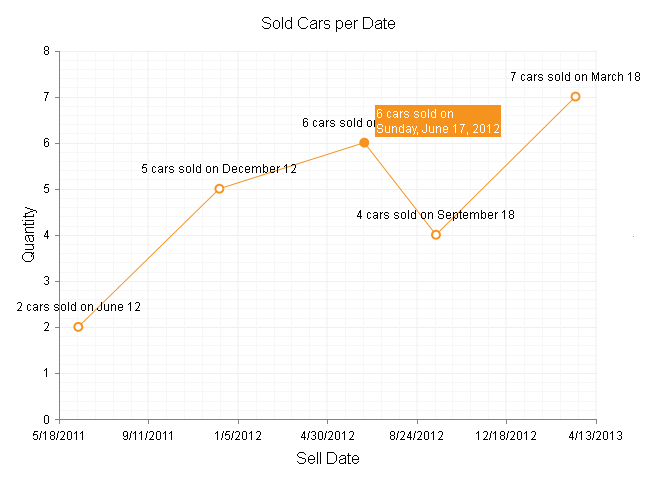

# Date Axis

This Help article describes the **Data Axis** support in **RadHtmlChart** and provides	a figure and example. As of Q2 2013, **Date Axis** support is available in **RadHtmlChart**,	so that the chart can now be data bound to **DateTime** objects (see **Figure 1**)	or their string representations.	[XAxis labels](),	[series labels and tooltips]() can be formatted to the desired date format.

>note **Date Axis** support is available only for a *databound* **RadHtmlChart** which automatically detects the **DateTime** object data in the column/field and adjusts the distribution of the items on the XAxis.


## Numeric Series (Bubble, Scatter, ScatterLine)

The default base time interval for the **Date Axis labels** is determined automatically from the value range. The **SeriesItems** that are created appear over their corresponding date and respect the scale of the axis (items for dates that are closer together are plotted next to each other).

The **BaseUnit** property controls the scale of the axis. The available options are **"auto"**, **"years"**, **"months"**,	**"weeks"**, **"days"**,**"hours"**, **"minutes"** and **"seconds"**.This controls the time intervals though which a label is placed on the date axis.

No prior data sorting is required for the data source.

The **Type** property of the XAxis must not beset explicitly; otherwise, the dates will be converted to numbers.

## Category Series (Area, Bar, Candlestick, Column, Line)

The type of the XAxis is controlled via its **Type** property which takes a string value of **"Date"** or **"Category"**. See **List 1** for more details on these properties.

>caption List 1: Description of XAxis Type - "Date" and "Category".

* **Date** 

	* The XAxis behaves like a **Date Axis** from a numeric series,	so series items are created for their corresponding date.

	* The default base time interval for the **Date Axis** labels is determined automatically from the value range and it can be controlled through	the **BaseUnit** property. Available options are **"auto"** , **"years"** , **"months"** , **"weeks"** , **"days"** , **"hours"** , **"minutes"** and **"seconds"** .

	* No prior data sorting is required for the data source.

	* You can explicitly set the first and the last date to be displayed on the x-axis through the **MinDateValue** and **MaxDateValue** properties.

* **Category**

	* The XAxis behaves like a **Category Axis** , so that **DateTime** intervals between	the items are not taken into consideration and XAxis items are plotted on the XAxis evenly.

	* A **SeriesItem** will be created for each entry in the data source and they will be placed	in the order in which they passed. Thus, the data source may need to be sorted in ascending order	to have the series items placed subsequently according to their date.

>caption Figure 1: Configuration of a Numeric Series (ScatterLine) bound to DateTime object data.



>caption Example 1: shows the simple markup used to configure a **Numeric Series (ScatterLine)** bound to **DateTime** object data in **Figure 1**.

````ASP.NET
<telerik:RadHtmlChart runat="server" ID="RadHtmlChart1" Width="640px" Height="480px">
	<PlotArea>
		<Series>
			<telerik:ScatterLineSeries DataFieldY="SellQuantity" DataFieldX="SellDate">
				<LabelsAppearance DataFormatString="{1} cars sold on {0:m}">
				</LabelsAppearance>
				<TooltipsAppearance Color="White" DataFormatString="{1} cars sold on<br/>{0:D}" />
			</telerik:ScatterLineSeries>
		</Series>
		<XAxis BaseUnit="days">
			<TitleAppearance Text="Sell Date">
			</TitleAppearance>
			<LabelsAppearance DataFormatString="d">
			</LabelsAppearance>
			<MajorGridLines Color="#EFEFEF" Width="1"></MajorGridLines>
			<MinorGridLines Color="#F7F7F7" Width="1"></MinorGridLines>
		</XAxis>
		<YAxis>
			<TitleAppearance Text="Quantity">
			</TitleAppearance>
			<MajorGridLines Color="#EFEFEF" Width="1"></MajorGridLines>
			<MinorGridLines Color="#F7F7F7" Width="1"></MinorGridLines>
		</YAxis>
	</PlotArea>
	<ChartTitle Text="Sold Cars per Date">
	</ChartTitle>
</telerik:RadHtmlChart>
````
````C#
protected void Page_Load(object sender, EventArgs e)
{
	RadHtmlChart1.DataSource = GetData();
	RadHtmlChart1.DataBind();
}

protected DataTable GetData()
{
	DataTable dt = new DataTable();

	dt.Columns.Add("ID", typeof(int));
	dt.Columns.Add("SellQuantity", typeof(int));
	dt.Columns.Add("SellDate", typeof(DateTime));

	dt.Rows.Add(1, 2, new DateTime(2011, 06, 12));
	dt.Rows.Add(2, 5, new DateTime(2011, 12, 12));
	dt.Rows.Add(3, 6, new DateTime(2012, 06, 17));
	dt.Rows.Add(4, 4, new DateTime(2012, 09, 18));
	dt.Rows.Add(5, 7, new DateTime(2013, 03, 18));

	return dt;
}
````
````VB
Protected Sub Page_Load(sender As Object, e As EventArgs) Handles Me.Load
	RadHtmlChart1.DataSource = GetData()
	RadHtmlChart1.DataBind()
End Sub

Protected Function GetData() As DataTable
	Dim dt As New DataTable()

	dt.Columns.Add("ID", GetType(Integer))
	dt.Columns.Add("SellQuantity", GetType(Integer))
	dt.Columns.Add("SellDate", GetType(DateTime))

	dt.Rows.Add(1, 2, New DateTime(2011, 6, 12))
	dt.Rows.Add(2, 5, New DateTime(2011, 12, 12))
	dt.Rows.Add(3, 6, New DateTime(2012, 6, 17))
	dt.Rows.Add(4, 4, New DateTime(2012, 9, 18))
	dt.Rows.Add(5, 7, New DateTime(2013, 3, 18))

	Return dt
End Function
````

## See Also

 * [Axes Configuration]()

 * [Series Configuration]()

 * [Format Dates]()

 * [Format Numbers]()

 * [Localization]()
