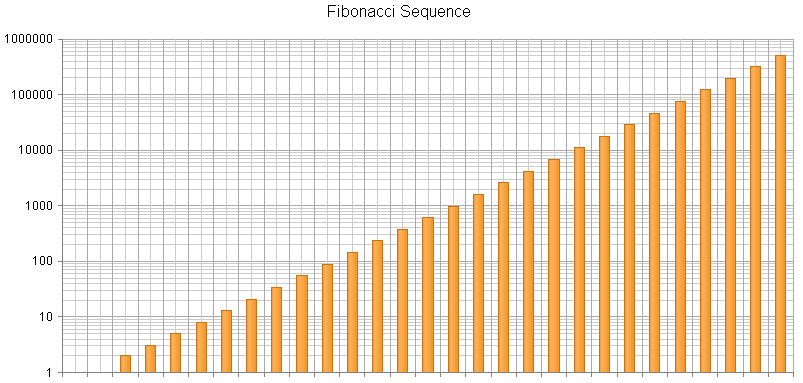

# Logarithmic Axis

This help article explains how to use a logarithmic axis in the **RadHtmlChart** control. The feature is available since Q3 2014.

A logarithmic axis is a special numeric axis that transforms the actual values by using a logarithmic function with a particular base. The purpose of the logarithmic axis is to display values that cover different orders of magnitude in a more convenient way because it lets large values display together with small values in a more condensed scale than the default linear axis.

In order to configure a logarithmic axis in **RadHtmlChart** you must set the **Type** property of the **Axis** to "**Log**". You can control the base of the logarithm via the **Step** property (default value is 10).

>warning Logarithmic scale can be used only for numerical data, so it cannot be used for a category or date axis. This means that the x-axis of anArea, Line, Bar and Column series cannot be put in logarithmic mode.

**Example 1** shows how to configure a logarithmic y-axis in **RadHtmlChart** and **Figure 1** displays the output.

>caption Example 1: Configuring a logarithmic y-axis in a Column series that displays a Fibonacci sequence.

````ASP.NET
<telerik:RadHtmlChart ID="RadHtmlChart1" runat="server" Width="800px" Height="400px">
	<PlotArea>
		<YAxis Type="Log" Step="10"></YAxis>
		<Series>
			<telerik:ColumnSeries>
				<LabelsAppearance Visible="false"></LabelsAppearance>
			</telerik:ColumnSeries>
		</Series>
	</PlotArea>
	<ChartTitle Text="Fibonacci Sequence"></ChartTitle>
</telerik:RadHtmlChart>
````
````C#
protected void Page_Load(object sender, EventArgs e)
{
	if (!IsPostBack)
	{
		RadHtmlChart1.DataSource = GetFibonacciSequence(29);
		RadHtmlChart1.DataBind();
	}
}

protected List<int> GetFibonacciSequence(int n)
{
	List<int> data = new List<int>() { 1, 1 };
	for (int i = 2; i < n; i++)
	{
		data.Add(data[i - 2] + data[i - 1]);
	}
	return data;
}
````
````VB
Protected Sub Page_Load(sender As Object, e As EventArgs) Handles Me.Load
	If Not IsPostBack Then
		RadHtmlChart1.DataSource = GetFibonacciSequence(29)
		RadHtmlChart1.DataBind()
	End If
End Sub
	
Protected Function GetFibonacciSequence(n As Integer) As List(Of Integer)
	Dim data As New List(Of Integer)() From {1, 1}
	For i As Integer = 2 To n - 1
		data.Add(data(i - 2) + data(i - 1))
	Next
	Return data
End Function
````

>caption Figure 1: Column series with a logarithmic y-axis.



## See Also

 * [Configuring PlotArea Element Axes of the RadHtmlChart]()
