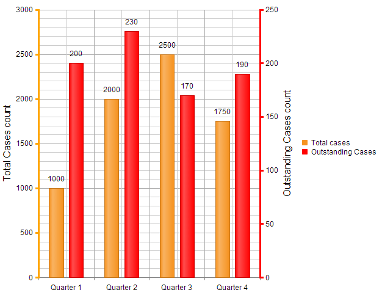

# Multiple Y-Axes


## 

__RadHtmlChart__ supports multiple Y-axes to provide an additional scale against which to plot information as of the Q2 2012 release.

To use multiple Y-axes, you add the required __telerik:AxisY__ definitions in the __AdditionalYAxes__ tag inside__PlotArea__. __Figure 1__ shows a Column chart with an additional y-axis defined on the right. As you can see in the markup in	__Example 1__, you configure the additional y-axes similar to the main YAxis, but you set the axis' __Name__property - its value is used in the series' __AxisName__ property to specify which axis is used by the current series.

As of Q1 2014, you can use the __AxisCrossingPoints__ tag to rearrange the position of the main and the additional Y-axes of the chart.__Figure 1__ shows the additional y-axis repositioned on the right of the chart. The markup in Example 1 shows that the __AxisCrossingPoints__ tag is defined in the__X-Axis__ configuration section. The order of the __AxisCrossingPoint__ properties corresponds to the Y-axes declarations and the __Value__	attribute sets the position through the X-axis.
>caption Figure 1: A Column chart with an additional y-axis, which is repositioned on the right.



__Example 1__: The simple markup to create __Figure 1__ with the __AdditionalYAxes__ and __AxisCrossingPoints__ tags.

````ASPNET
		<telerik:RadHtmlChart runat="server" ID="RadHtmlChart1" Width="640px" Height="480px">
				<PlotArea>
					<Series>
						<telerik:ColumnSeries Name="Total cases">
							<SeriesItems>
								<telerik:CategorySeriesItem Y="1000" />
								<telerik:CategorySeriesItem Y="2000" />
								<telerik:CategorySeriesItem Y="2500" />
								<telerik:CategorySeriesItem Y="1750" />
							</SeriesItems>
						</telerik:ColumnSeries>
						<telerik:ColumnSeries AxisName="AdditionalAxis" Name="Outstanding Cases">
							<Appearance>
								<FillStyle BackgroundColor="Red" />
							</Appearance>
							<SeriesItems>
								<telerik:CategorySeriesItem Y="200" />
								<telerik:CategorySeriesItem Y="230" />
								<telerik:CategorySeriesItem Y="170" />
								<telerik:CategorySeriesItem Y="190" />
							</SeriesItems>
						</telerik:ColumnSeries>
					</Series>
					<YAxis Color="Orange" Width="3">
						<TitleAppearance Text="Total Cases count">
							<TextStyle Color="Black" />
						</TitleAppearance>
						<LabelsAppearance>
							<TextStyle Color="Black" />
						</LabelsAppearance>
					</YAxis>
					<AdditionalYAxes>
						<telerik:AxisY Name="AdditionalAxis" Color="Red" Width="3">
							<TitleAppearance Text="Outstanding Cases count">
								<TextStyle Color="Black" />
							</TitleAppearance>
							<LabelsAppearance>
								<TextStyle Color="Black" />
							</LabelsAppearance>
						</telerik:AxisY>
					</AdditionalYAxes>
					<XAxis>
						<LabelsAppearance DataFormatString="Quarter {0}" />
						<Items>
							<telerik:AxisItem LabelText="1" />
							<telerik:AxisItem LabelText="2" />
							<telerik:AxisItem LabelText="3" />
							<telerik:AxisItem LabelText="4" />
						</Items>
						<AxisCrossingPoints>
							<telerik:AxisCrossingPoint Value="0" />
							<telerik:AxisCrossingPoint Value="4" />
						</AxisCrossingPoints>
					</XAxis>
				</PlotArea>
			</telerik:RadHtmlChart>
````


# See Also

 * [RadHtmlChart Structure]()
