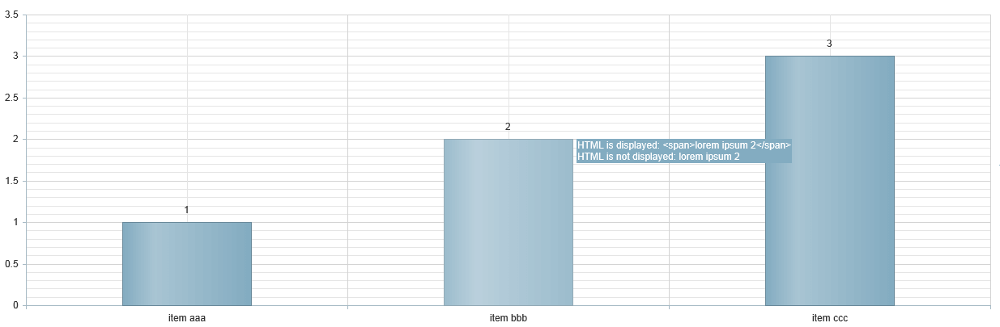

# Display HTML and Execute JavaScript


## Overview

You can display HTML in tooltips and/or execute JavaScript (i.e., declare variables,if statements, for loops, etc.) in ClientTemplate and SharedTemplate elements.You can find more information on these features in the sections below -*Execute JavaScript with a ClientTemplate* and*Display HTML with a ClientTemplate*.

## Execute JavaScript with a ClientTemplate

ClientTemplates let you use JavaScript, following this pattern: "#if (condition) {# expression #}#".

* __If Statement__:

````ASPNET
			<telerik:RadHtmlChart ID="RadHtmlChart1" runat="server" Width="300px" Height="300px">
				<PlotArea>
					<Series>
						<telerik:PieSeries>
							<LabelsAppearance>
								<ClientTemplate>
	        #if (percentage > 0.15) {# #=value# #} else {# 0 #} #
								</ClientTemplate>
							</LabelsAppearance>
							<TooltipsAppearance>
								<ClientTemplate>
	        #if (percentage > 0.15) {# #=value# #} else {# 0 #} #
								</ClientTemplate>
							</TooltipsAppearance>
							<SeriesItems>
								<telerik:PieSeriesItem Y="30" />
								<telerik:PieSeriesItem Y="60" />
								<telerik:PieSeriesItem Y="10" />
							</SeriesItems>
						</telerik:PieSeries>
					</Series>
				</PlotArea>
			</telerik:RadHtmlChart>
````

Only PieSeries/DonutSeries items whose percentage of the whole is higher than 15% will display their actual value in tooltips and labels.The rest of the series items will display a zero value.

* __For Loop__:

````C#
			<telerik:RadHtmlChart runat="server" ID="RadHtmlChart1" Width="800" Height="500">
				<PlotArea>
					<CommonTooltipsAppearance Shared="true">
						<SharedTemplate>
	                <div>GDP in #= category #</div>
	                 # for (var i = 0; i < points.length; i++) { # 
	                <div>#: points[i].series.name#: #: points[i].value #</div>
	                # } #
						</SharedTemplate>
					</CommonTooltipsAppearance>
					<XAxis>
						<Items>
							<telerik:AxisItem LabelText="1999"></telerik:AxisItem>
							<telerik:AxisItem LabelText="2000"></telerik:AxisItem>
						</Items>
					</XAxis>
					<Series>
						<telerik:ColumnSeries Name="Transport">
							<SeriesItems>
								<telerik:CategorySeriesItem Y="32735.7"></telerik:CategorySeriesItem>
								<telerik:CategorySeriesItem Y="37911.3"></telerik:CategorySeriesItem>
							</SeriesItems>
						</telerik:ColumnSeries>
						<telerik:ColumnSeries Name="Community">
							<SeriesItems>
								<telerik:CategorySeriesItem Y="12453.9"></telerik:CategorySeriesItem>
								<telerik:CategorySeriesItem Y="14394.3"></telerik:CategorySeriesItem>
							</SeriesItems>
						</telerik:ColumnSeries>
					</Series>
				</PlotArea>
			</telerik:RadHtmlChart>
````

The tooltip will display three lines of text. The first line shows the category and the next two lines show theY-values of both items from this category.

## Display HTML with a ClientTemplate

ClientTemplate can render HTML from a data source following this syntax: __"#: #"__.__Figure 1__ shows an example of using a ClientTemplate to render HTML in a tooltip.

__Example 1__: This example illustrates how to render and display HTML in tooltips.

>tabbedCode

````ASPNET
			<telerik:radhtmlchart runat="server" id="RadHtmlChart1" skin="Vista">
				<PlotArea>
					<Series>
						<telerik:ColumnSeries DataFieldY="myDataColumn">
							<TooltipsAppearance Color="White">
								<ClientTemplate>
									HTML is displayed: #:dataItem.myHTMLColumn# <br/> 
									HTML is not displayed: #=dataItem.myHTMLColumn#
								</ClientTemplate>
							</TooltipsAppearance>
						</telerik:ColumnSeries>
					</Series>
					<XAxis DataLabelsField="myLabelsColumn"></XAxis>
				</PlotArea>
			</telerik:radhtmlchart>
````
````C#
		protected void Page_Load(object sender, EventArgs e)
		{
			if (!IsPostBack)
			{
				RadHtmlChart1.DataSource = GetData();
				RadHtmlChart1.DataBind();
			}
		}
	
		protected DataTable GetData()
		{
			DataTable tbl = new DataTable();
			tbl.Columns.Add(new DataColumn("myDataColumn"));
			tbl.Columns.Add(new DataColumn("myLabelsColumn"));
			tbl.Columns.Add(new DataColumn("myHTMLColumn"));
			tbl.Rows.Add(new object[] { 1, "item aaa", "<span>lorem ipsum 1</span>" });
			tbl.Rows.Add(new object[] { 2, "item bbb", "<span>lorem ipsum 2</span>" });
			tbl.Rows.Add(new object[] { 3, "item ccc", "<span>lorem ipsum 3</span>" });
			return tbl;
		}
````
````VB.NET
		Protected Sub Page_Load(sender As Object, e As EventArgs) Handles Me.Load
			If Not IsPostBack Then
				RadHtmlChart1.DataSource = GetData()
				RadHtmlChart1.DataBind()
			End If
		End Sub
	
		Protected Function GetData() As DataTable
			Dim tbl As New DataTable()
			tbl.Columns.Add(New DataColumn("myDataColumn"))
			tbl.Columns.Add(New DataColumn("myLabelsColumn"))
			tbl.Columns.Add(New DataColumn("myHTMLColumn"))
			tbl.Rows.Add(New Object() {1, "item aaa", "<span>lorem ipsum 1</span>"})
			tbl.Rows.Add(New Object() {2, "item bbb", "<span>lorem ipsum 2</span>"})
			tbl.Rows.Add(New Object() {3, "item ccc", "<span>lorem ipsum 3</span>"})
			Return tbl
		End Function
````
>end
>caption Figure 1: Using a ClientTemplate to display HTML in a tooltip.



>important Since tooltips are rendered as pure HTML and labels as part of the SVG/VML rendering, HTML can only be rendered inside tooltips.
>


>note You can use number formats inside __Client Templates__ . You can find more information in[this Formatting Numbers]()article in the section called *Formatting Labels and Tooltips by Using their Client Templates.* 
>


# See Also

 * [Overview]()

 * [Shared Template for ToolTips]()

 * [Format Numbers]()
