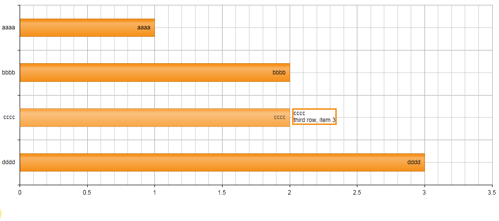

# ClientTemplate Overview

As of **Q3 2012**, **RadHtmlChart** offers client-side templates for the labels and tooltips used in the series. This Help article will discuss using client-side templates, connecting them to a data source and review the most used properties.

As of **Q2 2016**, client templates are also available for **Legend** items and **Axes** labels. In order to learn more details abouy how to configure them read the [Using Client Templates in Legend and Axes Labels]() article. 

The composite property that controls this functionality is **ClientTemplate** which is exposed in the **LabelsAppearance** and **TooltipsAppearance** tags for each series. You can use the **ClientTemplate** element to allow for runtime evaluation of the **dataItem** object and other fields associated with each series item. This means that additional columns from the data source and other fields like category, series name/type/stack can be displayed as the content instead of only a string formatted around the value.

**Figure 1** shows an example of using the **ClientTemplate** composite property.

>note You can use number formats inside **Client Templates** . You can find more information in [this Formatting Numbers]() article in the section called *Formatting Labels and Tooltips by Using their Client Templates.* 

## Showing Database Values Using a ClientTemplate

In order to return the original data item used to construct the point (an object that exposes all fields from the data source) you must use a **dataItem** object. If the chart is bound to an array the **dataItem** object will expose only a single field that contains the current value of the series item.

>important You must bind the **RadHtmlChart** to a data source in order for the **dataItem** object to be	available (tooltips and labels cannot be set programmatically for each item).

You use a simple evaluation clause to set the dateItem column: **#= dataItem.<columnName> #**. As the markup in **Example 1** shows, you can concatenate a few evaluation clauses to get the data from several columns. You can also add custom content between these clauses.

>caption Example 1: The template to set the dataItem for the **ClientTemplate** property is easy to code.

````ASP.NET
<telerik:radhtmlchart runat="server" id="RadHtmlChart1">
	<PlotArea>
		<Series>
			<telerik:BarSeries DataFieldY="data">
				<LabelsAppearance Position="InsideEnd">
					<ClientTemplate>
						#=dataItem.SecondColumn#
					</ClientTemplate>
				</LabelsAppearance>
				<TooltipsAppearance>
					<ClientTemplate>
						#=dataItem.SecondColumn#<br />
						#=dataItem.ThirdColumn#
					</ClientTemplate>
				</TooltipsAppearance>
			</telerik:BarSeries>
		</Series>
		<XAxis DataLabelsField="SecondColumn"></XAxis>
	</PlotArea>
</telerik:radhtmlchart>
````

**Example 2** shows how to set and get a simple data source for **RadHtmlChart** to work with the **ClientTemplate** composite property.

>caption Example 2: Setting a DataTable as the data source for the Bar chart shown in **Figure 1**.

````C#
protected void Page_Load(object sender, EventArgs e)
{
	if (!IsPostBack)
	{
		RadHtmlChart1.DataSource = GetData();
		RadHtmlChart1.DataBind();
	}
}
	
protected DataTable GetData()
{
	DataTable tbl = new DataTable();
	tbl.Columns.Add(new DataColumn("data"));
	tbl.Columns.Add(new DataColumn("SecondColumn"));
	tbl.Columns.Add(new DataColumn("ThirdColumn"));
	tbl.Rows.Add(new object[] { 1, "aaaa", "first row, item 3" });
	tbl.Rows.Add(new object[] { 2, "bbbb", "second row, item 3" });
	tbl.Rows.Add(new object[] { 2, "cccc", "third row, item 3" });
	tbl.Rows.Add(new object[] { 3, "dddd", "fourth row, item 3" });
	return tbl;
}
````
````VB
Protected Sub Page_Load(sender As Object, e As EventArgs) Handles Me.Load
	If Not IsPostBack Then
		RadHtmlChart1.DataSource = GetData()
		RadHtmlChart1.DataBind()
	End If
End Sub

Protected Function GetData() As DataTable
	Dim tbl As New DataTable()
	tbl.Columns.Add(New DataColumn("data"))
	tbl.Columns.Add(New DataColumn("SecondColumn"))
	tbl.Columns.Add(New DataColumn("ThirdColumn"))
	tbl.Rows.Add(New Object() {1, "aaaa", "first row, item 3"})
	tbl.Rows.Add(New Object() {2, "bbbb", "second row, item 3"})
	tbl.Rows.Add(New Object() {2, "cccc", "third row, item 3"})
	tbl.Rows.Add(New Object() {3, "dddd", "fourth row, item 3"})
	Return tbl
End Function
````

>caption Figure 1: A Bar chart with the tooltip for the third item based on the **ClientTemplate** composite property set in **Example 1**.



Note how the labels for each series, the labels for the x-axis and the first row of the tooltips have the same data because the same column is used.

## Main Properties Used in a ClientTemplate

You can set the following properties for a **ClientTemplate**:

* **category** - Returns the category name of the hovered series item.

	* **BubbleSeries** - Returns the value set in the **Tooltip** property of the series item for a non-data bound chart and the corresponding value from the **DataFieldTooltip** column of the data source for a data bound chart.

	* **Area**, **Candlestick**, **Column**, **Bar** and **Line Series** - Returns the label text from the corresponding axis item.

	* **PieSeries/DonutSeries** - Returns the value set in the **Name** property of the series item for a non-data bound chart and the corresponding value from the **NameField** column of the data source for a data bound chart.

	
	**ASP.NET**
	
		<LabelsAppearance>
			<ClientTemplate>
				Category: #=category#
			</ClientTemplate>
		</LabelsAppearance>
		<TooltipsAppearance>
			<ClientTemplate>
				Category: #=category#
			</ClientTemplate>
		</TooltipsAppearance>

* **dataItem** - Returns the original data item used to construct the point. You can see more information about using the **dataItem** object in a **ClientTemplate** in the previous section of this article — *Showing DataBase Values Using a ClientTemplate*.

* **percentage** - Returns the point value represented as a fraction of the grand total. Available for donut, pie and 100% stacked charts. To get the value in actual percent and not as a fraction between 0 and 1, you need to multiply it by 100, e.g., `<ClientTemplate>#= percentage * 100 # %</ClientTemplate>` . You can see more information about using the percentage field in the [Display HTML and Execute JavaScript]() article in the section called*Execute JavaScript*.

* **series** - Returns the data series information. You can use the **series** property to obtain the name, type and the stack group name (applicable for stacked series clustered in groups) of the series:

	* **name** - Returns the name of the hovered series. It corresponds to the **Name** property of the series. If the series does not have a name set, "undefined" text will be returned.For example,- **ClientTemplate = "text #=series.name# more text"** will return "text undefined more text".

	* **type** - Returns the type of the hovered series (for example Bar, Pie, ScatterLine, etc.).

	* **stack** - Returns the stack status of the hovered series. A stack can have the following values:

		* **true** - When the **Stack** property of the series is set to **true**.

		* **false** - When the **Stack** property of the series is set to **false**.

		* **custom string** - The string set in the **GroupName** property that clusters series in stacked groups.

	**ASP.NET**

		<LabelsAppearance>
			<ClientTemplate>
				Series Name: #=series.name# , Series Type: #=series.type# , Series Stack Status: #=series.stack #
			</ClientTemplate>
		</LabelsAppearance>
		<TooltipsAppearance>
			<ClientTemplate>
				Series Name: #=series.name# <br/> 
				Series Type: #=series.type# </br> 
				Series Stack Status: #=series.stack #
			</ClientTemplate>
		</TooltipsAppearance>

* **value** - Returns the point value (either a number or an object).

	* **BubbleSeries** - Returns an object that exposes three fields: x, y and size.

		**ASP.NET**
	
			<LabelsAppearance>
				<ClientTemplate>
					X Value: #=value.x# , Y Value: #=value.y# , Size Value: #=value.size #
				</ClientTemplate>
			</LabelsAppearance>
			<TooltipsAppearance>
				<ClientTemplate>
					X Value: #=value.x# <br/> 
					Y Value: #=value.y# <br/> 
					Size Value: #=value.size #
				</ClientTemplate>
			</TooltipsAppearance>


	* **CandlestickSeries** - Returns an object that exposes four fields: open, high, low and close.

		**ASP.NET**
		
			<TooltipsAppearance>
				<ClientTemplate>
					Open Value: #=value.open# <br/> 
					High Value: #=value.high# <br/> 
					Low Value: #=value.low # <br/> 
					Close Value: #=value.close #
				</ClientTemplate> 
			</TooltipsAppearance>

	* **ScatterSeries and ScatterLineSeries** - Returns an object that exposes the x and y fields for the X-value and the Y-value of the item.

		**ASP.NET**
		
			<LabelsAppearance>
				<ClientTemplate>
					X Value: #=value.x# , Y Value: #=value.y#
				</ClientTemplate>
			</LabelsAppearance>
			<TooltipsAppearance>
				<ClientTemplate>
					X Value: #=value.x# <br/> 
					Y Value: #=value.y#
				</ClientTemplate>=""
			</TooltipsAppearance>

	* **BoxPlot** - Returns an object that exposes the `lower`, `q1`, `median`, `mean`, `median`, `q3` and `upper` fields that contain the values from the corresponding fields of the series object.

		**ASP.NET**
		
			<TooltipsAppearance>
				<ClientTemplate>
					<table cellpadding=7><tr><td><b>#= category #<br /> Lower: #=value.lower# <br /> Q1: #=value.q1# <br /> Median: #=value.median# <br /> Mean: #=value.mean# <br /> Q3: #=value.q3# <br /> Upper #=value.upper#</b></td></tr></table>
				</ClientTemplate>=""
			</TooltipsAppearance>

	* **Other Series Types** - Returns the Y value of the hovered series Item.

		**ASP.NET**
		
			<LabelsAppearance>
				<ClientTemplate>
					Y Value: #=value#
				</ClientTemplate>
			</LabelsAppearance>
			<TooltipsAppearance>
				<ClientTemplate>
					Y Value: #=value#
				</ClientTemplate> 
			</TooltipsAppearance>

## See Also

 * [Using Client Templates in Legend and Axes Labels]()

 * [Format Numbers]()

 * [Format Dates]()

 * [Display HTML and Execute JavaScript]()

 * [Shared Template for ToolTips]()

