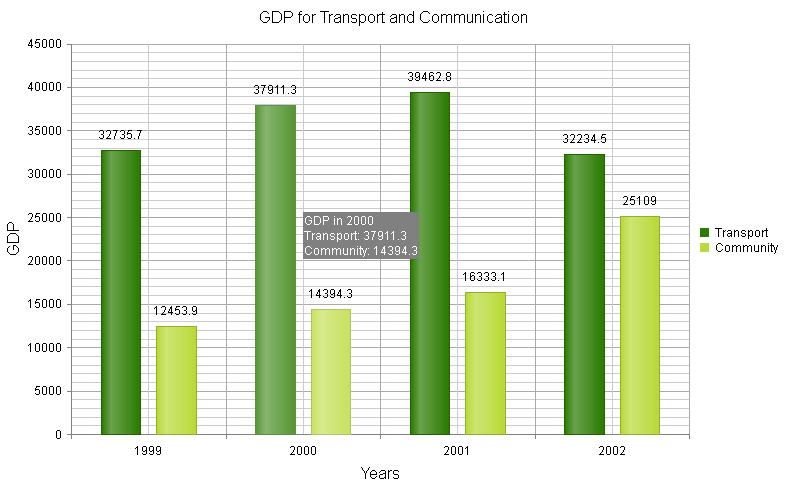

# Shared Template for ToolTips

## Shared Templates for ToolTips

You can hover over a single series item and display a common tooltip with information about all the series items from the particular category. As of Q3 2013, the templates for tooltips in **RadHtmlChart** can be shared among all the series items within their group. You can share these templatesby setting the following properties in the **CommonTooltipsAppearance** element, exposed by the **PlotArea** of the chart:

* **Shared** - You must explicitly set this property to **true** for standard charts. For Sparkline layout, the default value is **true**.

* **SharedTemplate** - You must set the composite **SharedTemplate** property to the appropriate string that represents the desired shared template that you want to apply to the tooltips when they render. The **SharedTemplate** composite property can use the following fields:

* **points** - The category points (`#= points[i].series.name#, #= points[i].value #`) where i is the index of the series.

* **category** - The category name (`#= category #`) The string delimited inside `#=.....#` is the expression to be evaluated. The tooltips are HTML, so HTML can be used outside of the expression tags.

>note You can use number formats inside **SharedTemplates** . You can find more information in[this Formatting Numbers]()article in the section called *Formatting Labels and Tooltips by Using their Client Templates.* 

## Example of Using SharedTemplates for ToolTips

This example illustrates the code that configures **SharedTemplate** for tooltips in **Example 1** and shows the actual output in **Figure 1**.

>caption Figure 1: Hover over a single series item and display common information about all the series items from	the category in the tooltip.



The chart in **Figure 1** was created with the markup in **Example 1**.

>caption Example 1: You can share the information about the series items from the category in a tooltip by configuring the **Shared** and **SharedTemplate** properties exposed by the **CommonTooltipsAppearance** element in the **PlotArea**.

````C#
<telerik:radhtmlchart runat="server" id="ColumnChart" width="800" height="500">
	<ChartTitle Text="GDP for Transport and Communication">
	</ChartTitle>
	<PlotArea>
		<CommonTooltipsAppearance Shared="true" Color="White" BackgroundColor="Gray">
			<SharedTemplate>
				<div>GDP in #= category #</div>
				 # for (var i = 0; i < points.length; i++) { # 
				<div>#: points[i].series.name#: #: points[i].value #</div>
				# } #
			</SharedTemplate>
		</CommonTooltipsAppearance>
		<XAxis>
			<Items>
				<telerik:AxisItem LabelText="1999"></telerik:AxisItem>
				<telerik:AxisItem LabelText="2000"></telerik:AxisItem>
				<telerik:AxisItem LabelText="2001"></telerik:AxisItem>
				<telerik:AxisItem LabelText="2002"></telerik:AxisItem>
			</Items>
			<TitleAppearance Text="Years">
			</TitleAppearance>
		</XAxis>
		<YAxis>
			<TitleAppearance Text="GDP">
			</TitleAppearance>
		</YAxis>
		<Series>
			<telerik:ColumnSeries Name="Transport">
				<Appearance>
					<FillStyle BackgroundColor="#2A7A00"></FillStyle>
				</Appearance>
				<SeriesItems>
					<telerik:CategorySeriesItem Y="32735.7"></telerik:CategorySeriesItem>
					<telerik:CategorySeriesItem Y="37911.3"></telerik:CategorySeriesItem>
					<telerik:CategorySeriesItem Y="39462.8"></telerik:CategorySeriesItem>
					<telerik:CategorySeriesItem Y="32234.5"></telerik:CategorySeriesItem>
				</SeriesItems>
			</telerik:ColumnSeries>
			<telerik:ColumnSeries Name="Community">
				<Appearance>
					<FillStyle BackgroundColor="#B8D936"></FillStyle>
				</Appearance>
				<SeriesItems>
					<telerik:CategorySeriesItem Y="12453.9"></telerik:CategorySeriesItem>
					<telerik:CategorySeriesItem Y="14394.3"></telerik:CategorySeriesItem>
					<telerik:CategorySeriesItem Y="16333.1"></telerik:CategorySeriesItem>
					<telerik:CategorySeriesItem Y="25109"></telerik:CategorySeriesItem>
				</SeriesItems>
			</telerik:ColumnSeries>
		</Series>
	</PlotArea>
</telerik:radhtmlchart>
````

## See Also

 * [Overview]()

 * [Display HTML and Execute JavaScript]()

 * [Format Numbers]()
