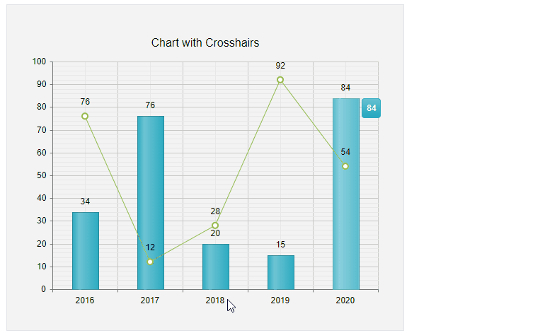

# Crosshairs

The **Crosshair** functionality of **RadHtmlChart** can be used as of Q3 2020.

The **RadHtmlChart** crosshairs are lines, which are perpendicular to the axes and enable the user to see the exact value at the current cursor position.

You can customize the look of the crosshair through the chosen axis `CrosshairAppearance` tag, and style its tooltips through its nested `TooltipsAppearance`.

>note The crosshair is displayed when the XAxis/YAxis `CrosshairAppearance.Visible` is set to true.

>caption Example 1: Shows the markup code used to create Figure 1, which demonstrates configured crosshairs in the chart.



You can create **Figure 1** using the markup in **Example 1**.

>caption Example 1: Shows an implementation of chart with enabled xAxis and yAxis crosshairs.

````ASP.NET
        <telerik:RadHtmlChart runat="server" ID="ChartWithColumnsAndLineSeries" Width="500px" Height="400px">
            <ChartTitle Text="Chart with Crosshairs">
            </ChartTitle>
            <PlotArea>
                <Series>
                    <telerik:ColumnSeries>
                        <SeriesItems>
                            <telerik:CategorySeriesItem Y="34" />
                            <telerik:CategorySeriesItem Y="76" />
                            <telerik:CategorySeriesItem Y="20" />
                            <telerik:CategorySeriesItem Y="15" />
                            <telerik:CategorySeriesItem Y="84" />
                        </SeriesItems>
                        <TooltipsAppearance Color="White" />
                    </telerik:ColumnSeries>
                    <telerik:LineSeries>
                        <SeriesItems>
                            <telerik:CategorySeriesItem Y="76" />
                            <telerik:CategorySeriesItem Y="12" />
                            <telerik:CategorySeriesItem Y="28" />
                            <telerik:CategorySeriesItem Y="92" />
                            <telerik:CategorySeriesItem Y="54" />
                        </SeriesItems>
                        <TooltipsAppearance Color="White" />
                    </telerik:LineSeries>
                </Series>
                <XAxis>
                    <CrosshairAppearance Color="#0000ff" DashType="Solid" Opacity="0.5" Visible="true" Width="2">
                        <TooltipsAppearance BackgroundColor="#0066ff" Color="#ffffff" Visible="true" DataFormatString="XAxis value is {0}">
                            <BorderAppearance Width="1" Color="#0000ff" />
                        </TooltipsAppearance>
                    </CrosshairAppearance>
                    <Items>
                        <telerik:AxisItem LabelText="2016" />
                        <telerik:AxisItem LabelText="2017" />
                        <telerik:AxisItem LabelText="2018" />
                        <telerik:AxisItem LabelText="2019" />
                        <telerik:AxisItem LabelText="2020" />
                    </Items>
                </XAxis>
                <YAxis>
                    <CrosshairAppearance Color="Red" DashType="Dot" Opacity="1" Visible="true" Width="3">
                        <TooltipsAppearance BackgroundColor="#ff6666" Color="#ffffff" Visible="true" DataFormatString="YAxis value is {0}">
                            <BorderAppearance Width="1" Color="#ff0000" />
                        </TooltipsAppearance>
                    </CrosshairAppearance>
                </YAxis>
            </PlotArea>
            <Legend>
                <Appearance Visible="false" />
            </Legend>
        </telerik:RadHtmlChart>
````


## See Also
 
 * [Crosshairs  demo](https://demos.telerik.com/aspnet-ajax/HtmlChart/Examples/Functionality/CrossHair/DefaultCS.aspx)

