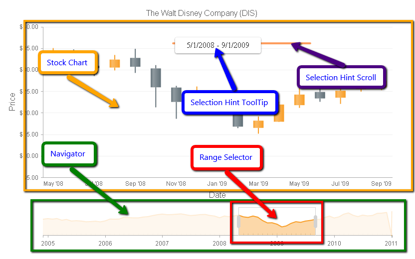

# Data Navigation


This help article describes the **Data Navigation** functionality (added in the Q1 2014 release), that letsyou zoom and scroll data over time in **RadHtmlChart** and provides an example on how to configure it in **Example 1**.

## Overview of RadHtmlChart Data Navigation Feature

The **Data Navigation** functionality added as the **Stock** layout of a **RadHtmlChart**allows users to visualize data over time with the ability to zoom and scroll certain periods. As you can see in **Figure 1**, there aretwo main areas: the main chart (in the yellow box) and the navigator pane area (in the green box).	The supported series types you can use in the main chart area and in the navigator include:

* [Area series]()

* [Column series]()

* [Line series]()

* [Candlestick series]()

## Data Navigation Element Structure

The **Stock** chart layout consists of two parts:

* **Main chart** - Data from the selected time period is plotted in the main chart. A user can drag the plot area of the main chartto either side (left or right) in order to scroll to preceding or subsequent time intervals.While dragging, a tooltip in the upper part of the main chart called the **Selection Hint** shows the selected time interval.

* [Navigator pane]() - Located below the main chart, the navigator pane is a view that shows the	trend of the **full data**. Users can use the navigator pane to selecta desired time period through the **Range Selector** element. Users can drag	the whole **Range Selector** element to the left or right side in order to scroll over the full data to a preceding or subsequent time frame.A user can also click and drag the left or right sides of the **Range Selector** to expand or collapse it from either side, which lets the user to zoom in/out the selected time interval.With each change of the selected range, the corresponding data will be plotted dynamically on the main chart (see **Figure 1**).
>caption Figure 1: The visual elements in a stock chart layout.



## An Example of Configuring a Stock Chart Layout with Data Navigation

The setup of a **Stock** chart layout with a Data Navigation requires that you:

* Configure a main chart:

1. Instantiate a **RadHtmlChart** object and set its **Layout** property to **"Stock"**.

1. Bind the chart to a data source that contains a **DateTime** field forthe x-axis and use a **numeric** field for the y-axis.

1. Create a supported series type and configure it to load data for the y-axis throughthe corresponding properties (i.e., **DataFieldY** for **Area, Column** and **Line** series and**DataOpenField, DataHighField, DataLowField, DataCloseField** for **Candlestick** series).

1. Set the **DataLabelsField** property of the x-axis to the name of the **DateTime** field of the data source in order todistribute dates over the x-axis. You must either set the **Type** property of the x-axis to **Date** or don't set it ( i.e., **Type**="**Date**" is the default value when you pass **DateTime** values to the x-axis).

1. The format strings of the dates over the x-axis can be controlled for each **BaseUnit**	(the x-axis' **BaseUnit** property of the main chart is automaticallychanged according to the Navigator pane's **RangeSelector**) through the**XAxis.LabelsAppearance.DateFormats** property which takes:

* **SecondsFormat**

* **MinutesFormat**

* **HoursFormat**

* **DaysFormat**

* **WeeksFormat**

* **MonthsFormat**

* **YearsFormat**You can find the list with the standard and custom format strings that can be used in[Format Dates]() help article.

* Configure the [Navigator pane]():

1. Add the **Navigator** tag in the chart.

1. Create a supported series type in the Navigator and set its **DataFieldY** property to afield name of the data source used to load the data.

1. Fine tune the Navigator (e.g., modify the appearance of the **XAxis**, choose a range for the**RangeSelector**, set a **DataFormatString** for the **Selection Hint**, etc.).

**Example 1** shows how to create the chart shown in **Figure 1**.

**Example 1**: The code that creates a **RadHtmlChart** with a Data Navigation functionality, shown in **Figure 1**.


````ASPNET
		<telerik:RadHtmlChart runat="server" ID="RadHtmlChart1" Layout="Stock" Width="800" Height="500" Skin="Default">
			<Navigator Visible="true">
				<RangeSelector From="2008/05/01" To="2009/09/01" />
				<SelectionHint Visible="true" DataFormatString="From {0:d} to {1:d}" />
				<Series>
					<telerik:AreaSeries DataFieldY="DisneyClose">
					</telerik:AreaSeries>
				</Series>
				<XAxis Color="#aaaaaa">
					<LabelsAppearance>
						<TextStyle Color="#666666" />
					</LabelsAppearance>
				</XAxis>
			</Navigator>
			<PlotArea>
				<Series>
					<telerik:CandlestickSeries Name="Disney" DataOpenField="DisneyOpen" DataHighField="DisneyHigh" DataLowField="DisneyLow" DataCloseField="DisneyClose">
					</telerik:CandlestickSeries>
				</Series>
				<XAxis DataLabelsField="DisneyDate" Type="Date">
					<MajorGridLines Visible="false"></MajorGridLines>
					<MinorGridLines Visible="false"></MinorGridLines>
					<TitleAppearance Text="Date">
					</TitleAppearance>
				</XAxis>
				<YAxis>
					<LabelsAppearance DataFormatString="{0:C}">
					</LabelsAppearance>
					<MajorGridLines Visible="true" Color="#efefef" Width="1"></MajorGridLines>
					<MinorGridLines Visible="false"></MinorGridLines>
					<TitleAppearance Text="Price">
					</TitleAppearance>
				</YAxis>
			</PlotArea>
			<ChartTitle Text="The Walt Disney Company (DIS)">
			</ChartTitle>
		</telerik:RadHtmlChart>
````
````C#
		protected void Page_Load(object sender, EventArgs e)
		{
			RadHtmlChart1.DataSource = GetData();
			RadHtmlChart1.DataBind();
		}
	
		protected DataTable GetData()
		{
			DataTable dt = new DataTable();
	
			dt.Columns.Add("ID", typeof(int));
			dt.Columns.Add("DisneyDate", typeof(DateTime));
			dt.Columns.Add("DisneyOpen", typeof(float));
			dt.Columns.Add("DisneyHigh", typeof(float));
			dt.Columns.Add("DisneyLow", typeof(float));
			dt.Columns.Add("DisneyClose", typeof(float));
	
			dt.Rows.Add(0, new DateTime(2011, 1, 3), 37.74, 40, 37.62, 39.17);
			dt.Rows.Add(1, new DateTime(2010, 12, 1), 37.15, 37.99, 36.51, 37.51);
			dt.Rows.Add(2, new DateTime(2010, 11, 1), 36.21, 38, 35.15, 36.51);
			dt.Rows.Add(3, new DateTime(2010, 10, 1), 33.3, 36.52, 33.08, 36.13);
			dt.Rows.Add(4, new DateTime(2010, 9, 1), 33, 34.99, 32.68, 33.1);
			dt.Rows.Add(5, new DateTime(2010, 8, 2), 34.14, 35.41, 31.55, 32.54);
			dt.Rows.Add(6, new DateTime(2010, 7, 1), 31.47, 34.8, 30.72, 33.69);
			dt.Rows.Add(7, new DateTime(2010, 6, 1), 33.06, 35.83, 31.36, 31.5);
			dt.Rows.Add(8, new DateTime(2010, 5, 3), 36.95, 37.98, 31, 33.42);
			dt.Rows.Add(9, new DateTime(2010, 4, 1), 35.07, 37.49, 35.01, 36.84);
			dt.Rows.Add(10, new DateTime(2010, 3, 1), 31.4, 35.6, 31.34, 34.91);
			dt.Rows.Add(11, new DateTime(2010, 2, 1), 29.6, 31.52, 28.99, 31.24);
			dt.Rows.Add(12, new DateTime(2010, 1, 4), 32.5, 32.75, 28.71, 29.55);
			dt.Rows.Add(13, new DateTime(2009, 12, 1), 30.44, 32.75, 30.3, 32.25);
			dt.Rows.Add(14, new DateTime(2009, 11, 2), 27.38, 30.93, 27.01, 30.22);
			dt.Rows.Add(15, new DateTime(2009, 10, 1), 27.76, 29.98, 26.84, 27.37);
			dt.Rows.Add(16, new DateTime(2009, 9, 1), 25.89, 28.68, 25.25, 27.46);
			dt.Rows.Add(17, new DateTime(2009, 8, 3), 25.52, 27.3, 24.89, 26.04);
			dt.Rows.Add(18, new DateTime(2009, 7, 1), 23.5, 26.84, 22.05, 25.12);
			dt.Rows.Add(19, new DateTime(2009, 6, 1), 24.83, 25.64, 22.55, 23.33);
			dt.Rows.Add(20, new DateTime(2009, 5, 1), 21.76, 26.29, 21.12, 24.22);
			dt.Rows.Add(21, new DateTime(2009, 4, 1), 17.92, 22.57, 17.84, 21.9);
			dt.Rows.Add(22, new DateTime(2009, 3, 2), 16.48, 19.14, 15.14, 18.16);
			dt.Rows.Add(23, new DateTime(2009, 2, 2), 20.08, 20.79, 16.42, 16.77);
			dt.Rows.Add(24, new DateTime(2009, 1, 2), 22.76, 24.83, 19.95, 20.68);
			dt.Rows.Add(25, new DateTime(2008, 12, 1), 22.04, 26.1, 20.27, 22.69);
			dt.Rows.Add(26, new DateTime(2008, 11, 3), 25.85, 26.24, 18.6, 22.52);
			dt.Rows.Add(27, new DateTime(2008, 10, 1), 30.3, 31.06, 21.25, 25.91);
			dt.Rows.Add(28, new DateTime(2008, 9, 2), 32.74, 34.85, 29.25, 30.69);
			dt.Rows.Add(29, new DateTime(2008, 8, 1), 30.5, 33.42, 29.83, 32.35);
			dt.Rows.Add(30, new DateTime(2008, 7, 1), 30.91, 31.77, 28.55, 30.35);
			dt.Rows.Add(31, new DateTime(2008, 6, 2), 33.5, 34.71, 31.14, 31.2);
			dt.Rows.Add(32, new DateTime(2008, 5, 1), 32.45, 35.02, 32.42, 33.6);
			dt.Rows.Add(33, new DateTime(2008, 4, 1), 31.52, 33.03, 29.57, 32.43);
			dt.Rows.Add(34, new DateTime(2008, 3, 3), 32.61, 32.71, 30.05, 31.38);
			dt.Rows.Add(35, new DateTime(2008, 2, 1), 30.75, 33.23, 30.05, 32.41);
			dt.Rows.Add(36, new DateTime(2008, 1, 2), 32.32, 32.63, 26.3, 29.84);
			dt.Rows.Add(37, new DateTime(2007, 12, 3), 33.06, 33.5, 31.71, 32.28);
			dt.Rows.Add(38, new DateTime(2007, 11, 1), 34.51, 34.71, 30.68, 33.15);
			dt.Rows.Add(39, new DateTime(2007, 10, 1), 34.38, 35.69, 33.57, 34.63);
			dt.Rows.Add(40, new DateTime(2007, 9, 4), 33.51, 34.95, 33, 34.39);
			dt.Rows.Add(41, new DateTime(2007, 8, 1), 32.88, 34.93, 31.25, 33.6);
			dt.Rows.Add(42, new DateTime(2007, 7, 2), 34.38, 35.38, 32.99, 33);
			dt.Rows.Add(43, new DateTime(2007, 6, 1), 35.41, 35.89, 33, 34.14);
			dt.Rows.Add(44, new DateTime(2007, 5, 1), 35.09, 36.79, 35.09, 35.44);
			dt.Rows.Add(45, new DateTime(2007, 4, 2), 34.4, 35.47, 34.24, 34.98);
			dt.Rows.Add(46, new DateTime(2007, 3, 1), 33.73, 35.42, 33.28, 34.43);
			dt.Rows.Add(47, new DateTime(2007, 2, 1), 35.09, 36.09, 32.65, 34.25);
			dt.Rows.Add(48, new DateTime(2007, 1, 3), 34.21, 35.97, 33.95, 35.17);
			dt.Rows.Add(49, new DateTime(2006, 12, 1), 33.05, 34.89, 32.76, 34.27);
			dt.Rows.Add(50, new DateTime(2006, 11, 1), 31.55, 33.85, 31.39, 33.05);
			dt.Rows.Add(51, new DateTime(2006, 10, 2), 30.79, 31.99, 30.4, 31.46);
			dt.Rows.Add(52, new DateTime(2006, 9, 1), 29.82, 31.46, 29.3, 30.91);
			dt.Rows.Add(53, new DateTime(2006, 8, 1), 29.65, 30.12, 28.69, 29.65);
			dt.Rows.Add(54, new DateTime(2006, 7, 3), 30.19, 30.45, 28.15, 29.69);
			dt.Rows.Add(55, new DateTime(2006, 6, 1), 30.5, 31.03, 27.95, 30);
			dt.Rows.Add(56, new DateTime(2006, 5, 1), 28.01, 30.53, 27.63, 30.5);
			dt.Rows.Add(57, new DateTime(2006, 4, 3), 27.87, 28.25, 26.75, 27.96);
			dt.Rows.Add(58, new DateTime(2006, 3, 1), 28, 28.85, 27.06, 27.89);
			dt.Rows.Add(59, new DateTime(2006, 2, 1), 25.15, 28.49, 24.9, 27.99);
			dt.Rows.Add(60, new DateTime(2006, 1, 3), 24.08, 26.5, 23.77, 25.31);
			dt.Rows.Add(61, new DateTime(2005, 12, 1), 25.05, 25.7, 23.95, 23.97);
			dt.Rows.Add(62, new DateTime(2005, 11, 1), 24.28, 26.19, 24.28, 24.93);
			dt.Rows.Add(63, new DateTime(2005, 10, 3), 24.13, 25, 22.89, 24.37);
			dt.Rows.Add(64, new DateTime(2005, 9, 1), 25.09, 25.34, 22.9, 24.13);
			dt.Rows.Add(65, new DateTime(2005, 8, 1), 25.64, 26.47, 24.92, 25.19);
			dt.Rows.Add(66, new DateTime(2005, 7, 1), 25.22, 26.5, 24.35, 25.64);
			dt.Rows.Add(67, new DateTime(2005, 6, 1), 27.51, 27.99, 25.12, 25.18);
			dt.Rows.Add(68, new DateTime(2005, 5, 2), 26.57, 28.02, 26.02, 27.44);
			dt.Rows.Add(69, new DateTime(2005, 4, 1), 28.79, 29, 25.71, 26.4);
			dt.Rows.Add(70, new DateTime(2005, 3, 1), 27.97, 29, 27.47, 28.73);
			dt.Rows.Add(71, new DateTime(2005, 2, 1), 28.75, 29.99, 27.51, 27.94);
			dt.Rows.Add(72, new DateTime(2005, 1, 3), 27.81, 28.94, 27.05, 28.63);
			dt.Rows.Add(73, new DateTime(2004, 12, 1), 26.97, 28.03, 26.68, 27.8);
	
			return dt;
		}
````
````VB.NET
		Protected Sub Page_Load(sender As Object, e As EventArgs) Handles Me.Load
			RadHtmlChart1.DataSource = GetData()
			RadHtmlChart1.DataBind()
		End Sub
	
		Protected Function GetData() As DataTable
			Dim dt As New DataTable()
	
			dt.Columns.Add("ID", GetType(Integer))
			dt.Columns.Add("DisneyDate", GetType(DateTime))
			dt.Columns.Add("DisneyOpen", GetType(Single))
			dt.Columns.Add("DisneyHigh", GetType(Single))
			dt.Columns.Add("DisneyLow", GetType(Single))
			dt.Columns.Add("DisneyClose", GetType(Single))
	
			dt.Rows.Add(0, New DateTime(2011, 1, 3), 37.74, 40, 37.62, 39.17)
			dt.Rows.Add(1, New DateTime(2010, 12, 1), 37.15, 37.99, 36.51, 37.51)
			dt.Rows.Add(2, New DateTime(2010, 11, 1), 36.21, 38, 35.15, 36.51)
			dt.Rows.Add(3, New DateTime(2010, 10, 1), 33.3, 36.52, 33.08, 36.13)
			dt.Rows.Add(4, New DateTime(2010, 9, 1), 33, 34.99, 32.68, 33.1)
			dt.Rows.Add(5, New DateTime(2010, 8, 2), 34.14, 35.41, 31.55, 32.54)
			dt.Rows.Add(6, New DateTime(2010, 7, 1), 31.47, 34.8, 30.72, 33.69)
			dt.Rows.Add(7, New DateTime(2010, 6, 1), 33.06, 35.83, 31.36, 31.5)
			dt.Rows.Add(8, New DateTime(2010, 5, 3), 36.95, 37.98, 31, 33.42)
			dt.Rows.Add(9, New DateTime(2010, 4, 1), 35.07, 37.49, 35.01, 36.84)
			dt.Rows.Add(10, New DateTime(2010, 3, 1), 31.4, 35.6, 31.34, 34.91)
			dt.Rows.Add(11, New DateTime(2010, 2, 1), 29.6, 31.52, 28.99, 31.24)
			dt.Rows.Add(12, New DateTime(2010, 1, 4), 32.5, 32.75, 28.71, 29.55)
			dt.Rows.Add(13, New DateTime(2009, 12, 1), 30.44, 32.75, 30.3, 32.25)
			dt.Rows.Add(14, New DateTime(2009, 11, 2), 27.38, 30.93, 27.01, 30.22)
			dt.Rows.Add(15, New DateTime(2009, 10, 1), 27.76, 29.98, 26.84, 27.37)
			dt.Rows.Add(16, New DateTime(2009, 9, 1), 25.89, 28.68, 25.25, 27.46)
			dt.Rows.Add(17, New DateTime(2009, 8, 3), 25.52, 27.3, 24.89, 26.04)
			dt.Rows.Add(18, New DateTime(2009, 7, 1), 23.5, 26.84, 22.05, 25.12)
			dt.Rows.Add(19, New DateTime(2009, 6, 1), 24.83, 25.64, 22.55, 23.33)
			dt.Rows.Add(20, New DateTime(2009, 5, 1), 21.76, 26.29, 21.12, 24.22)
			dt.Rows.Add(21, New DateTime(2009, 4, 1), 17.92, 22.57, 17.84, 21.9)
			dt.Rows.Add(22, New DateTime(2009, 3, 2), 16.48, 19.14, 15.14, 18.16)
			dt.Rows.Add(23, New DateTime(2009, 2, 2), 20.08, 20.79, 16.42, 16.77)
			dt.Rows.Add(24, New DateTime(2009, 1, 2), 22.76, 24.83, 19.95, 20.68)
			dt.Rows.Add(25, New DateTime(2008, 12, 1), 22.04, 26.1, 20.27, 22.69)
			dt.Rows.Add(26, New DateTime(2008, 11, 3), 25.85, 26.24, 18.6, 22.52)
			dt.Rows.Add(27, New DateTime(2008, 10, 1), 30.3, 31.06, 21.25, 25.91)
			dt.Rows.Add(28, New DateTime(2008, 9, 2), 32.74, 34.85, 29.25, 30.69)
			dt.Rows.Add(29, New DateTime(2008, 8, 1), 30.5, 33.42, 29.83, 32.35)
			dt.Rows.Add(30, New DateTime(2008, 7, 1), 30.91, 31.77, 28.55, 30.35)
			dt.Rows.Add(31, New DateTime(2008, 6, 2), 33.5, 34.71, 31.14, 31.2)
			dt.Rows.Add(32, New DateTime(2008, 5, 1), 32.45, 35.02, 32.42, 33.6)
			dt.Rows.Add(33, New DateTime(2008, 4, 1), 31.52, 33.03, 29.57, 32.43)
			dt.Rows.Add(34, New DateTime(2008, 3, 3), 32.61, 32.71, 30.05, 31.38)
			dt.Rows.Add(35, New DateTime(2008, 2, 1), 30.75, 33.23, 30.05, 32.41)
			dt.Rows.Add(36, New DateTime(2008, 1, 2), 32.32, 32.63, 26.3, 29.84)
			dt.Rows.Add(37, New DateTime(2007, 12, 3), 33.06, 33.5, 31.71, 32.28)
			dt.Rows.Add(38, New DateTime(2007, 11, 1), 34.51, 34.71, 30.68, 33.15)
			dt.Rows.Add(39, New DateTime(2007, 10, 1), 34.38, 35.69, 33.57, 34.63)
			dt.Rows.Add(40, New DateTime(2007, 9, 4), 33.51, 34.95, 33, 34.39)
			dt.Rows.Add(41, New DateTime(2007, 8, 1), 32.88, 34.93, 31.25, 33.6)
			dt.Rows.Add(42, New DateTime(2007, 7, 2), 34.38, 35.38, 32.99, 33)
			dt.Rows.Add(43, New DateTime(2007, 6, 1), 35.41, 35.89, 33, 34.14)
			dt.Rows.Add(44, New DateTime(2007, 5, 1), 35.09, 36.79, 35.09, 35.44)
			dt.Rows.Add(45, New DateTime(2007, 4, 2), 34.4, 35.47, 34.24, 34.98)
			dt.Rows.Add(46, New DateTime(2007, 3, 1), 33.73, 35.42, 33.28, 34.43)
			dt.Rows.Add(47, New DateTime(2007, 2, 1), 35.09, 36.09, 32.65, 34.25)
			dt.Rows.Add(48, New DateTime(2007, 1, 3), 34.21, 35.97, 33.95, 35.17)
			dt.Rows.Add(49, New DateTime(2006, 12, 1), 33.05, 34.89, 32.76, 34.27)
			dt.Rows.Add(50, New DateTime(2006, 11, 1), 31.55, 33.85, 31.39, 33.05)
			dt.Rows.Add(51, New DateTime(2006, 10, 2), 30.79, 31.99, 30.4, 31.46)
			dt.Rows.Add(52, New DateTime(2006, 9, 1), 29.82, 31.46, 29.3, 30.91)
			dt.Rows.Add(53, New DateTime(2006, 8, 1), 29.65, 30.12, 28.69, 29.65)
			dt.Rows.Add(54, New DateTime(2006, 7, 3), 30.19, 30.45, 28.15, 29.69)
			dt.Rows.Add(55, New DateTime(2006, 6, 1), 30.5, 31.03, 27.95, 30)
			dt.Rows.Add(56, New DateTime(2006, 5, 1), 28.01, 30.53, 27.63, 30.5)
			dt.Rows.Add(57, New DateTime(2006, 4, 3), 27.87, 28.25, 26.75, 27.96)
			dt.Rows.Add(58, New DateTime(2006, 3, 1), 28, 28.85, 27.06, 27.89)
			dt.Rows.Add(59, New DateTime(2006, 2, 1), 25.15, 28.49, 24.9, 27.99)
			dt.Rows.Add(60, New DateTime(2006, 1, 3), 24.08, 26.5, 23.77, 25.31)
			dt.Rows.Add(61, New DateTime(2005, 12, 1), 25.05, 25.7, 23.95, 23.97)
			dt.Rows.Add(62, New DateTime(2005, 11, 1), 24.28, 26.19, 24.28, 24.93)
			dt.Rows.Add(63, New DateTime(2005, 10, 3), 24.13, 25, 22.89, 24.37)
			dt.Rows.Add(64, New DateTime(2005, 9, 1), 25.09, 25.34, 22.9, 24.13)
			dt.Rows.Add(65, New DateTime(2005, 8, 1), 25.64, 26.47, 24.92, 25.19)
			dt.Rows.Add(66, New DateTime(2005, 7, 1), 25.22, 26.5, 24.35, 25.64)
			dt.Rows.Add(67, New DateTime(2005, 6, 1), 27.51, 27.99, 25.12, 25.18)
			dt.Rows.Add(68, New DateTime(2005, 5, 2), 26.57, 28.02, 26.02, 27.44)
			dt.Rows.Add(69, New DateTime(2005, 4, 1), 28.79, 29, 25.71, 26.4)
			dt.Rows.Add(70, New DateTime(2005, 3, 1), 27.97, 29, 27.47, 28.73)
			dt.Rows.Add(71, New DateTime(2005, 2, 1), 28.75, 29.99, 27.51, 27.94)
			dt.Rows.Add(72, New DateTime(2005, 1, 3), 27.81, 28.94, 27.05, 28.63)
			dt.Rows.Add(73, New DateTime(2004, 12, 1), 26.97, 28.03, 26.68, 27.8)
	
			Return dt
		End Function
````


# See Also

 * [RadHtmlChart Area Chart]()

 * [RadHtmlChart Candlestick Chart]()

 * [RadHtmlChart Column Chart]()

 * [RadHtmlChart Configuring Navigator]()

 * [RadHtmlChart Date Axis]()

 * [RadHtmlChart Formatting Dates]()
