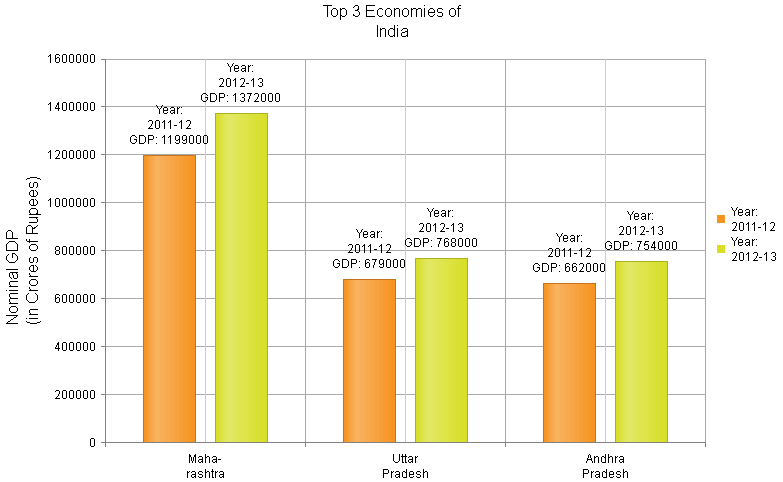
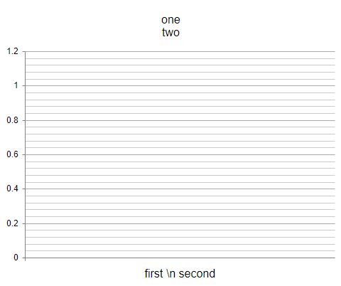

# Multiline Labels

You can split labels and titles in **RadHtmlChart** into multiple lines by using the **"\n"** line feed character. This help article shows how to wrap labels and titles in a chart (**Figure 1**) with a small sample (**Example 1**). The multiline labels feature is available since **Q3 2014**. If you are using an older version of the suite, [this]( https://feedback.telerik.com/Project/108/Feedback/Details/38633) page provides a workaround.

>note You can add line breaks in tooltips via the `<br />` tag because tooltips in **RadHtmlChart** are rendered with simple HTML.

>caption Figure 1: Wrapping text in chart labels and titles by using a line feed character ("\n").



>caption Example 1: How to split labels, titles and tooltips in **RadHtmlChart** into several lines. This code creates the chart shown in **Figure 1**.

````ASP.NET
<telerik:RadHtmlChart runat="server" ID="RadHtmlChart1" Width="800px" Height="500px">
	<ChartTitle Text="Top 3 Economies of \n India"></ChartTitle>
	<PlotArea>
		<Series>
			<telerik:ColumnSeries Name="Year:\n2011-12">
				<LabelsAppearance>
					<ClientTemplate>
					#=series.name#\n
					GDP: #=value#
					</ClientTemplate>
				</LabelsAppearance>
				<TooltipsAppearance>
					<ClientTemplate>
					#=series.name#<br />
					GDP: #=value#<br />
					State: #=category#
					</ClientTemplate>
				</TooltipsAppearance>
				<SeriesItems>
					<telerik:CategorySeriesItem Y="1199000" />
					<telerik:CategorySeriesItem Y="679000" />
					<telerik:CategorySeriesItem Y="662000" />
				</SeriesItems>
			</telerik:ColumnSeries>
			<telerik:ColumnSeries Name="Year:\n2012-13">
				<LabelsAppearance>
					<ClientTemplate>
					#=series.name#\n
					GDP: #=value#
					</ClientTemplate>
				</LabelsAppearance>
				<TooltipsAppearance>
					<ClientTemplate>
					#=series.name#<br />
					GDP: #=value#<br />
					State: #=category#
					</ClientTemplate>
				</TooltipsAppearance>
				<SeriesItems>
					<telerik:CategorySeriesItem Y="1372000" />
					<telerik:CategorySeriesItem Y="768000" />
					<telerik:CategorySeriesItem Y="754000" />
				</SeriesItems>
			</telerik:ColumnSeries>
		</Series>
		<XAxis>
			<Items>
				<telerik:AxisItem LabelText="Maha-\nrashtra" />
				<telerik:AxisItem LabelText="Uttar\nPradesh" />
				<telerik:AxisItem LabelText="Andhra\nPradesh" />
			</Items>
		</XAxis>
		<YAxis>
			<TitleAppearance Text="Nominal GDP\n(in Crores of Rupees)"></TitleAppearance>
			<MinorGridLines Visible="false" />
		</YAxis>
	</PlotArea>
</telerik:RadHtmlChart>
````


>note If you are setting these properties from the code-behind, you may need to escape the backslash as shown in **Example 2** below. You can read more about this in the [Handle Special Symbols]() article. This does not apply to the `[axis].LabelsAppearance.DateFormats` whose format strings are escaped by the .NET `JavaScriptSerializer`. The main axis label format string, client templates, data and other strings (such as titles) require escaping.
>
>As of R3 2018, escaping the back slash with more backslashes than necessary will result in the `\n` string being rendered instead of a new line. This is a feature that allows the `\n` string to be present in texts. **Example 2** below explains how this works.

>caption Example 2: How to escape new line characters from the code-behind. The result is shown in Figure 2.

````C#
//escape the new line character from the code-behind in C#
RadHtmlChart1.ChartTitle.Text = "one \\n two";

//as of R3 2018 this will not render a new line but a "\n" literal in the text
RadHtmlChart1.PlotArea.XAxis.TitleAppearance.Text = "first \\\\n second";
````
````VB
'in VB, the backslash is not a special symbol so it will not need additional escaping
RadHtmlChart1.ChartTitle.Text = "one \n two" 

'as of R3 2018 this will not render a new line but a "\n" literal in the text
RadHtmlChart1.PlotArea.XAxis.TitleAppearance.Text = "first \\n second" 
````

>caption Figure 2: The expected result of the escaping shown in Example 2, after R3 2018.



## See Also

 * [RadHtmlChart Server-side API]()

 * [RadHtmlChart ClientTemplate for Series Labels and Tooltips]()

 * [Escaping Special Symbols Coming from the Server]()
