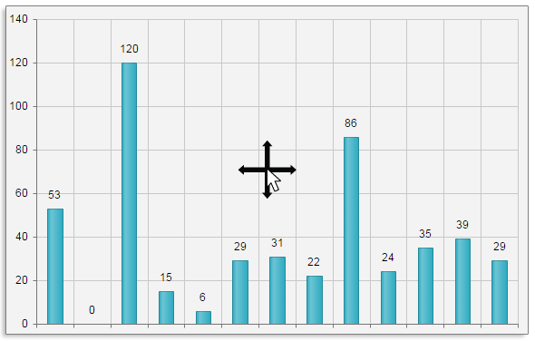

# Panning and Zooming
As of **Q1 2016**, **RadHtmlChart** exposes **Pan** and **Zoom** features for category and numeric series.  These features help the end-user to navigate and zoom the chart.

>caption Figure 1: Chart that can be panned to all directions.

>caption Figure 2: Chart that is zoomed using Selection, where selection is locked for Y axis.

Here you can the full list if the available **Pan** and **Zoom** properties and options:

## Pan

If modifier key for panning is specified, the user should hold the assigned key and pan in order to perform panning.

*   **Enabled**—specifies if the chart can be panned;
*   **ModifierKey**—specifies the key that should be pressed to activate panning. The available values are:
    *   _None_—no key is required;
    *   _Ctrl_—the Ctrl key should be pressed;
    *   _Shift_—the Shift key should be pressed;
    *   _Alt_—the Alt key should be pressed.
*   **Lock**—specifies an axis that should not be panned. The supported values are:
    *   _None_—none of the series are locked (i.e., user can pan by either X and Y axis as in **Figure 1**.);
    *   _X_—X axis is locked, i.e., user can pan only by Y axis.
    *   _Y_—Y axis is locked. i.e., user can pan only by X axis.

## Zoom

This tag exposes only the **Enabled** property that toggles the entire **Zoom** feature. If set to _false_ both **MouseWheel** and **Selection** features will be disabled.

### MouseWheel

*   **Enabled**—specifies if the chart can be zoomed via the mousewheel;
*   **Lock**—specifies an axis that should not be zoomed via the mousewheel. The supported values are:
    *   _None_—none of the series are locked (i.e., user can zoom by either X and Y axis.);
    *   _X_—X axis is locked, i.e., user can zoom only by Y axis.
    *   _Y_—Y axis is locked. i.e., user can zoom only by X axis.

### Selection

If **Selection** is enabled without a modifier key (or if **ModifierKey** property is set to _None_), user will be able to just click and draw an area in the chart and zoom it. Correspondingly, if a modifier key is configured, user should hold the assigned key in order to draw the area to be zoomed. As shown in **Figure 2**, the are to be zoomed is created by holding the **Shift** key.
 
*   **Enabled**—specifies if the chart can be zoomed via selection method;
*   **ModifierKey**—specifies the key that should be pressed to activate selection. The available values are:
    *   _None_—no key is required;
    *   _Ctrl_—the Ctrl key should be pressed;
    *   _Shift_—the Shift key should be pressed;
    *   _Alt_—the Alt key should be pressed.
*   **Lock**—specifies an axis that should not be zoomed via the selection method. The supported values are:
    *   _None_—none of the series are locked (i.e., user can zoom by either X and Y axis.);
    *   _X_—X axis is locked, i.e., user can zoom only by Y axis.
    *   _Y_—Y axis is locked. i.e., user can zoom only by X axis (**Figure 2**).
    
## See Also

* [Demo: Panning and Zooming](http://demos.telerik.com/aspnet-ajax/HtmlChart/Examples/Functionality/Panning-Zooming/DefaultCS.aspx)

* [Kendo Chart API - Pannable](http://docs.telerik.com/KENDO-UI/api/javascript/dataviz/ui/chart#configuration-pannable)

* [Kendo Chart API - Zoomable](http://docs.telerik.com/KENDO-UI/api/javascript/dataviz/ui/chart#configuration-zoomable)
 