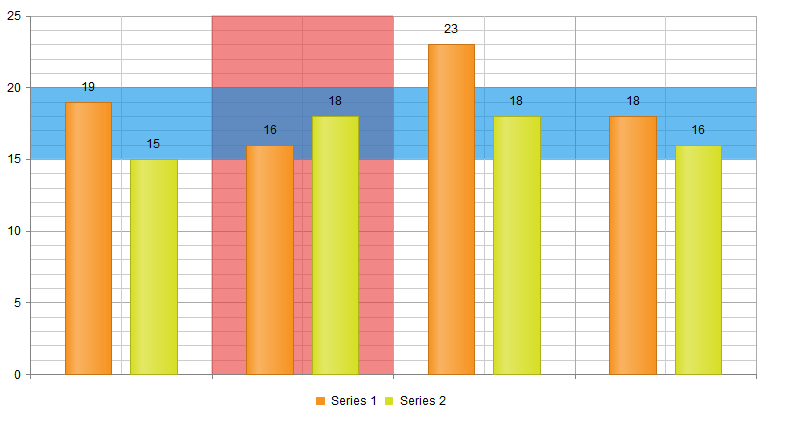

# Plot Bands

**Plot Bands** are colored ranges in **RadHtmlChart**, the purpose of which is to highlight areas of the chart by changing its background in a predefined axis range. Telerik introduced the plot bands in the Q1 2014 release.

The plot bands appear on the chart as colored areas that fill the entire space between two grid lines on the x-axis or on the y-axis.

You can set up such a range by creating **PlotBand** items and populating them in the **PlotBands** collection of the [axis element]() (XAxis and YAxis).

Each **PlotBand** item exposes properties that allow you to specify how the colored area should be visualized:

* **From** - The starting grid line of the plot band on the X or Y axes.

* **FromDate** - The starting date for the plot band. Will have effect for a date axis only. Available as of R1 2019.

* **To** - The ending grid line of the plot band on the X or Y axes.

* **ToDate** - The end date for the plot band. Will have effect for a date axis only. Available as of R1 2019.

* **Alpha** - The opacity of the plot band in range [0-255].

* **Color** - The color of the plot band.

The value of the properties **From** and **To** depends on the type of the chart:

* For the x-axis of **categorical** chart types (**Area**, **Bar**, **Column**, etc.), you need to set the **index** of the corresponding category. See **Figure 1** and **Example 1**.

* For a [date axis](), you can set an **integer** as the item **index** in the **From** and **To** properties. Alternatively, the **FromDate** and **ToDate** properties let you set a .NET date as of R1 2019. The exact numbers from the date (year, month, day, hour, minute, second, millisecond) are serialized for rendering without time zone conversions. Parsing the date, if set in the markup, is done by .NET according to your current settings. To use date objects, you must set both properties, if one of them does not have a value, the numbers will be serialized instead.

* For **numerical** chart types (**Scatter**, **Scatter Line**, **Bubble**) **and** for the **y-axis** of categorical chart types, you need to set the actual **value from the axis** in the **From** and **To** properties.

>caption Figure 1: A chart with two plot bands. The red band is on a categirical x-axis and the blue band is on the y-axis. Produced by the code in Example 1.



>caption Example 1: Creating a chart that has two plot bands – one on a categorical x-axis and one on the y-axis.

````ASP.NET
<telerik:RadHtmlChart ID="Chart" runat="server" Width="760px" Height="420px">
	<PlotArea>
		<XAxis>
			<PlotBands>
				<telerik:PlotBand From="1" To="2" Color="#e83737" Alpha="100" />
			</PlotBands>
		</XAxis>
		<YAxis>
			<PlotBands>
				<telerik:PlotBand From="15" To="20" Color="#008de7" Alpha="100" />
			</PlotBands>
		</YAxis>
		<Series>
			<telerik:ColumnSeries Name="Series 1">
				<SeriesItems>
					<telerik:CategorySeriesItem Y="19" />
					<telerik:CategorySeriesItem Y="16" />
					<telerik:CategorySeriesItem Y="23" />
					<telerik:CategorySeriesItem Y="18" />
				</SeriesItems>
			</telerik:ColumnSeries>
			<telerik:ColumnSeries Name="Series 2">
				<SeriesItems>
					<telerik:CategorySeriesItem Y="15" />
					<telerik:CategorySeriesItem Y="18" />
					<telerik:CategorySeriesItem Y="18" />
					<telerik:CategorySeriesItem Y="16" />
				</SeriesItems>
			</telerik:ColumnSeries>
		</Series>
	</PlotArea>
	<Legend>
		<Appearance Position="Bottom"></Appearance>
	</Legend>
</telerik:RadHtmlChart>
````

>caption Figure 2: A date axis with plot bands. Produced by the code in Example 2.


>caption Example 2: How to add plot bands for a date axis. The FromDate and ToDate properties are available as of R1 2019. Indexes work in all versions that support Plot Bands.

````ASP.NET
<telerik:RadHtmlChart runat="server" ID="Chart2" Width="760px" Height="420px">
	<PlotArea>
		<Series>
			<telerik:LineSeries DataFieldY="valuesField"></telerik:LineSeries>
		</Series>
		<XAxis DataLabelsField="datesField" Type="Date">
			<PlotBands>
				<telerik:PlotBand From="0" To="1" Color="Red" Alpha="200" />
				<telerik:PlotBand FromDate="2019/1/13" ToDate="2019/1/14" Color="Green" Alpha="200" />
			</PlotBands>
		</XAxis>
	</PlotArea>
</telerik:RadHtmlChart>
````

````C#
protected void Page_Load(object sender, EventArgs e)
{
	if (!Page.IsPostBack)
	{
		Chart2.DataSource = GetData();
		Chart2.DataBind();
	}
	PlotBand plotBand3 = new PlotBand(new DateTime(2019, 1, 15),
    									new DateTime(2019, 1, 16, 15, 16, 17),
    									System.Drawing.Color.Blue,
    									200);
	Chart2.PlotArea.XAxis.PlotBands.Add(plotBand3);
}

protected DataTable GetData()
{
	DataTable dt = new DataTable();

	dt.Columns.Add("valuesField", typeof(int));
	dt.Columns.Add("datesField", typeof(DateTime));

	dt.Rows.Add(5, new DateTime(2019, 1, 11));
	dt.Rows.Add(8, new DateTime(2019, 1, 12));
	dt.Rows.Add(2, new DateTime(2019, 1, 13));
	dt.Rows.Add(5, new DateTime(2019, 1, 14));
	dt.Rows.Add(4, new DateTime(2019, 1, 15));
	dt.Rows.Add(7, new DateTime(2019, 1, 16));

	return dt;
}
````
````VB
Protected Sub Page_Load(sender As Object, e As EventArgs) Handles Me.Load
	If Not Page.IsPostBack Then
		Chart2.DataSource = GetData()
		Chart2.DataBind()
	End If

	Dim plotBand3 As PlotBand = New PlotBand(New DateTime(2019, 1, 15),
											 New DateTime(2019, 1, 16, 15, 16, 17),
											 System.Drawing.Color.Blue,
											 200)
	Chart2.PlotArea.XAxis.PlotBands.Add(plotBand3)
End Sub

Protected Function GetData() As DataTable
	Dim dt As DataTable = New DataTable()
	
	dt.Columns.Add("valuesField", GetType(Integer))
	dt.Columns.Add("datesField", GetType(DateTime))
	
	dt.Rows.Add(5, New DateTime(2019, 1, 11))
	dt.Rows.Add(8, New DateTime(2019, 1, 12))
	dt.Rows.Add(2, New DateTime(2019, 1, 13))
	dt.Rows.Add(5, New DateTime(2019, 1, 14))
	dt.Rows.Add(4, New DateTime(2019, 1, 15))
	dt.Rows.Add(7, New DateTime(2019, 1, 16))
	
	Return dt
End Function
````


## See Also

 * [RadHtmlChart PlotBand Server-Side API](https://www.telerik.com/help/aspnet-ajax/t_telerik_web_ui_plotband.html)

 * [RadHtmlChart Configuring Axes]()

 * [RadHtmlChart AreaSeries]()

 * [RadHtmlChart BarSeries]()

 * [RadHtmlChart ColumnSeries]()

 * [RadHtmlChart ScatterSeries]()

 * [RadHtmlChart ScatterLineSeries]()

 * [RadHtmlChart BubbleSeries]()
